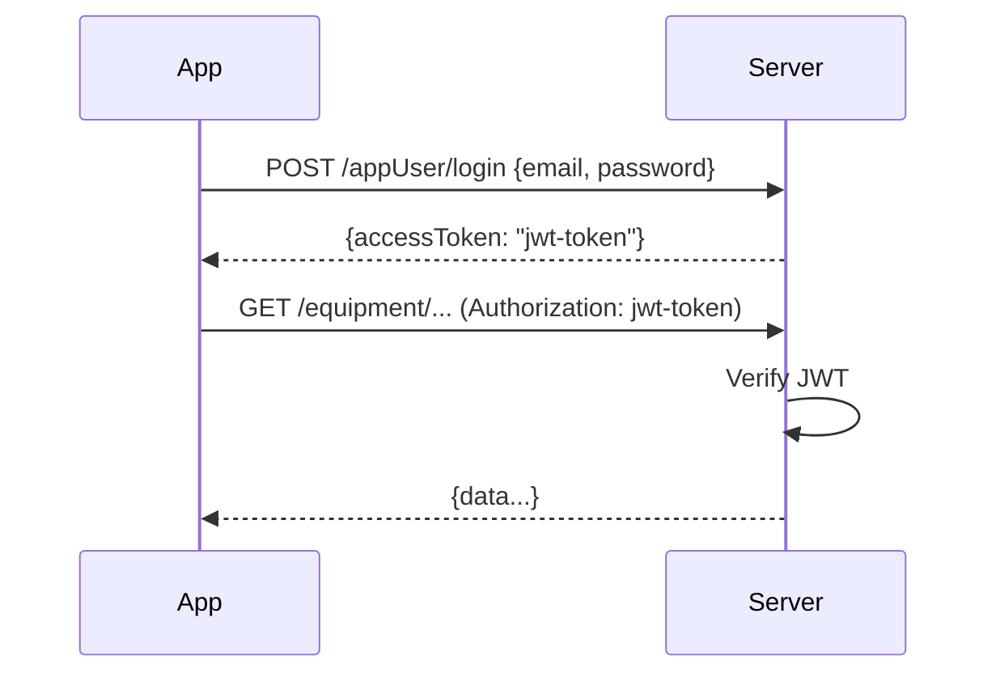

# Authentication

## Local Server Authentication

### JWT Tokens

The local server uses JWT tokens for app authentication.



Login returns a JWT `accessToken` which is sent in the `Authorization` header of subsequent requests.

### Password Encryption

The app encrypts passwords with AES-128-CBC before sending.

<!-- PRIVATE -->
| Property | Value |
|----------|-------|
| Algorithm | AES-128-CBC |
| Key | `1234123412ABCDEF` (UTF-8) |
| IV | `1234123412ABCDEF` (same as key) |
| Padding | PKCS7 |
| Output | Base64 |
<!-- /PRIVATE -->

---

## Cloud API Authentication (Reverse-Engineered)

The real cloud uses a more complex signature scheme:

<!-- PRIVATE -->
### Request Headers

| Header | Value | Description |
|--------|-------|-------------|
| `Authorization` | `<accessToken>` | UUID token from login |
| `echostr` | `p` + 12 random hex chars | Random nonce |
| `nonce` | `1453b963a29b...` | **Static**: SHA1("qtzUser") |
| `timestamp` | `String(Date.now())` | Milliseconds |
| `signature` | SHA256(echostr + nonce + ts + token) | Request signature |
| `source` | `app` | Fixed |
| `userlanguage` | `en` | Language setting |
<!-- /PRIVATE -->

<!-- PRIVATE -->
### Signature Formula

```javascript
const nonce = crypto.createHash('sha1')
  .update('qtzUser', 'utf8').digest('hex');
// = "1453b963a29b5441b839b18939aaf0817944300b"

const echostr = 'p' + randomHex(12);

const signature = crypto.createHash('sha256')
  .update(echostr + nonce + timestamp + token, 'utf8')
  .digest('hex');
```

!!! warning "Intentionally misleading header names"
    - `echostr` = actually the random nonce
    - `nonce` = actually a static constant (SHA1 of "qtzUser")
<!-- /PRIVATE -->

### Cloud Backend

- Spring Boot microservices behind nginx + Spring Cloud Gateway
- 5 services: `nova-user`, `nova-data`, `nova-file-server`, `novabot-message`, `nova-network`
- Swagger not deployed (404), Spring Boot Actuator blocked by nginx (403)

---

## MQTT Authentication

### Devices

| Device | Username | Password | Client ID |
|--------|----------|----------|-----------|
| Charger | `li9hep19` | `jzd4wac6` | `ESP32_<last-6-hex-of-BLE-MAC>` (e.g. `ESP32_1bA408` for MAC `48:27:E2:1B:A4:08`) |
| Mower | `null` | `null` | `LFIN2230700XXX_6688` |

!!! info "Local broker accepts all credentials"
    Our Aedes broker accepts any username/password. The charger firmware v0.3.6 does not send MQTT credentials at all.

### Cloud MQTT Credentials

Returned by `getEquipmentBySN` / `userEquipmentList`:

<!-- PRIVATE -->
| Device | `account` | `password` |
|--------|-----------|-----------|
| Charger | `li9hep19` | `jzd4wac6` |
| Mower | `null` | `null` |
<!-- /PRIVATE -->

The charger gets MQTT credentials from the cloud; the mower does **not**.

### App MQTT CONNECT Bug

The Novabot app sends an MQTT CONNECT packet with **Will QoS=1** while **Will Flag=0**.
This violates MQTT 3.1.1 spec section 3.1.2.6.

**Fix**: `sanitizeConnectFlags()` in `broker.ts` patches the raw TCP bytes before Aedes parses them.

### MQTT Payload Encryption

All `LFI*` devices on charger firmware v0.4.0+ and mower firmware v6.x+ encrypt their MQTT payloads.

| Property | Value |
|----------|-------|
| Algorithm | AES-128-CBC |
| Key | `"abcdabcd1234" + SN[-4:]` (e.g. `"abcdabcd12340238"` for `LFIN2230700238`) |
| IV | `"abcd1234abcd1234"` (static) |
| Padding | Null bytes to next 16-byte boundary (NOT PKCS7) |

Charger firmware below v0.4.0 and mower firmware v5.x send plain JSON (no AES). See [MQTT Protocol](../mqtt/encryption.md) for full details and reference code.
