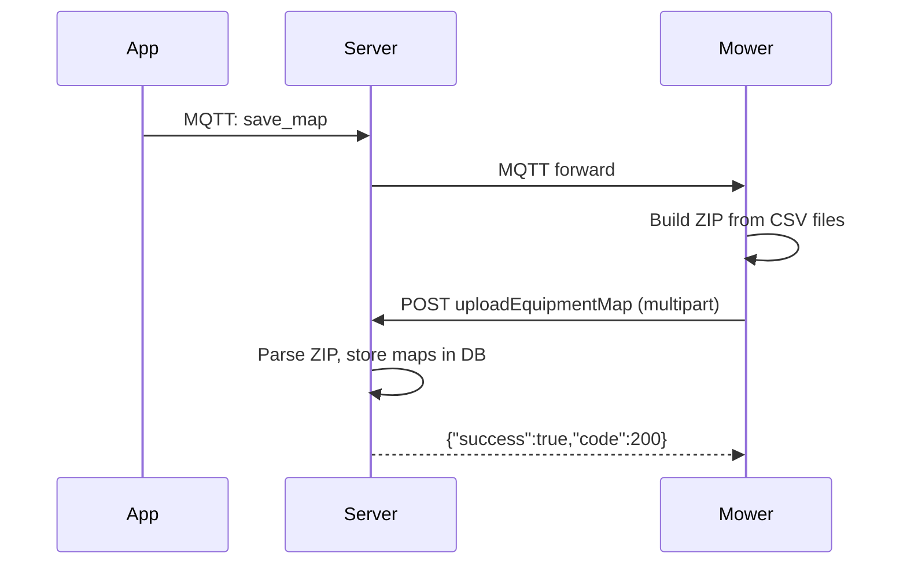

# Mower → Server API

These endpoints are called by the **mower firmware** (`mqtt_node` via libcurl).
The mower reads the server URL from `/userdata/lfi/http_address.txt`.

!!! warning "No authentication"
    The mower does NOT send JWT tokens. These endpoints must work without auth.

---

## uploadEquipmentMap

### POST `/api/nova-file-server/map/uploadEquipmentMap`

Mower uploads its map ZIP after a mapping session completes.

**Content-Type**: `multipart/form-data` (via `curl_formadd`)

| Field | Type | Description |
|-------|------|-------------|
| `local_file` | binary | ZIP file containing CSV maps |
| `local_file_name` | string | Filename of the ZIP |
| `zipMd5` | string | MD5 checksum of the ZIP |
| `sn` | string | Mower serial number |
| `jsonBody` | string | Extra metadata (JSON) |

!!! note "SN resolution"
    The handler accepts `sn` from the multipart body OR from the `?sn=` query string. If neither is present, it falls back to extracting the SN prefix from the uploaded filename (e.g. `LFIN2230700238_<timestamp>.zip`). See `server/src/cloud-api/routes/map.ts` (`uploadEquipmentMap`).

**Trigger**: After `save_map` MQTT command completes, the mower generates a ZIP from `/userdata/lfi/maps/home0/csv_file/` and uploads it.



---

## uploadEquipmentTrack

### POST `/api/nova-file-server/map/uploadEquipmentTrack`

Mower uploads the planned mowing path.

**Content-Type**: `multipart/form-data`

| Field | Type | Description |
|-------|------|-------------|
| `local_file` | binary | Path data file |
| `local_file_name` | string | Filename |
| `sn` | string | Mower serial number |

**Source**: `/userdata/lfi/maps/home0/planned_path/`

---

## queryPlanFromMachine

### POST `/api/nova-data/cutGrassPlan/queryPlanFromMachine`

Mower fetches mowing schedules from the server.

```json title="Request"
{
  "sn": "LFIN2230700XXX"
}
```

```json title="Response → value"
[
  {
    "planId": "uuid",
    "equipmentId": "uuid",
    "startTime": "08:00",
    "endTime": "12:00",
    "weekday": [1, 3, 5]
  }
]
```

---

## saveCutGrassRecord

### POST `/api/nova-data/equipmentState/saveCutGrassRecord`

Mower saves mowing session results.

**Content-Type**: `multipart/form-data`

The mower posts the fields as multipart form parts (server uses `multer().none()` to parse them), not as JSON.

| Field | Type | Description |
|-------|------|-------------|
| `sn` | string | Mower serial number |
| `dateTime` | string | Session start time (ISO 8601; firmware may post `2001-01-01...` when NTP failed) |
| `workTime` | string/number | Mowing duration in seconds |
| `workArea` | string/number | Mowed area in m2 |
| `cutGrassHeight` | string/number | Blade height (cm) |
| `mapNames` | string | JSON array of map names |
| `startWay` | string | `app`, `schedule`, or `manual` |
| `workStatus` | string | `completed`, `interrupted`, etc. |
| `scheduleId` | string | Optional schedule UUID |
| `week` | string/number | Weekday number |

!!! note "Empty body is tolerated"
    The handler returns `ok(null)` if the body is empty or unparseable, because firmware retries this call in a tight loop until it gets a 200. Failing here causes a retry storm.

---

## saveCutGrassMessage

### POST `/api/novabot-message/machineMessage/saveCutGrassMessage`

Mower saves a notification message (e.g., "mowing complete", "error occurred").

```json title="Request"
{
  "sn": "LFIN2230700XXX"
}
```

---

## machineReset

### POST `/api/nova-user/equipment/machineReset`

Device unbind/factory reset request.

```json title="Request"
{
  "sn": "LFIN2230700XXX"
}
```

---

## connection

### POST `/api/nova-network/network/connection`

Connectivity check (called periodically by mower).

```json title="Response"
{
  "success": true,
  "code": 200,
  "message": "request success",
  "value": 1
}
```

---

## Log Upload

### POST `/x3/log/upload`

Mower uploads debug/system logs.

**Content-Type**: Raw binary (up to 50MB)

```json title="Response"
{
  "code": 200,
  "msg": "ok"
}
```

---

## Implementation Status

| Endpoint | Status | Notes |
|----------|--------|-------|
| `uploadEquipmentMap` | ✅ Implemented | Accepts multipart, parses ZIP |
| `uploadEquipmentTrack` | ✅ Implemented | Stores path data |
| `queryPlanFromMachine` | ✅ Implemented | Returns schedules |
| `saveCutGrassRecord` | ✅ Implemented | Stores work records |
| `saveCutGrassMessage` | ✅ Implemented | Stores messages |
| `machineReset` | ✅ Implemented | Unbinds device |
| `connection` | ✅ Implemented | Returns success |
| `/x3/log/upload` | ✅ Implemented | Accepts raw binary |
