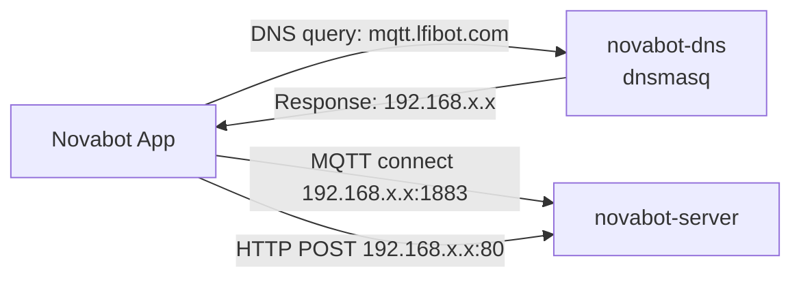

# Network Topology

!!! info "DNS rewrites are OPTIONAL since v1.0.0"
    Since v1.0.0, DNS rewrites are OPTIONAL. The OpenNova app and bootstrap tool provision devices with direct IP addresses via BLE. DNS rewrites are only needed if you want to use the official Novabot app.

## DNS Redirect

The Novabot app connects to `app.lfibot.com` (HTTP) and `mqtt.lfibot.com` (MQTT).
To intercept, DNS is rewritten to point to the local server.

### DNS Configuration Options

1. **novabot-dns Docker** — `docker compose -f novabot-dns/docker-compose.yml up`
2. **Pi-hole / AdGuard Home** — Add DNS rewrite rules
3. **Router DNS** — Override DNS entries (if supported)

### Domains to Redirect

| Domain | Port | Protocol | Purpose |
|--------|------|----------|---------|
| `app.lfibot.com` | 443 → 3000 | HTTPS → HTTP | REST API |
| `mqtt.lfibot.com` | 1883 | MQTT | MQTT broker |

## Port Allocation

| Port | Service | Protocol |
|------|---------|----------|
| 1883 | Aedes MQTT Broker | MQTT (plain TCP) |
| 3000 | Express HTTP Server | HTTP REST + Socket.io |
| 8100 | MkDocs Wiki | HTTP (Docker) |

## External Cloud Services

| URL | IP | Purpose |
|-----|-----|---------|
| `app.lfibot.com` | `47.253.145.99` | Cloud API server |
| `mqtt.lfibot.com` | (varies) | Cloud MQTT broker |
<!-- PRIVATE -->
| `mqtt-dev.lfibot.com` | (varies) | Development MQTT broker |
| `47.253.57.111` | Hardcoded | Fallback MQTT IP (Alibaba Cloud) |
<!-- /PRIVATE -->
| `novabot-oss.oss-us-east-1.aliyuncs.com` | (CDN) | OTA firmware + documents |
| `novabot-oss.oss-accelerate.aliyuncs.com` | (CDN) | OTA firmware (accelerated) |
| `lfibot.zendesk.com` | (varies) | Customer support |

## Android DNS Issues

!!! bug "Android Private DNS bypasses local DNS"
    Android's Private DNS (DNS-over-TLS) bypasses router DNS settings.
    ADB logcat shows `gai_error = 7` (EAI_AGAIN).

    **Fix**: Settings → Network → Private DNS → Off (or "Automatic")
