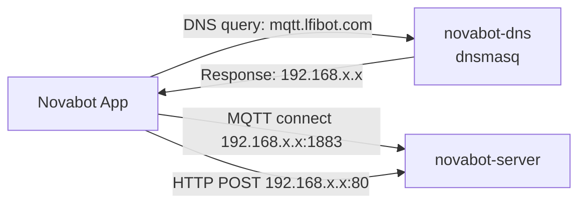

# Network Topology

!!! info "DNS rewrites are OPTIONAL since v1.0.0"
    Since v1.0.0, DNS rewrites are OPTIONAL. The OpenNova app and bootstrap tool provision devices with direct IP addresses via BLE. DNS rewrites are only needed if you want to use the official Novabot app.

## DNS Redirect

The Novabot app connects to `app.lfibot.com` (HTTP) and `mqtt.lfibot.com` (MQTT).
To intercept, DNS is rewritten to point to the local server.

### DNS Configuration Options

1. **NGINX Proxy Manager + AdGuard Home (recommended)** - external resolver rewrites `*.lfibot.com` to the LAN IP, NPM terminates TLS to internal port 80. See [guide/dns-setup.md](../guide/dns-setup.md).
2. **Pi-hole / AdGuard Home only** - add DNS rewrite rules, app talks plain HTTP on port 80.
3. **Bundled `dnsmasq`** - set `ENABLE_DNS=true` and `TARGET_IP` in `docker-compose.yml` to start the in-container resolver.
4. **Router DNS** - override DNS entries (if supported).

### Domains to Redirect

| Domain | Port | Protocol | Purpose |
|--------|------|----------|---------|
| `app.lfibot.com` | 443 -> 80 | HTTPS -> HTTP | REST API (NPM terminates TLS to internal port 80) |
| `mqtt.lfibot.com` | 1883 | MQTT | MQTT broker |

## Port Allocation

| Port | Service | Protocol |
|------|---------|----------|
| 80 | Express HTTP Server (production) | HTTP REST + Socket.io |
| 1883 | Aedes MQTT Broker | MQTT (plain TCP) |
| 3000 | Express HTTP Server (dev mode / LAN bypass only) | HTTP REST + Socket.io |
| 8100 | MkDocs Wiki | HTTP (Docker) |

The mower firmware and the rewritten `app.lfibot.com` hostname both target **port 80**. Port 3000 is only used by `npm run dev` and direct LAN testing; it is marked deprecated for production traffic.

## Mower Server Discovery Order

Custom firmware v6.0.2-custom-16+ tries each step in order until one succeeds:

1. WiFi STA wait (network ready)
2. mDNS query for `opennovabot.local`
3. DNS query for `mqtt.lfibot.com` (LAN-side AdGuard / dnsmasq rewrite)
4. Last-known IP from previous successful connection
5. Fallback host hardcoded at firmware build time

Cascade is implemented in `set_server_urls.sh` on the mower.

## External Cloud Services

| URL | IP | Purpose |
|-----|-----|---------|
| `app.lfibot.com` | `47.253.145.99` | Cloud API server |
| `mqtt.lfibot.com` | (varies) | Cloud MQTT broker |
<!-- PRIVATE -->
| `mqtt-dev.lfibot.com` | (varies) | Development MQTT broker |
| `47.253.57.111` | Hardcoded | Fallback MQTT IP (Alibaba Cloud) |
<!-- /PRIVATE -->
| `novabot-oss.oss-us-east-1.aliyuncs.com` | (CDN) | OTA firmware + documents |
| `novabot-oss.oss-accelerate.aliyuncs.com` | (CDN) | OTA firmware (accelerated) |
| `lfibot.zendesk.com` | (varies) | Customer support |

## Android DNS Issues

!!! bug "Android Private DNS bypasses local DNS"
    Android's Private DNS (DNS-over-TLS) bypasses router DNS settings.
    ADB logcat shows `gai_error = 7` (EAI_AGAIN).

    **Fix**: Settings → Network → Private DNS → Off (or "Automatic")
