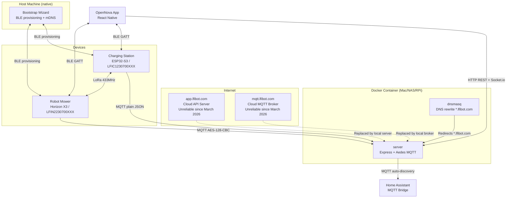
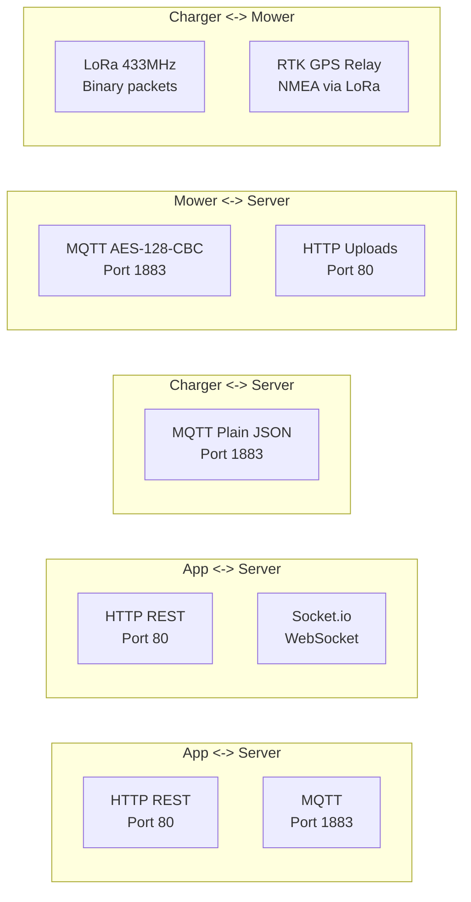

# Architecture Overview

!!! warning "Novabot Cloud Unreliable"
    The Novabot cloud (`app.lfibot.com` / `mqtt.lfibot.com`) has been experiencing frequent outages since March 2026. OpenNova keeps your mower operational regardless of cloud status.

## System Diagram

## Communication Layers

!!! note "Port 3000 is dev-only"
    The server binds both port 80 (production-facing, what the mower firmware and `app.lfibot.com` rewrites talk to) and port 3000 (LAN dev bypass, used by `npm run dev` and direct LAN testing). In production deployments behind NGINX Proxy Manager, all traffic terminates on port 80.

## Technology Stack

### Server (`server/`)

| Layer | Technology |
|-------|-----------|
| Runtime | Node.js + TypeScript (ESM modules) |
| HTTP | Express.js |
| MQTT Broker | Aedes (port 1883) |
| WebSocket | Socket.io |
| Database | better-sqlite3 (WAL mode) |
| Auth | JWT (jsonwebtoken + bcrypt) |

### OpenNova App (`app/`)

| Layer | Technology |
|-------|-----------|
| Framework | React Native + Expo |
| Platforms | iOS + Android |
| BLE | NimBLE (provisioning) |
| Maps | SVG-based with GPS conversion |
| Real-time | Socket.io client |

### Bootstrap Wizard (`bootstrap/`)

| Layer | Technology |
|-------|-----------|
| Runtime | Node.js + TypeScript |
| BLE | @stoprocent/noble (native) + Web BLE (browser fallback) |
| mDNS | Bonjour/Avahi advertisement |
| Purpose | First-time firmware patching, BLE provisioning, mDNS `opennovabot.local` |

### DNS redirect (optional)

The container bundles `dnsmasq` but it is **OFF by default** (only started when `ENABLE_DNS=true` and `TARGET_IP` are set in `docker-compose.yml`). Most deployments use an external resolver instead.

| Option | Recommended for |
|--------|-----------------|
| External AdGuard Home / Pi-hole rewrite | Self-hosted networks, multi-device LANs |
| NGINX Proxy Manager + LAN DNS | Reverse-proxy setups, TLS termination for iOS |
| Bundled `dnsmasq` (set `ENABLE_DNS=true`) | Single-host quick start, no external resolver available |

See [guide/dns-setup.md](../guide/dns-setup.md) for setup instructions.

## Distribution Model

The project uses a Docker-based distribution where the server runs on the user's local network (Mac/NAS/Raspberry Pi), NOT on the mower itself.

### Why Not On The Mower?

- CPU load impacts mowing performance
- Battery drain from running Node.js server
- Heat buildup from continuous server operation
- Brick risk if server crashes
- No app access when mower is offline/sleeping

### Components

| Component | Runs On | Purpose |
|-----------|---------|---------|
| **Docker container** | Mac/NAS/RPi | server + dnsmasq |
| **Bootstrap wizard** | Host machine (native) | Initial setup, firmware patching, mDNS advertising |
| **Custom mower firmware** | Mower | SSH, URL patches, camera, mDNS discovery |

### Server Discovery

The mower finds the local server via a fallback cascade (custom firmware v6.0.2-custom-16+):

1. **WiFi wait** for STA connection to complete
2. **mDNS query** for `opennovabot.local` (8 second timeout)
3. **DNS query** for `mqtt.lfibot.com` (resolves to LAN IP via AdGuard / dnsmasq rewrite)
4. **Last-known IP** from previous successful connection
5. **Fallback host** (hardcoded during firmware build)
6. **Skip** -- mower continues without server connection

!!! info "mDNS runs on the host, not in Docker"
    The bootstrap wizard advertises `opennovabot.local` via mDNS on the host machine. Docker bridge networking blocks multicast on macOS, so mDNS runs natively in the bootstrap tool, not inside Docker.

## Database Schema

| Table | Purpose |
|-------|---------|
| `users` | User accounts (email, bcrypt password, machine_token) |
| `email_codes` | Temporary verification codes |
| `equipment` | Bound devices (mower_sn PK, charger_sn, mac_address) |
| `maps` | Map metadata (polygons stored as JSON) |
| `map_uploads` | Fragmented map upload tracking |
| `cut_grass_plans` | Mowing schedules per device |
| `robot_messages` | Device-to-user messages |
| `work_records` | Mowing session history |
| `ota_versions` | OTA firmware versions |
| `device_registry` | Auto-learned via MQTT CONNECT (sn, mac, last_seen) |
| `device_factory` | Factory inventory imported from LFI account (sn, mac, type) |
| `equipment_lora_cache` | Cached LoRa parameters (survives unbind) |
| `dashboard_schedules` | Dashboard mowing schedules (CRUD + MQTT push) |
| `signal_history` | Time-series WiFi / LoRa / RTK signal samples |
| `map_calibration` | Manual map offset/rotation/scale per mower |
| `device_settings` | Per-device preference flags (rain delay, LED, etc.) |
| `push_tokens` | Expo push notification tokens per user/device |
| `remote_support_identities` | Remote-support tunnel identity + token per instance |
| `import_audit` | Audit log of LFI cloud imports (device pulls, dedup) |
| `rain_sessions` | Detected rain events (rain sensor history) |
| `rain_settings` | Per-mower rain delay configuration |
| `virtual_walls` | No-go zones / virtual boundaries per mower |
