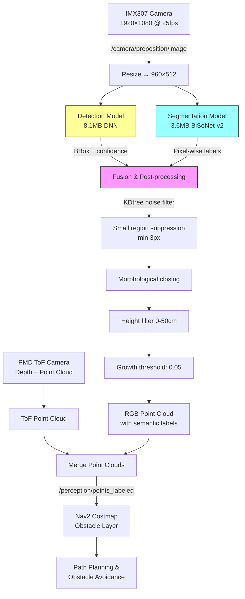

# AI Perception System

The mower has a **fully implemented AI obstacle detection system** with two neural networks running on the Horizon BPU AI accelerator.

## AI Models

| Model | File | Size | Input | Architecture |
|-------|------|------|-------|-------------|
| **Detection** | `novabot_detv2_11_960_512.bin` | 8.1 MB | 960×512 RGB | YOLO-variant (Horizon quantized) |
| **Segmentation** | `bisenetv2-seg_2023-11-27_512-960_vanilla.bin` | 3.6 MB | 960×512 RGB | BiSeNet-v2 (Horizon quantized) |

Location: `install/perception_node/share/perception_node/perception_conf/`

## Detection Classes (9 classes)

| ID | Class | Description |
|----|-------|-------------|
| 100 | `person` | People |
| 101 | `animal` | Animals |
| 102 | `obstacle` | Generic obstacles |
| 103 | `shoes` | Shoes |
| 104 | `wheel` | Wheels |
| 105 | `leaf debris` | Leaf debris |
| 106 | `faeces` | Animal droppings |
| 107 | `rock` | Rocks/stones |
| 108 | `background` | Background |

## Segmentation Classes (14 classes)

| ID | Class | Description |
|----|-------|-------------|
| 0 | `unlabeled` | Unlabeled |
| 1 | `background` | Background |
| 2 | `lawn` | **Lawn** (primary target) |
| 3 | `road` | Road/path |
| 4 | `terrain` | Terrain |
| 5 | `fixed obstacle` | Fixed obstacle |
| 6 | `static obstacle` | Static obstacle |
| 7 | `dynamic obstacle` | Dynamic obstacle |
| 8 | `bush` | Bush |
| 9 | `faeces` | Animal droppings |
| 10 | `charging station` | Charging station |
| 11 | `dirt` | Dirt |
| 12 | `sunlight` | Sunlight reflection |
| 13 | `glass` | Glass |

## Perception Pipeline



## Camera System

| Camera | Sensor | Resolution | Interface | Purpose |
|--------|--------|-----------|-----------|---------|
| Front | Sony IMX307 | 1920×1080 @25fps | MIPI CSI-2 | RGB navigation, AI detection |
| Panoramic | Sony IMX307 | 1920×1080 | MIPI CSI-2 | Wide overview |
| Depth/ToF | PMD Royale (IRS2875C) | Point cloud + grayscale | Integrated | 3D depth sensing |

### Camera ROS 2 Topics

| Topic | Description |
|-------|-------------|
| `/camera/preposition/image` | RGB image (1920×1080) |
| `/camera/preposition/image/compressed` | Compressed RGB stream |
| `/camera/tof/depth_image` | Depth map |
| `/camera/tof/gray_image` | Grayscale from ToF |
| `/camera/tof/point_cloud` | 3D point cloud |
| `/perception/points_labeled` | **Main output**: labeled obstacles |
| `/perception/labeled_img/compressed` | Debug: segmented image |
| `/perception/pedestrian_detect` | Detected persons/animals |

## Inference Configuration

```yaml
det_model_name: "novabot_detv2_11_960_512.bin"
seg_model_name: "bisenetv2-seg_2023-11-27_512-960_vanilla.bin"
detec_threshold: 0.61          # Detection confidence threshold
infer_mode: 1                  # 1=seg, 2=det, 3=both
suppress_size: 3               # Min region size (pixels)
timer_rate: 100.0              # Inference frequency (Hz)
dirty_frame: 60                # Dirty lens detection threshold
pub_debug_image: False         # Debug visualization
```

### Inference Modes

| Mode | Description | Service Call |
|------|-------------|-------------|
| 1 | Segmentation only | `/perception/do_perception` (SetBool) |
| 2 | Detection only | |
| 3 | Detection + Segmentation (fusion) | |

## Nav2 Costmap Integration

```yaml
# Obstacle layer parameters
min_obstacle_height: 0.35m
max_obstacle_height: 0.50m
obstacle_max_range: 1.49m
observation_persistence: 2.0s
```

## Camera Dirty Detection

Separate ML module that detects if the camera lens is dirty/fogged:

- Classes: `clean`, `transparent`, `semi_transparent`, `opaque`
- Entropy-based analysis + ML inference
- Service: `/start_dirty_detection`

## Version History

| Version | Changes |
|---------|---------|
| V0.2.0 | Initial: dual-model support |
| V0.2.1 | Model switching, fusion modes |
| V0.3.0 | Single-model inference, morphological post-processing |
| V0.3.3 | KDtree noise filtering, 10% CPU reduction |
| V0.4.0 | Data recording capability |
| V0.4.7 | Camera dirty detection |
| V0.5.2b | Z-filter 0.35→0.50m, growth threshold 0.08 (tall grass fix) |
| V0.5.3 | Growth threshold → 0.05, charging station color distinction |
| **V0.5.3d** | Last observed (2024/06/12), input size filter against crashes |

!!! note "Video streaming on stock vs custom firmware"
    Stock firmware has no video streaming, RTSP, WebRTC, or MJPEG. Camera images are used exclusively for autonomous navigation, and live camera was marketed but never implemented in stock software. OpenNova custom firmware (v6.0.2-custom-NN) adds an MJPEG stream on port 8000 via a Python ROS 2 node.
