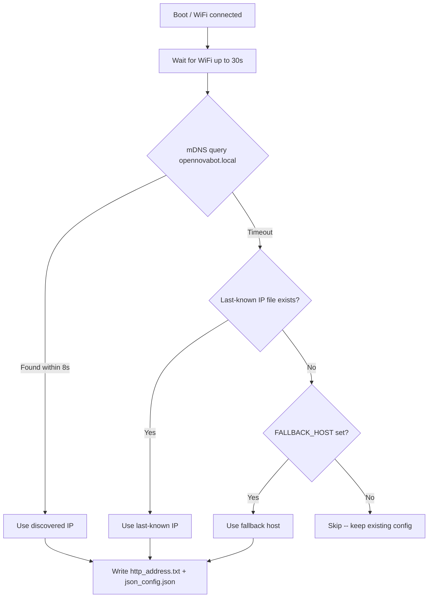
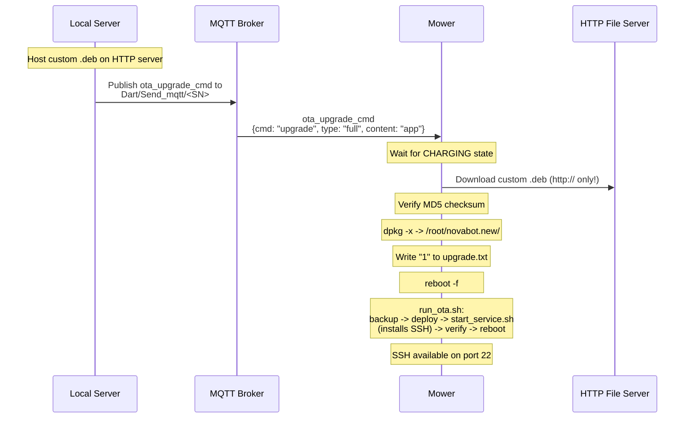
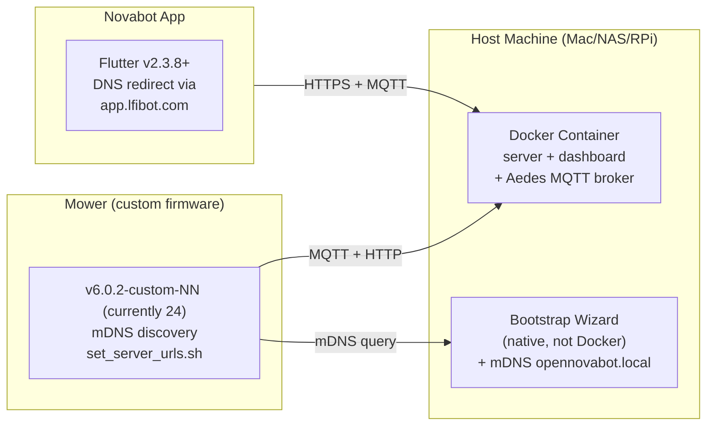

# Custom Firmware

!!! info "Custom firmware is OPTIONAL"
    Custom firmware is OPTIONAL for basic OpenNova setup. Stock Novabot firmware works with BLE provisioning (direct IP). Custom firmware adds: mDNS discovery, SSH access, camera streaming.

## Feasibility Assessment

Can we build custom firmware for the Novabot charger and mower without the original source code? The answer depends on the device.

### Charger (ESP32-S3) --- Fully Feasible

| Aspect | Status | Details |
|--------|--------|---------|
| **Decompilation** | Complete | Ghidra: 7405 functions, 296K lines of C |
| **Architecture** | Simple | MQTT <-> LoRa bridge, 3 FreeRTOS tasks |
| **Framework** | Known | ESP-IDF v4.4.2 (open source) |
| **Protocol** | Documented | All MQTT commands, LoRa packets, BLE provisioning mapped |
| **Hardware** | Identified | ESP32-S3, GD25Q64 flash, EBYTE LoRa, UM960 RTK |
| **Binary patching** | Working | MQTT host replacement tool available |
| **Rebuild from scratch** | Feasible | Clean-room ESP-IDF project possible |

The charger is architecturally simple: it receives JSON commands via MQTT, translates them to binary LoRa packets, and vice versa. With 7405 decompiled functions, every code path is visible. A complete rewrite in ESP-IDF is realistic.

### Mower (Horizon X3 / Linux) --- Modifiable, Not Rebuildable

| Aspect | Status | Details |
|--------|--------|---------|
| **OS** | Full Linux | Ubuntu/Debian ARM64, ROS 2 Galactic |
| **Firmware format** | Debian package | `.deb` with 7570 files |
| **Core binaries** | Compiled C++ | ~40 ELF binaries, 239 shared libraries |
| **Scripts** | Editable | 575 shell, 298 Python, 136 YAML configs |
| **AI models** | Binary | 2 DNN models (8.1MB + 3.6MB), not editable |
| **Rebuild from scratch** | Not feasible | Requires ROS 2 source, Horizon BPU SDK, camera drivers |
| **Modify and repackage** | **Fully feasible** | Unpack .deb, edit scripts/configs, repack, OTA flash |

The mower firmware is a Debian package. While the compiled ROS 2 nodes cannot be rebuilt without source code, the **scripts, configs, and system settings are fully editable**. This covers the most important modifications:

- SSH server installation
- Server URL configuration (mDNS discovery + fallback cascade)
- Camera MJPEG streaming
- LED control bridge
- WiFi AP fallback
- Extended commands (reboot, system info, PIN verify)
- STM32 MCU firmware patching (PIN lock bypass)
- daemon_node fix for mqtt_node startup

---

## Current Firmware Version

!!! info "v6.0.2-custom-24 (latest installed)"
    This is the current custom firmware running on production mowers. It includes all features listed below.

### Custom Firmware Feature Summary

| Feature | Description |
|---------|-------------|
| **SSH server** | `openssh-server` installed at first boot |
| **Server URL config** | `set_server_urls.sh` runs at every boot |
| **mDNS discovery** | Firmware queries `opennovabot.local` at boot via raw mDNS |
| **Fallback cascade** | mDNS (8s) -> last-known IP -> FALLBACK_HOST -> skip |
| **Atomic config writes** | `json_config.json` with factory backup + pre-boot validation |
| **Camera stream** | Python ROS 2 node on port 8000 (MJPEG) |
| **LED bridge** | Python MQTT->ROS bridge for LED/headlight control |
| **WiFi AP fallback** | Creates AP `OpenNova` if home WiFi fails after 90s |
| **daemon_node fix** | Prevents watchdog from killing custom scripts; starts mqtt_node |
| **Extended commands** | Python ROS 2 node: reboot, camera snapshot, system info, PIN verify |
| **STM32 stock v3.6.0 retained** | pin_unlock patch disabled per `build_custom_firmware.sh:1611-1615` because it broke blade calibration |

---

## Mower .deb Firmware Composition

```
Total files: 7570

By type:
+-- Shell scripts:     575  (editable)
+-- Python scripts:    298  (editable)
+-- YAML configs:      136  (editable)
+-- JSON configs:       45  (editable)
+-- Launch files:       38  (editable)
+-- ELF binaries:      ~40  (compiled C++)
+-- Shared libraries:  239  (.so files)
+-- AI models:           2  (Horizon BPU format)
+-- Camera calibration: 12  (JSON/txt)
+-- Other:           ~6185  (ROS packages, headers, cmake, etc.)
```

**Key insight:** Over 1000 files are directly editable text. The OTA system (`dpkg -x`) simply extracts the .deb content, making modification straightforward.

---

## What Can Be Modified

### Without Source Code (script/config level)

| Modification | Method | Files |
|-------------|--------|-------|
| **Install SSH server** | Add `apt install openssh-server` to `start_service.sh` | `scripts/start_service.sh` |
| **Change server URLs** | Override `/userdata/lfi/http_address.txt` at boot | `scripts/set_server_urls.sh` |
| **Change MQTT host** | Python json merge into `json_config.json` at boot | `scripts/set_server_urls.sh` |
| **mDNS server discovery** | Raw mDNS query for `opennovabot.local` | `scripts/set_server_urls.sh` |
| **Enable ROS 2 network** | Remove `ROS_LOCALHOST_ONLY=1` | `scripts/run_novabot.sh` |
| **Camera streaming** | Python ROS 2 MJPEG node on port 8000 | `scripts/camera_stream.py` |
| **LED control** | Python MQTT->ROS bridge | `scripts/led_bridge.py` |
| **Extended commands** | Python MQTT listener for reboot, info, PIN verify | `scripts/extended_commands.py` |
| **WiFi AP fallback** | hostapd hotspot if STA fails | `scripts/wifi_ap_fallback.sh` |
| **WiFi watchdog** | Continuous monitoring + auto-recovery | `scripts/wifi_watchdog.sh` |
| **Config validation** | Pre-boot `json_config.json` integrity check | `scripts/validate_config.sh` |
| **daemon_node** | Watchdog that spawns and monitors mqtt_node | `run_novabot.sh` injection |
| **Perception tuning** | Adjust thresholds, modes | `perception_conf/*.yaml` |
| **Navigation params** | Tune planners, costmap | Nav2 YAML configs |
| **STM32 MCU firmware** | Replace `.bin` in MCU_BIN directory | `MCU_BIN/*.bin` |

### Requires Source Code (binary level)

| Modification | Reason |
|-------------|--------|
| MQTT protocol changes | Hardcoded in `mqtt_node` (6.3MB ELF) |
| New ROS 2 service types | Requires message compilation |
| Camera driver modifications | Compiled `camera_307_cap` binary |
| Motor control changes | Compiled `chassis_control` binary |
| AI model replacement | Requires Horizon BPU toolchain |

---

## Build Process

### Custom Mower Firmware Builder

<!-- PRIVATE -->
A build script (`research/build_custom_firmware.sh`) automates the process of creating modified mower firmware:

```bash
# Basic usage --- auto-detect newest .deb, use defaults
./research/build_custom_firmware.sh

# Specify server and version
./research/build_custom_firmware.sh \
    --server 192.168.1.50 \
    --http-port 3000 \
    --ssh-password novabot \
    --version custom-16

# Bundle the server inside the firmware (runs on the mower itself)
./research/build_custom_firmware.sh \
    --include-server \
    --bundle-node \
    --bundle-node-ip 192.168.0.244 \
    --version custom-16-server
```

#### Build Script Options

| Option | Default | Description |
|--------|---------|-------------|
| `--input` | auto-detect | Source .deb firmware file |
| `--server` | `novabot.local` | Local server hostname/IP (fallback host) |
| `--http-port` | _(none)_ | HTTP API port (omit for reverse proxy on 80) |
| `--mqtt-host` | same as `--server` | MQTT broker hostname |
| `--mqtt-port` | `1883` | MQTT broker port |
| `--ssh-password` | `novabot` | Root SSH password |
| `--ssh-port` | `22` | SSH listen port |
| `--remote-ros2` | off | Remove `ROS_LOCALHOST_ONLY=1` restriction |
| `--include-server` | off | Bundle server + dashboard in firmware |
| `--bundle-node` | off | Also bundle Node.js + node_modules (offline install) |
| `--bundle-node-ip` | _(auto)_ | Mower IP to copy node_modules from |
| `--server-port` | `3000` | Dashboard port (with `--include-server`) |
| `--version` | `custom-1` | Version suffix appended to base version |

#### What the Builder Does (step by step)

| Step | Description |
|------|-------------|
| 1. SSH install | Adds `openssh-server` + `hostapd` installation to `start_service.sh` |
| 2. URL patches | Creates `set_server_urls.sh` with mDNS discovery + fallback cascade |
| 3. Config validation | Creates `validate_config.sh` for pre-boot `json_config.json` integrity |
| 4. Camera stream | Copies `camera_stream.py` (MJPEG on port 8000) |
| 5. LED bridge | Copies `led_bridge.py` (MQTT->ROS `/led_set`) |
| 6. WiFi AP fallback | Creates `wifi_ap_fallback.sh` + `wifi_watchdog.sh` |
| 7. daemon_node fix | Injects `ros2 run daemon_process daemon_node` into run_novabot.sh |
| 8. Extended commands | Copies `extended_commands.py` + `pin_verify_ros2.py` |
| 9. STM32 MCU patch | Disabled/legacy in current build (`build_custom_firmware.sh:1611-1615`). Stock v3.6.0 is retained because the v3.6.6 patch broke blade calibration. |
| 10. Server bundle | _(optional)_ Bundles server + dashboard + Node.js |
| 11. Version update | Updates `novabot_api.yaml` + `Readme.txt` + `package_verify.json` |
| 12. Build .deb | Repackages modified firmware into `.deb` + generates metadata JSON |

#### Generated Files

| File | Description |
|------|-------------|
| `research/firmware/mower_firmware_v6.0.2-custom-NN.deb` | Modified .deb package (~35MB), currently custom-24 |
| `research/firmware/mower_firmware_v6.0.2-custom-NN.json` | Metadata (version, md5, filename) |
| `research/firmware/ota_flash_command.json` | Ready-to-use OTA MQTT command |

!!! note "macOS Compatibility"
    The build script works on macOS without `dpkg-deb` by using `ar` + `tar` directly. All `sed` calls use macOS-compatible `sed -i ''` syntax. `COPYFILE_DISABLE=1` prevents macOS `._*` resource fork files in the tar.
<!-- /PRIVATE -->

The general approach for building custom mower firmware:

```
1. Extract original .deb:
   ar x mower_firmware_v6.0.2.deb
   tar -xf data.tar.xz

2. Modify scripts, configs, add new files

3. Repackage:
   tar -cJf data.tar.xz .
   ar rcs custom_firmware.deb debian-binary control.tar.xz data.tar.xz
```

The `.deb` uses flat directory structure (not `root/novabot/`), and the OTA system extracts it via `dpkg -x` to `/root/novabot.new/`.

---

## Server Discovery (mDNS + Fallback Cascade)

The custom firmware uses a multi-step approach to find the local server at every boot:



The mDNS discovery is implemented as a raw Python socket query (no external dependencies). It queries for `opennovabot.local`, which is advertised by the bootstrap wizard running on the host machine.

!!! warning "Critical: `http_address.txt` format"
    The firmware prepends `http://` when building URLs. The file must contain ONLY `host:port` (e.g. `192.168.0.222`), with **NO** `http://` prefix and **NO** trailing newline. The build script uses `printf "%s"` instead of `echo` for this reason.

!!! warning "Critical: `json_config.json` handling"
    NEVER overwrite the entire file. It contains BLE-provisioned data (WiFi, LoRa, SN) that would be lost. The build script uses a Python JSON merge that updates ONLY the `mqtt` section, with atomic writes (`.tmp` -> verify -> `os.replace`), factory backup (`.factory`, created once), and rolling backup (`.bak`).

---

## OTA Flash Process

Custom firmware is installed via the standard OTA mechanism --- no physical access needed:



### Prerequisites

1. **Mower must be charging** --- OTA download only starts when `battery_state == "CHARGING"`
2. **HTTP file server** --- host the .deb file on a server reachable by the mower
3. **MQTT access** --- ability to publish to `Dart/Send_mqtt/<SN>`
4. **Correct MD5** --- the mower verifies the checksum before installing

### OTA Command Payload

!!! danger "CRITICAL --- exact OTA payload (NEVER modify)"
    The OTA command must match this **exact** structure. Any deviation causes the mower's `mqtt_node` to silently ignore it.

```json
{
  "ota_upgrade_cmd": {
    "cmd": "upgrade",
    "type": "full",
    "content": "app",
    "url": "http://your-server/api/dashboard/firmware/mower_firmware_v6.0.2-custom-24.deb",
    "version": "v6.0.2-custom-24",
    "md5": "abcdef1234567890abcdef1234567890"
  }
}
```

**Required fields:**

| Field | Value | Why |
|-------|-------|-----|
| `cmd` | `"upgrade"` | Required --- `mqtt_node` ignores the command without it |
| `type` | `"full"` | Required --- `"increment"` downloads nothing |
| `content` | `"app"` | Required --- must be a string, NOT an object. `mqtt_node` ignores without it |
| `url` | `http://...` | Must be `http://`, NOT `https://` --- mower has no TLS support for OTA |
| `version` | version string | Used for display and version comparison |
| `md5` | MD5 hash | Mower verifies checksum before installing |

!!! danger "NO `tz` field!"
    NEVER include a `tz` field in the OTA command. The mower's `mqtt_node` reads the `tz` value, writes it to a timezone file, and then **overwrites `type` with `"increment"`**, which causes the download to fail. The broker-level fix in `broker.ts` strips `tz` from app-originated commands, but dashboard-triggered OTA must also omit it.

<!-- PRIVATE -->
Send via the dashboard OTA trigger endpoint or mosquitto_pub:

```bash
# Via dashboard (recommended)
curl -X POST http://your-server/api/dashboard/ota/trigger/LFIN2230700238 \
  -H 'Content-Type: application/json' \
  -d '{"version_id": 1}'

# Via mosquitto_pub (manual)
mosquitto_pub -h localhost -t "Dart/Send_mqtt/LFIN2230700238" \
  -m '{"ota_upgrade_cmd":{"cmd":"upgrade","type":"full","content":"app","url":"http://192.168.0.247/api/dashboard/firmware/mower_firmware_v6.0.2-custom-24.deb","version":"v6.0.2-custom-24","md5":"..."}}'
```
<!-- /PRIVATE -->

### Safety & Rollback

The mower has a built-in rollback mechanism:

1. Before installing, current firmware is backed up to `/root/novabot.bak/`
2. After extraction, the installer checks if `run_novabot.sh` exists and is non-empty
3. If the check fails, the installer automatically restores from backup
4. User data (maps, CSV files, charging station config) is preserved across updates

!!! warning "OTA boot loop"
    If `upgrade.txt=1` and `/root/novabot.new` exists, `run_ota.sh` copies firmware at every boot. Fix via SSH: `echo 0 > /userdata/ota/upgrade.txt && rm -rf /root/novabot.new`

!!! warning "`run_ota.sh` does NOT preserve `json_config.json`"
    WiFi and LoRa configuration is lost after OTA. The charger restores LoRa params via its LoRa link. WiFi must be re-provisioned via BLE if the factory backup does not exist.

!!! tip "Always test modifications incrementally"
    Start with minimal changes (just SSH) before adding more modifications. The rollback mechanism protects against broken firmware, but it is better to be cautious.

---

## Extended Commands

The `extended_commands.py` Python service runs alongside `mqtt_node` and handles commands that are not built into the stock firmware.

### MQTT Interface

| Direction | Topic |
|-----------|-------|
| Commands | `novabot/extended/<SN>` |
| Responses | `novabot/extended_response/<SN>` |

!!! note "Unencrypted"
    Extended commands use their own topic namespace and are NOT AES-encrypted (unlike `Dart/Send_mqtt/<SN>`). This is a separate channel from `mqtt_node`.

### Available Commands

All commands are sent as `{<command>: <payload>}` on `novabot/extended/<SN>`. The handler responds with `{<command>_respond: <result>}` on `novabot/extended_response/<SN>` (see `respond()` helper in `extended_commands.py`). Response shape is typically `{result: 0|1, value: ...}` where `result=0` means success.

#### Device & State

| Command | Payload | Description |
|---------|---------|-------------|
| `is_opennova` | `{}` | Ping marker — returns `{"opennova": true, "version": "..."}` so the server can verify a mower is running custom firmware |
| `set_robot_reboot` | `{}` | System reboot with 3s delay |
| `get_system_info` | `{}` | CPU temp, uptime, disk, memory, ROS nodes summary |
| `clear_error` | `{}` | Serial-level error clear via STM32 (`serial_clear_error()`) — complements MQTT `clear_error` when mqtt_node is unresponsive |

#### PIN Verification

| Command | Payload | Description |
|---------|---------|-------------|
| `verify_pin` | `{"code": "1234"}` | PIN verify via `pin_verify_ros2.py` subprocess (bypasses broken stock C++ action client) |
| `query_pin` | `{}` | Return stored device PIN from `/userdata/device_pin.json` |

#### Perception / Semantic

| Command | Payload | Description |
|---------|---------|-------------|
| `set_perception_mode` | `{"mode": 0\|1\|2}` | Switch perception node perception mode |
| `set_semantic_mode` | `{"mode": 0\|1}` | Toggle semantic segmentation |
| `get_perception_status` | `{}` | Return current perception+semantic config |

#### Network / Config

| Command | Payload | Description |
|---------|---------|-------------|
| `set_mqtt_config` | `{"host": "...", "port": 1883}` | Update `/userdata/lfi/json_config.json` mqtt section + restart mqtt_node |
| `set_wifi_config` | `{"ssid": "...", "psk": "..."}` | Update wpa_supplicant + reconnect |
| `clean_ota_cache` | `{}` | Wipe `/userdata/lfi/update/` before retrying OTA |

#### LoRa

| Command | Payload | Description |
|---------|---------|-------------|
| `get_lora_info` | `{}` | Read LoRa addr + channel from `/userdata/lfi/lora_info.json` |
| `set_lora_info` | `{"addr": 718, "channel": 15}` | Update LoRa config + restart LoRa service |

#### Map / Path Backchannel (buffer-overflow workaround)

The stock `mqtt_node`'s `get_preview_cover_path` / `get_map_plan_path` handlers have a `__fortify_fail` buffer overflow that crashes the whole MQTT daemon when the planned path JSON is larger than a certain size (~16 KB). We avoid those entirely by reading the files directly from disk via this backchannel.

| Command | Payload | Description |
|---------|---------|-------------|
| `get_preview_cover_path` | `{"map_name": "all"}` | Read `/userdata/lfi/maps/home0/planned_path/preview_planned_path.json` and return its parsed content. Broker intercept redirects app→mower requests here transparently |
| `get_map_plan_path` | `{"map_name": "all"}` | Read `/userdata/lfi/maps/home0/planned_path/planned_path.json` (live plan during coverage) |
| `stat_path_files` | `{}` | List sizes + mtimes of all files in `planned_path/` — diagnostic for the "no preview" issue |

#### Log Retrieval (Mower Debug tab)

| Command | Payload | Description |
|---------|---------|-------------|
| `list_ros_logs` | `{}` | Return the list of `*.log` files in the most recent `ros2_log/` session directory with sizes |
| `get_ros_log` | `{"name": "mqtt_node_...", "lines": 500, "grep": "error", "level": "WARN"}` | Read the last N lines of a specific ROS log, optionally filtered by substring and/or log-level |
| `get_mqtt_log` | `{"lines": 200, "grep": "...", "level": "..."}` | Same as `get_ros_log` but auto-targeted at the most recent `mqtt_node_*.log` — convenience for the admin UI |

The log handlers return `{result: 0, value: {name, total_lines, returned, content}}` so the admin panel can paginate client-side without re-fetching.

### PIN Verify Workaround (`pin_verify_ros2.py`)

The stock `mqtt_node` has a broken C++ action client for `ChassisPinCodeSet` --- it times out after 21 seconds because it never finds the action server. A Python ROS 2 action client finds it in under 1 second.

`pin_verify_ros2.py` is a standalone ROS 2 script called by `extended_commands.py` via subprocess. It sends a type=2 (verify) goal to `chassis_control_node`, which forwards it to the STM32 MCU.

**Startup:** `extended_commands.py` is launched by `run_novabot.sh` with a 12-second delay after boot, giving ROS 2 nodes time to initialize.

---

## STM32 MCU Firmware (v3.6.6)

!!! danger "Historical / disabled in current build"
    Stock STM32 v3.6.0 is currently deployed on production mowers. The pin_unlock patches described below are archived under `research/firmware/STM32/` but are NOT applied by the current build script (the v3.6.x custom patches broke blade calibration). The section is kept for reference only.

The STM32F407 on the chassis PCB handles the touchscreen display, motor control, sensors, PIN lock, and LoRa communication.

### Hardware

| Property | Value |
|----------|-------|
| **Microcontroller** | STM32F407 on chassis PCB |
| **Connection** | USB serial `/dev/ttyACM0` to ARM SoC (Horizon X3) |
| **Original firmware** | v3.6.0, 444,144 bytes |
| **Patched firmware** | v3.6.6, same size |
| **Location on mower** | `/root/novabot/install/chassis_control/share/chassis_control/MCU_BIN/` |

### Flashing Mechanism

`chassis_control_node` reads the firmware version from the **filename** (not the binary contents). The naming pattern is `v{major}_{minor}_{patch}` and the comparison value is `major * 10000 + minor * 100 + patch`.

To install a new MCU firmware version:

1. Place the `.bin` file in the `MCU_BIN/` directory with the correct version in the filename
2. Remove old versions to avoid conflicts
3. Reboot the mower completely (not just ROS nodes)
4. `chassis_control_node` detects the version difference and auto-flashes via IAP at boot

!!! warning "Both filename AND binary version must match"
    The MCU reports its version after flashing via serial. If the binary's internal version bytes (at offset `0x47638`) don't match the filename, things will get confused.

### PIN Lock Bypass (v3.6.6 patch)

The custom STM32 firmware adds remote PIN verification (type=2) to the stock command handler.

<!-- PRIVATE -->
**Root cause chain** for error_status=151 (PIN locked):

```
STM32 check_pin_lock() → sets error_byte (0x20000774) = 0x02
  → CMD 0x20 serial report includes 0x02
    → chassis_control_node reads error_no_pin_code flag
      → mqtt_node action client timeout (21s, broken C++ client)
        → error_status=151 persists in MQTT status reports
```

**v3.6.6 fixes (cumulative):**

| Version | Fix |
|---------|-----|
| v3.6.3 | Clear `error_flag_byte` + `incident_flag_byte` after verify |
| v3.6.4 | Clear `error_byte` at 0x20000774 (the actual CMD 0x20 data source) |
| v3.6.5 | Set `lock_state = 0xFF` --- permanently skips `check_pin_lock()` state machine until reboot |
| v3.6.6 | Return `status=0` (was 2) --- `chassis_control_node` only accepts 0 as success |

**Build tool:** `research/firmware/STM32/patch_pin_unlock.py`

```bash
cd research/firmware/STM32/
python3 patch_pin_unlock.py
# Produces: novabot_stm32f407_v3_6_6_NewMotor25082301_pin_unlock.bin
```

The build script automatically copies this binary into the firmware's `MCU_BIN/` directory.
<!-- /PRIVATE -->

After successful PIN verify via type=2:

1. Screen switches to home (0x0C)
2. All error flags are cleared (display, incident, CMD 0x20 error byte)
3. `lock_state` set to `0xFF` --- `check_pin_lock()` permanently skipped until reboot
4. Response returns `status=0` --- compatible with ROS 2 `ChassisPinCodeSet` action

---

## Charger Firmware Modification

### Binary Patching (v0.3.6 / v0.4.0)

Since the charger firmware is a single binary image (not a package), modification requires binary patching:

<!-- PRIVATE -->
A patch tool handles:

- ESP32-S3 image header parsing and segment identification
- String replacement in DROM (read-only data) segments
- String relocation when replacement is longer than original
- Code reference updates (literal pool pointers)
- SHA256 hash recalculation

```bash
# Patch MQTT host
node research/patch_firmware.js --mqtt-host my.server.nl

# Analyze strings without patching
node research/patch_firmware.js --analyze
```

For NVS-stored MQTT settings, use BLE:

```bash
# Set MQTT host via BLE NVS
node research/ble_set_mqtt.js --host <server-ip>   # e.g. 192.168.0.247 (production server)
```

Available patched binaries:

| Version | Changes | File |
|---------|---------|------|
| v0.3.6 | MQTT -> local server | `research/firmware/charger_v0.3.6_patched.bin` |
| v0.4.0 | MQTT -> local server | `research/firmware/charger_v0.4.0_patched.bin` |
<!-- /PRIVATE -->

The charger binary contains hardcoded MQTT server hostnames. These can be patched using binary search-and-replace with SHA256 hash recalculation. The ESP32-S3 OTA system validates the image header checksum, so the hash must be updated after patching.

For runtime MQTT host changes, the charger reads its primary MQTT address from NVS (`mqtt_data`), which can be set via BLE provisioning.

### Full Rewrite (ESP-IDF)

A complete charger firmware rewrite is feasible:

| Component | Source | Effort |
|-----------|--------|--------|
| **MQTT client** | ESP-IDF `esp_mqtt` | Low (well documented) |
| **LoRa driver** | EBYTE E32/E22 UART protocol | Medium (fully reverse-engineered) |
| **BLE provisioning** | ESP-IDF `esp_ble_gatts` | Medium (GATT service 0x1234) |
| **WiFi management** | ESP-IDF `esp_wifi` | Low (standard API) |
| **GPS/RTK** | NMEA parser for UM960 | Low (standard protocol) |
| **NVS storage** | ESP-IDF `nvs_flash` | Low (standard API) |
| **OTA** | ESP-IDF `esp_ota_ops` | Low (standard API) |
| **Command dispatch** | cJSON + switch table | Medium (all commands documented) |
| **Status reporting** | cJSON + timer | Low (format fully known) |

**Estimated complexity:** ~3000-5000 lines of C, primarily mapping between JSON and LoRa binary packets. The complete LoRa protocol, MQTT command set, BLE provisioning flow, and NVS storage format are all documented.

---

## MQTT Host Configuration

Understanding how each device gets its MQTT server address is crucial for custom firmware:

| Device | Primary Source | Fallback | Needs Binary Patching? |
|--------|---------------|----------|----------------------|
| **Charger** | NVS `mqtt_data` (set via BLE) | Hardcoded in binary | Only for fallback IP |
| **Mower** | `/userdata/lfi/json_config.json` (set at boot) | mDNS -> last-known IP -> fallback host | No --- `set_server_urls.sh` handles it |

For the mower, the MQTT host is set at every boot by `set_server_urls.sh`, which uses a discovery cascade: mDNS query for `opennovabot.local` (8s timeout) -> last-known IP from file -> hardcoded fallback host -> skip (keep existing config).

For the charger, the primary MQTT host is stored in NVS (set via BLE provisioning). The hardcoded fallback IP in the binary is only used when DNS resolution fails completely.

---

## HTTP Server URL Configuration

The mower's `mqtt_node` reads the HTTP server URL from `/userdata/lfi/http_address.txt`. This is used for:

- Map ZIP uploads (`uploadEquipmentMap`)
- Track uploads (`uploadEquipmentTrack`)
- Work record saving (`saveCutGrassRecord`)
- Plan queries (`queryPlanFromMachine`)

Custom firmware overrides this file at every boot to ensure it always points to the local server, even if the mower's firmware tries to reset it.

!!! warning "File format"
    The firmware prepends `http://` when building URLs. Write ONLY `host:port` to this file (e.g. `192.168.0.222`), with NO `http://` prefix and NO trailing newline. Use `printf "%s"` not `echo`.

---

## Distribution Model

!!! info "Decided March 2026"
    The server runs in a **Docker container on Mac/NAS/RPi**, NOT on the mower. Reasons: CPU load, battery drain, heat, brick risk, no dashboard when mower is offline.

### Architecture



### Key Decisions

| Decision | Rationale |
|----------|-----------|
| **No Novabot binaries distributed** | Legal risk. Only patch tools shipped; user downloads firmware from cloud |
| **Charger patching** | Binary patching for MQTT URLs (`patch_firmware.js`) + BLE NVS set (`ble_set_mqtt.js`) |
| **Bootstrap wizard** | `bootstrap/` --- standalone tool for initial firmware flash + mDNS advertising of `opennovabot.local` |
| **mDNS in bootstrap, not Docker** | Docker bridge networking blocks multicast on macOS. Bootstrap runs native on host |

!!! warning "Novabot Cloud Unreliable"
    The Novabot cloud has been experiencing frequent outages since March 2026. Firmware downloads from the cloud may not be available during outages.

---

## WiFi AP Fallback

If the mower cannot connect to its home WiFi network within 90 seconds of boot, it creates a WiFi hotspot for emergency access:

| Setting | Value |
|---------|-------|
| **SSID** | `OpenNova` |
| **Password** | `novabot123` |
| **IP** | `192.168.4.1` |
| **DHCP range** | `192.168.4.10` -- `192.168.4.50` |

A separate **WiFi watchdog** (`wifi_watchdog.sh`) runs continuously and:

1. Checks WiFi connectivity every 30 seconds
2. After 2 minutes without WiFi, checks if `json_config.json` has a `wifi` section
3. If missing, restores from backup/factory and restarts `mqtt_node`
4. If WiFi still fails after 5 minutes, starts the AP fallback as a safety net

---

## Recovery

### Mower Firmware

- **Automatic rollback**: If `run_novabot.sh` is missing or empty after OTA extraction, the installer restores from `/root/novabot.bak/`
- **SSH access**: `ssh root@<mower-ip>` (password: `novabot`)
- **WiFi AP fallback**: Connect to `OpenNova` hotspot if home WiFi is unreachable
- **Ethernet**: Static IP `192.168.1.10/24` on `eth0` is always configured

### STM32 MCU

<!-- PRIVATE -->
- **Original firmware backup**: `MCU_BIN/novabot_stm32f407_v3_6_0_NewMotor25082301.bin.bak` on the mower
- **Restore**: Copy the `.bak` file back with the original filename and reboot
- **MCU stuck in IAP mode**: Display may be blank, but the ARM SoC still boots with WiFi (SSH accessible)
<!-- /PRIVATE -->

### Config Recovery

`json_config.json` has three layers of protection:

1. **Factory backup** (`.factory`) --- created once, NEVER overwritten
2. **Rolling backup** (`.bak`) --- updated at every successful modification
3. **Pre-boot validation** (`validate_config.sh`) --- checks for `sn` section before `mqtt_node` starts

Recovery cascade: `.json` -> `.bak` -> `.factory`
