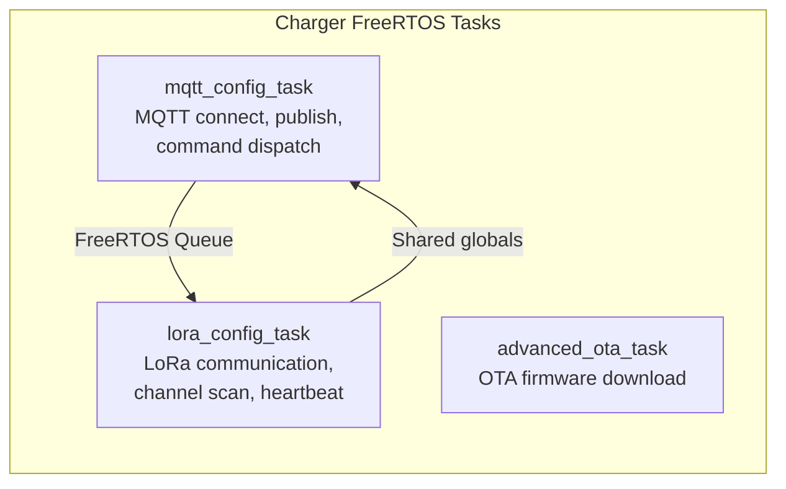
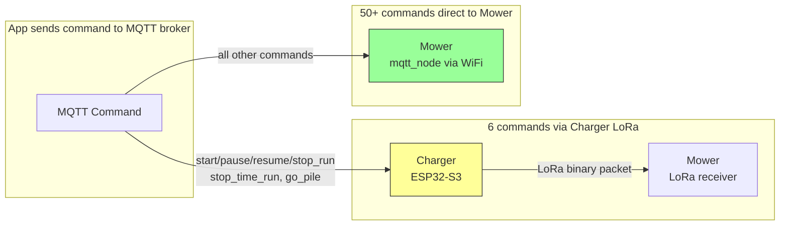

# LoRa ↔ MQTT Command Mapping

Complete mapping between MQTT JSON commands and binary LoRa packets.

## Commands Relayed via LoRa

These commands arrive via MQTT on the charger and are translated to LoRa binary packets for the mower:

| MQTT Command | LoRa Queue | LoRa Payload | Description |
|---|---|---|---|
| `start_run` | `0x20` | `[0x35, 0x01, mapName, area, cutterHeight]` | Start mowing (5 bytes) |
| `pause_run` | `0x21` | `[0x35, 0x03]` | Pause mowing |
| `resume_run` | `0x22` | `[0x35, 0x05]` | Resume mowing |
| `stop_run` | `0x23` | `[0x35, 0x07]` | Stop mowing |
| `stop_time_run` | `0x24` | `[0x35, 0x09]` | Stop scheduled task |
| `go_pile` | `0x25` | `[0x35, 0x0B]` | Go to charging station |

Each command is sent via a FreeRTOS queue to the LoRa task, which waits max 3 seconds for an ACK from the mower.

## Commands Handled Locally (No LoRa)

These commands are handled entirely by the charger firmware, without LoRa relay:

| MQTT Command | Charger Action |
|---|---|
| `get_lora_info` | Read LoRa config from NVS, respond with addr/channel/hc/lc |
| `ota_version_info` | Read firmware version, respond directly |
| `ota_upgrade_cmd` | Start OTA download from URL (esp_https_ota) |

## Status Report Flow

```mermaid
graph TB
    subgraph "LoRa → MQTT Translation"
        L1[LoRa: 0x34 REPORT<br/>19 bytes from mower]
        L2[Parse uint32/uint24<br/>little-endian fields]
        L3[Build JSON:<br/>mower_status, mower_x/y/z,<br/>mower_info, mower_info1]
        L4[MQTT publish:<br/>up_status_info]

        L1 --> L2 --> L3 --> L4
    end

    subgraph "MQTT → LoRa Translation"
        M1[MQTT: start_run<br/>{mapName, cutGrassHeight}]
        M2[Extract parameters]
        M3[Build LoRa packet:<br/>[0x35, 0x01, map, area, height]]
        M4[FreeRTOS queue → LoRa task]
        M5[LoRa TX + wait ACK]

        M1 --> M2 --> M3 --> M4 --> M5
    end
```

## FreeRTOS Task Architecture



## Command Routing: Charger LoRa vs Mower Direct MQTT

!!! important "Key finding from firmware analysis"
    The charger firmware **only relays 6 MQTT commands** via LoRa. All other commands (30+) are handled **directly by the mower's own MQTT connection** (`mqtt_node`), bypassing the charger entirely.

### Commands Relayed by Charger (via LoRa) — only 6

These are the **only** commands the charger firmware processes from MQTT:

| MQTT Command | LoRa Queue | Response Generated By |
|---|---|---|
| `start_run` | `0x20` | Charger (after LoRa ACK) |
| `pause_run` | `0x21` | Charger |
| `resume_run` | `0x22` | Charger |
| `stop_run` | `0x23` | Charger |
| `stop_time_run` | `0x24` | Charger |
| `go_pile` | `0x25` | Charger |

### Commands Handled Locally by Charger (no LoRa) — 3

| MQTT Command | Response Generated By |
|---|---|
| `get_lora_info` | Charger |
| `ota_version_info` | Charger |
| `ota_upgrade_cmd` | Charger |

### Commands Handled Directly by Mower (`mqtt_node`) — 50+

All remaining commands go directly to the mower via WiFi MQTT. The charger does NOT see these:

| Category | Commands |
|----------|----------|
| **Mapping** | `start_scan_map`, `stop_scan_map`, `add_scan_map`, `save_map`, `delete_map`, `reset_map`, `rename_map`, `get_map_list`, `get_map_outline`, `get_map_info`, `get_map_plan_path`, `get_mapping_path2d`, `request_map_ids`, `start_assistant_build_map`, `start_erase_map`, `stop_erase_map`, `quit_mapping_mode`, `area_set`, `update_virtual_wall` |
| **Navigation** | `start_navigation`, `stop_navigation`, `pause_navigation`, `resume_navigation`, `navigate_to_position`, `start_time_navigation`, `stop_time_navigation`, `set_navigation_max_speed` |
| **Patrol** | `start_patrol`, `stop_patrol` |
| **Charging** | `go_to_charge`, `stop_to_charge`, `auto_recharge`, `auto_charge_threshold`, `get_recharge_pos`, `save_recharge_pos` |
| **Manual control** | `start_move`, `stop_move` |
| **Coverage preview** | `get_preview_cover_path`, `generate_preview_cover_path` |
| **Parameters** | `get_para_info`, `set_para_info`, `dev_pin_info` |
| **Timer** | `timer_task`, `timer_task_active`, `timer_task_stop` |
| **Diagnostics** | `get_current_pose`, `get_vel_odom`, `get_log_info`, `get_version_info`, `get_dev_info`, `get_wifi_rssi`, `gbf`, `mst` |
| **Control mode** | `set_control_mode`, `get_control_mode` |
| **System** | `reset_factory`, `reset_utm_origin_info`, `wifi_ble_active` |
| **Config (BLE only)** | `set_lora_info`, `set_mqtt_info`, `set_wifi_info` (BLE provisioning only; `mqtt_node` does NOT handle these at runtime) |
| **Config (MQTT)** | `get_cfg_info`, `set_cfg_info` |

!!! note "Stock vs custom firmware"
    The command list above reflects stock firmware plus the customs in use as of 2026-05 (e.g. custom firmware adds `start_edge_cut`). Vanilla stock builds may expose fewer commands.


