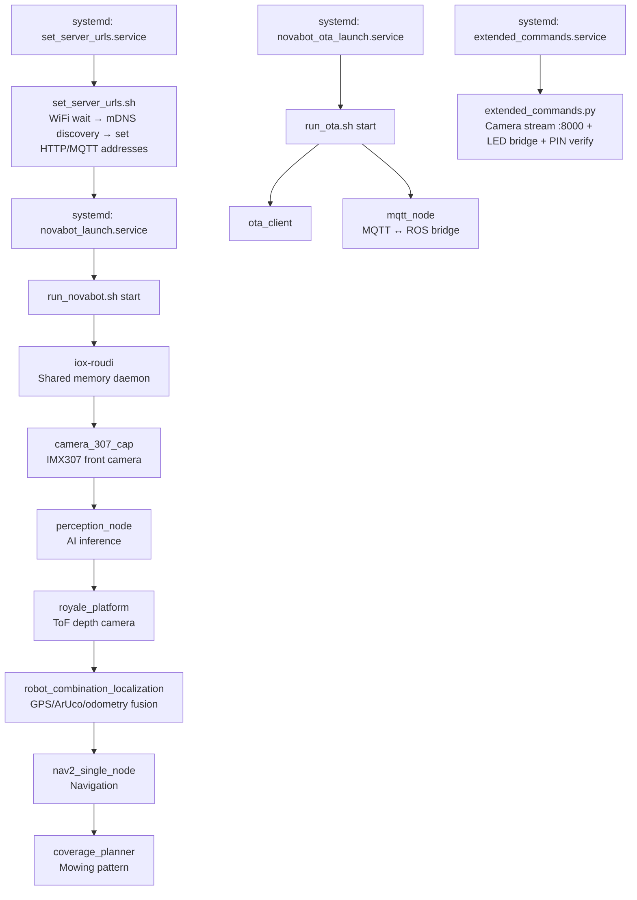

# Mower Firmware (Horizon X3)

## Overview

| Property | Value |
|----------|-------|
| SoC | Horizon Robotics X3 (Sunrise X3) — ARM Cortex-A53 quad-core |
| AI | BPU (Brain Processing Unit) — dedicated DNN accelerator |
| OS | Ubuntu/Debian ARM64, ROS 2 Galactic |
| Firmware | v6.0.2-custom-NN (currently v6.0.2-custom-24, Debian package, 35MB, 7570 files) |
| MCU (motor board) | STM32F407 (v3.6.0 stock). Custom STM32 patches (v3.6.10-v3.6.12) are not deployed; they broke blade calibration. |

The mower runs a full Linux system with ROS 2 — fundamentally different from the charger (ESP32-S3 microcontroller).

## System Startup Sequence



## Key ROS 2 Packages

### Perception & Camera

| Package | Description |
|---------|-------------|
| `perception_node` | AI perception: obstacle detection + segmentation (2.6MB binary) |
| `camera_307_cap` | IMX307 front camera driver (MIPI, GDC undistortion) |
| `royale_platform_driver` | PMD ToF depth camera driver |
| `horizon_wrapper` | Horizon BPU DNN inference wrapper |
| `take_picture_manager` | Photo capture manager |

### Navigation (Nav2 Stack)

| Package | Description |
|---------|-------------|
| `nav2_single_node_navigator` | Main navigator |
| `nav2_controller` | Path-following controller |
| `nav2_costmap_2d` | Costmap with obstacle layers |
| `nav2_navfn_planner` | A* global planner |
| `nav2_theta_star_planner` | Theta* planner |
| `nav2_smac_planner` | State lattice planner |
| `nav2_dwb_controller` | Dynamic Window controller |
| `nav2_regulated_pure_pursuit_controller` | Pure Pursuit controller |
| `teb_local_planner` | Timed Elastic Band local planner |

### Core Functionality

| Package | Description |
|---------|-------------|
| `novabot_api` (`mqtt_node`) | MQTT ↔ ROS 2 bridge (6.3MB binary) |
| `novabot_mapping` | Map building and management |
| `coverage_planner` | Mowing pattern generation |
| `compound_decision` | Decision logic (autonomous tasks) |
| `chassis_control` | Wheel drive, motors |
| `robot_combination_localization` | GPS + ArUco + odometry fusion |
| `aruco_localization` | ArUco marker localization (charger QR code) |
| `automatic_recharge` | Auto-return to charger |
| `daemon_process` | System daemon (watchdog) |
| `ota_client` | OTA firmware update client |

## mqtt_node — The MQTT ↔ ROS Bridge

The `mqtt_node` binary (6.3MB, NOT stripped) is the central hub:

- Receives MQTT commands from the broker
- Translates JSON to ROS 2 service calls
- Receives ROS 2 topic data
- Publishes AES-encrypted status reports to MQTT
- Handles HTTP uploads to server (map ZIP, tracks, work records)

### MQTT → ROS Service Mapping

| MQTT Command | ROS Service | Service Type |
|---|---|---|
| `start_scan_map` | `/robot_decision/start_mapping` | — |
| `stop_scan_map` | `/robot_decision/map_stop_record` | — |
| `save_map` | `/robot_decision/save_map` | `SaveMap.srv` |
| `delete_map` | `/robot_decision/delete_map` | `DeleteMap.srv` |
| `start_run` | `/robot_decision/start_cov_task` | `StartCoverageTask.srv` |
| `stop_run` | `/robot_decision/stop_task` | — |
| `go_to_charge` | `/robot_decision/nav_to_recharge` | — |
| `stop_to_charge` | `/robot_decision/cancel_recharge` | — |
| `auto_recharge` | `/robot_decision/auto_recharge` | — |
| `start_assistant_build_map` | `/robot_decision/start_assistant_mapping` | — |
| `reset_map` | `/robot_decision/reset_mapping` | — |
| `start_erase_map` | `/robot_decision/start_erase` | — |
| `save_recharge_pos` | `/robot_decision/save_charging_pose` | — |
| `generate_preview_cover_path` | `/robot_decision/generate_preview_cover_path` | `GenerateCoveragePath.srv` |
| `quit_mapping_mode` | `/robot_decision/quit_mapping_mode` | — |
| `area_set` | `/robot_decision/add_area` | — |

## ROS Service Definitions (.srv)

### StartCoverageTask.srv

```
uint8 NORMAL=0              # Normal map mowing mode
uint8 SPECIFIED_AREA=1      # Specified polygon area mowing
uint8 BOUNDARY_COV=2        # Boundary/edge mowing mode
uint8 INFO_CLOSE=1
uint8 INFO_BUZZER=2
uint8 INFO_LED=3
uint8 INFO_BUZZER_LED=4

uint8 cov_mode              # Mowing mode (0/1/2)
uint8 request_type           # Source: 11=app, 12=schedule, 21=MCU, 22=MCU schedule
uint32 map_ids               # Map ID (priority over map_names when > 0)
string[] map_names           # Specified map names
geometry_msgs/Point[] polygon_area  # GPS polygon (for SPECIFIED_AREA)
uint8[] blade_heights        # Cutting heights (0-7, height = (level+2)*10 mm)
bool specify_direction
uint8 cov_direction          # Main direction 0-180°
uint8 light                  # LED brightness
bool specify_perception_level
uint8 perception_level       # 0=off, 1=detection, 2=segmentation, 3=high sensitivity
uint8 blade_info_level       # 0=default, 1=all off, 2=buzzer, 3=LED, 4=all on
bool night_light             # Allow night LED
bool enable_loc_weak_mapping # Allow mapping with weak localization
bool enable_loc_weak_working # Allow mowing with weak localization
---
bool result
```

### SaveMap.srv

```
string mapname
float32 resolution
int64 type
---
string data
uint8 result
uint8 error_code
uint8 OVERLAPING_OTHER_MAP=1
uint8 OVERLAPING_OTHER_UNICOM=2
uint8 CROSS_MULTI_MAPS=3
```

### DeleteMap.srv

```
uint8 maptype
string mapname
---
uint8 result
string description
```

### StartMap.srv

```
string model
string mapname
uint8 type
---
string data
uint8 result
```

### GenerateCoveragePath.srv

```
uint32 map_ids
bool specify_direction
uint8 cov_direction     # 0-180°
---
bool result
```

### Charging.srv

```
string name
float32 pose_x
float32 pose_y
float32 pose_theta
string mode
---
uint8 result
string description
```

### Unicom.srv

```
string start_map
---
uint8 result
string description
```

### SaveUtmOriginInfo.srv / LoadUtmOriginInfo.srv

```
string utm_info_path   # UTM origin info file path
---
string msg
bool result            # true = ok, false = not ok
```

### Common.srv

```
string data
---
string data
uint8 result
```

## ROS Message Definitions (.msg)

### RobotStatus.msg

The main status message published by the mower's decision system.

```
# merged_work_status enum
uint8 FREE=0
uint8 COVER=1
uint8 RECHARING=2
uint8 MAPPING=3
uint8 CHARGING=4
uint8 STOP=5

builtin_interfaces/Time stamp
uint8 task_mode               # cover/mapping/patrol/control/other
uint8 work_status             # detail mode within task_mode
uint8 recharge_status
uint8 error_status
uint8 prev_work_status
uint8 prev_recharge_status
uint8 prev_task_mode
uint8 merged_work_status      # simplified status for app/MQTT/chassis
string msg
string error_msg

# Coverage data
uint32 request_map_ids
uint32 current_map_ids
float32 cov_ratio
float32 cov_area
float32 cov_remaining_area
float32 cov_estimate_time
float32 cov_work_time
float32 valid_cov_work_time   # Effective mowing work time
float32 avoiding_obstacle_time
float32 pause_time
string cov_map_path
uint8 target_height
decision_msgs/CovTaskInfo[] cov_infos
uint8 map_num
uint8 finished_num
builtin_interfaces/Time start_time
builtin_interfaces/Time end_time

# System info
uint8 light
uint8 perception_level
uint8 battery_power
uint8 cpu_usage
uint32 memory_remaining       # MB
uint8 cpu_temperature
uint32 disk_remaining         # MB
uint8 loc_quality             # 0-100
uint32 working_time           # Software runtime (minutes)
float32 x
float32 y
float32 theta
```

### CovTaskInfo.msg

Per-task coverage information (nested in `RobotStatus.msg`).

```
builtin_interfaces/Time start_time
builtin_interfaces/Time end_time
uint8 request_type            # Start source
float32 cov_ratio
float32 cov_area
float32 cov_work_time         # minutes
float32 valid_cov_work_time   # effective mowing minutes
float32 avoiding_obstacle_time
float32 pause_time
string cov_map_path
uint8 target_height
uint8 work_status             # 9=complete, 2=CANCELLED, 1=failed
uint8 error_status
```

### CovTaskResult.msg

Coverage task result (sent on task completion).

```
builtin_interfaces/Time start_time
builtin_interfaces/Time end_time
uint8 map_num
uint8 finished_num
uint8 work_status             # 9=complete, 2=CANCELLED, 1=failed
uint8 error_status
uint32 map_ids
float32 area                  # Mowing area (m²)
uint8 target_height           # 0-7, actual = (level+2)*10 mm
uint8 request_type            # 11=app normal, 12=scheduled, etc.
```

## Network Services

| Service | Status | Details |
|---------|--------|---------|
| SSH/SSHD | **Available** | Custom firmware installs openssh-server at first boot |
| Telnet | **Not installed** | — |
| VNC | **Removed** | `apt purge -y x11vnc` in startup |
| HTTP server | **Not present** | No web server |
| Camera Stream | **Port 8000** | MJPEG stream via Python ROS2 node (custom firmware) |
| ROS 2 | **Localhost only** | `ROS_LOCALHOST_ONLY=1` |

!!! info "Remote access via custom firmware"
    Stock firmware has no SSH — it must be installed via UART or HDMI+USB console first.
    Custom firmware (v6.0.2-custom-NN, currently custom-24) installs openssh-server automatically at first boot and
    enables an MJPEG camera stream on port 8000.

## Coordinate System

The mower uses **UTM projection** for GPS ↔ local coordinate conversion:

```
GPS (WGS84) → UTM → Local frame (relative to charging station)
```

- UTM zone determined by longitude
- Origin saved/loaded via `SaveUtmOriginInfo` / `LoadUtmOriginInfo` ROS services
- Log: `"Setting utm origin: zone: %d utm_x: %.3f utm_y:%.3f longitude: %.7f latitude: %.7f"`

## DDS Middleware

| Property | Value |
|----------|-------|
| DDS | CycloneDDS + iceoryx |
| IPC | Zero-copy shared memory |
| Sub-queue | 128 messages capacity |
| History | 16 samples |
| Alternative | FastRTPS with `shm_fastdds.xml` |

## STM32 Motor Controller (MCU)

The motor controller board uses an STM32F407 microcontroller, communicating with the ARM system via internal serial (UART).

### Serial Protocol

| Property | Value |
|----------|-------|
| Frame header | `02 02 07 FF` |
| Frame footer | `03 03` |
| CRC | CRC-8 (poly=0x07, init=0x00) over CMD+payload |
| Baudrate | Unknown (internal connection) |

Frame format: `[02 02] [07 FF] [LEN] [CMD PAYLOAD... CRC8] [03 03]`

### Key Commands

| CMD | Type | Function |
|-----|------|----------|
| `0x20` | Periodic (~10Hz) | Error/incident report. Data byte at offset reflects `error_byte` from `check_pin_lock()` |
| `0x23` type=0 | Request | Query PIN state |
| `0x23` type=1 | Request | Set new PIN (4 ASCII digits, 0x30-0x39) |
| `0x23` type=2 | Request | Verify PIN (4 ASCII digits) → response status: 0=success |

!!! warning "PIN digits must be ASCII"
    PIN digits MUST be ASCII characters (`0x30`-`0x39`), NOT raw values (`0x00`-`0x09`).

### Firmware Flashing

The STM32 firmware is flashed automatically by `chassis_control_node`:

1. Firmware binaries are placed in `/root/novabot/install/chassis_control/share/chassis_control/MCU_BIN/`
2. `chassis_control_node` reads the version from the **filename** (not from the binary)
3. At boot, it compares the filename version with the current STM32 version
4. If the file version is higher → automatic flash via internal serial
5. After flashing: mower reboots, new version confirmed via `chassis_board_version` in status reports

Filename format: `novabot_stm32f407_v{X}_{Y}_{Z}_NewMotor25082301.bin`

### PIN Lock System (error_status=151)

!!! note "Historical / not active in production"
    Stock STM32 v3.6.0 is currently deployed on production mowers. The v3.6.x custom PIN-lock patches below are historical and not active. They are retained here for reference and for users who choose to re-enable them.

The PIN lock error (151) involves three layers:

| Layer | Component | Issue | Fix |
|-------|-----------|-------|-----|
| 1 | STM32 `check_pin_lock()` | Sets error_byte when battery ≥19V, counter >200 ticks | v3.6.5: lock_state=0xFF bypass |
| 2 | `chassis_control_node` | Sets `error_no_pin_code` flag, only clears on action result status=0 | v3.6.6: verify returns status=0 |
| 3 | `mqtt_node` action client | ChassisPinCodeSet action client never finds server (21s timeout) | Workaround: Python ROS2 client |

Historical fix (v3.6.6, not deployed): STM32 returns status=0 for verify success → chassis_control_node calls `set_pincode_flag(false)` → error_no_pin_code cleared at boot.

### ROS2 ChassisPinCodeSet Action

| Property | Value |
|----------|-------|
| Action name | `chassis_pin_code_set` |
| Server | `chassis_control_node` |
| Client (broken) | `mqtt_node` C++ — always times out (21s) |
| Client (working) | Python via `pin_verify_ros2.py` — finds server in <1s |
| Goal | `type` (uint8: 1=set, 2=verify), `code` (string: 4 digits) |
| Result | `status` (uint8: 0=success), `code` (string) |
