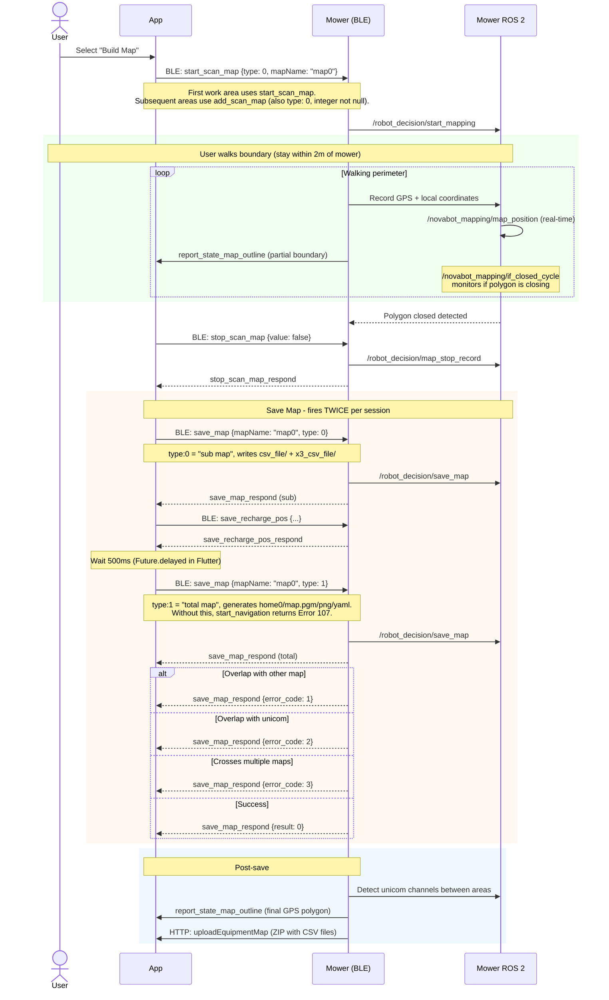
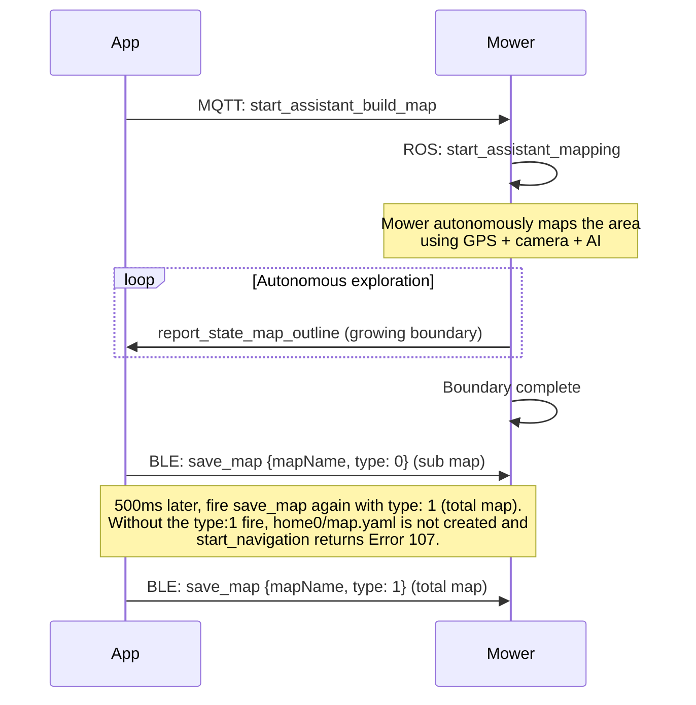

# Flow: Map Building

## Manual Mapping (Walk the Boundary)

!!! info "BLE-direct, not via charger MQTT"
    Mapping commands flow App <-> Mower over BLE (GATT). The charger is NOT in the loop for mapping. The mower may also report status over MQTT in parallel, but the mapping control plane is BLE.



### Obstacle Flow

Obstacles use a separate BLE flow within the same mapping session:

- `add_scan_map` with `type: 1` (NOT type:2) and `mapName` set to the literal string `"map"` (NOT the active map name).
- Firmware derives the parent work map from the active context and auto-indexes obstacle CSVs: `map0_0_obstacle.csv`, `map0_1_obstacle.csv`, and so on.
- Stop with `stop_scan_map {value: false}`.
- Save sequence mirrors work maps: `save_map type:0` (sub) -> 3s delay -> `save_map type:1` (total).
- See `CLAUDE.md` "BLE Mapping - OBSTACLE flow" for the full live capture.

## Automatic Mapping



## Map File Structure

```mermaid
graph TB
    subgraph "Mower filesystem: /userdata/lfi/maps/home0/"
        subgraph "csv_file/  AND  x3_csv_file/  (always loose CSVs in BOTH, never zip)"
            MI[map_info.json]
            M0W[map0_work.csv]
            M0O[map0_0_obstacle.csv]
            M0U[map0tocharge_unicom.csv]
            M1W[map1_work.csv]
        end
        MY[map.yaml / map.pgm / map.png  (created only by save_map type:1)]
    end

    subgraph "map_info.json"
        CP[charging_pose:<br/>orientation: 1.326<br/>x: -0.048, y: -0.180]
        S0[map0_work.csv: map_size: 149.28]
        S1[map1_work.csv: map_size: 26.62]
    end

    MI --> CP
    MI --> S0
    MI --> S1
```

## Map Types

| Type | File Pattern | Description | Limits |
|------|-------------|-------------|--------|
| Work area | `map{N}_work.csv` | Lawn to be mowed | Max 3 |
| Obstacle | `map{N}_{M}_obstacle.csv` | Areas to avoid | Min 1m from boundary |
| Channel | `map{N}to{target}_unicom.csv` | Narrow passages | Min 1m wide, max 10m straight |

## Three Map Sync Options

```mermaid
graph TB
    subgraph "Option 1: SPECIFIED_AREA (no physical mapping needed)"
        A1[Dashboard: Draw polygon on satellite photo]
        A2[start_run with polygon_area + cov_mode=1]
        A3[Mower mows within GPS polygon]
        A1 --> A2 --> A3
    end

    subgraph "Option 2: Direct CSV Upload (requires SSH)"
        B1[Dashboard: Export ZIP via mapConverter.ts]
        B2[SCP loose CSVs to BOTH csv_file/ AND x3_csv_file/<br/>under /userdata/lfi/maps/home0/]
        B3[Maps persisted on mower]
        B1 --> B2 --> B3
    end

    subgraph "Option 3: Physical Mapping"
        C1[Walk boundary with mower]
        C2[save_map via MQTT]
        C3[Mower writes CSV + uploads ZIP to server]
        C1 --> C2 --> C3
    end

    style A1 fill:#9f9,stroke:#333
    style B1 fill:#ff9,stroke:#333
    style C1 fill:#f99,stroke:#333
```


