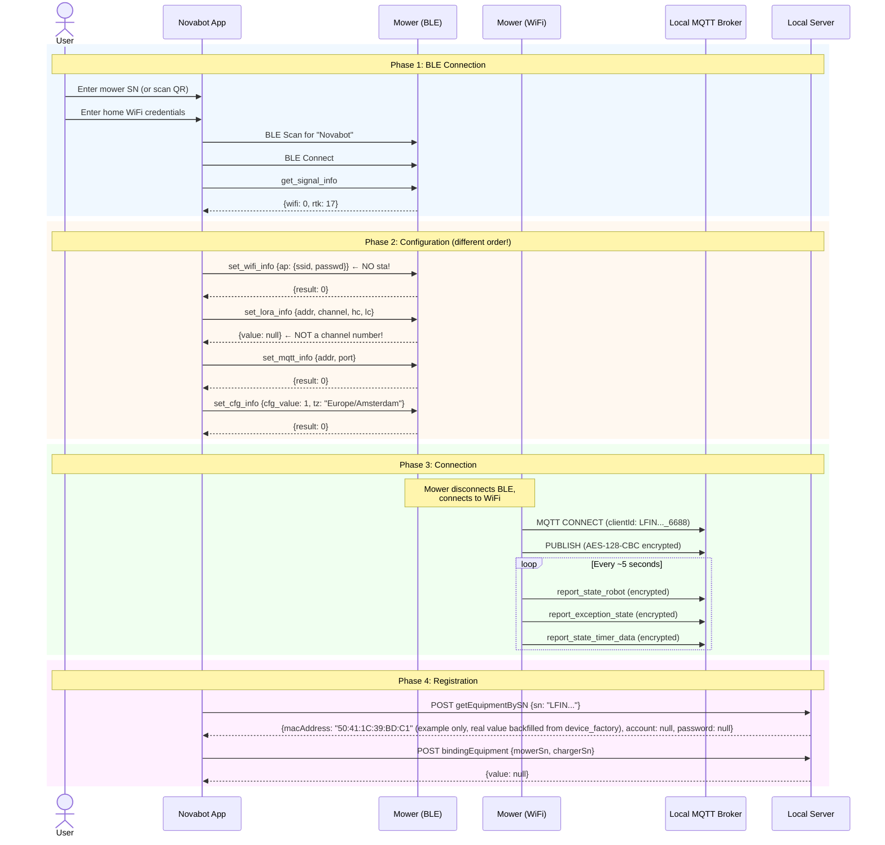

# Flow: Mower Provisioning

Complete flow for adding a mower to the system.

## Key Differences from Charger

| Aspect | Charger | Mower |
|--------|---------|-------|
| WiFi config | `sta` + `ap` | **Only `ap`** |
| RTK config | `set_rtk_info` sent | **Not sent** |
| Config commit | `set_cfg_info: 1` | `set_cfg_info: {cfg_value: 1, tz: "..."}` |
| LoRa response | Channel number | `null` |
| MQTT messages | Plain JSON | AES-128-CBC encrypted |
| Cloud credentials | `account`/`password` present | `null`/`null` |
