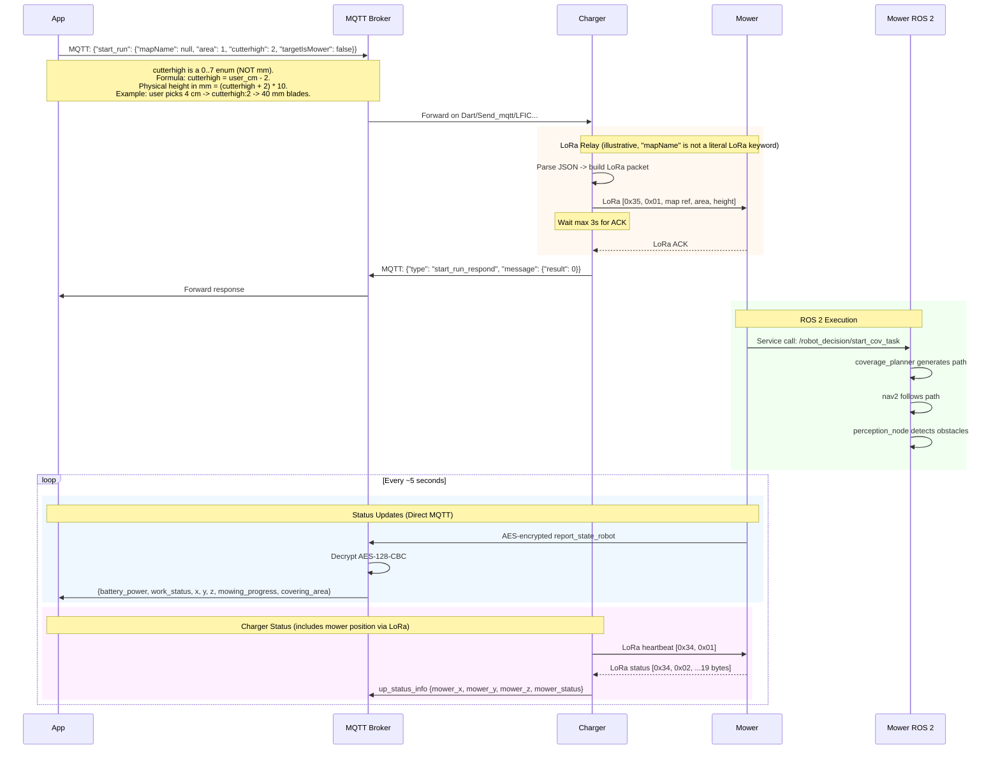
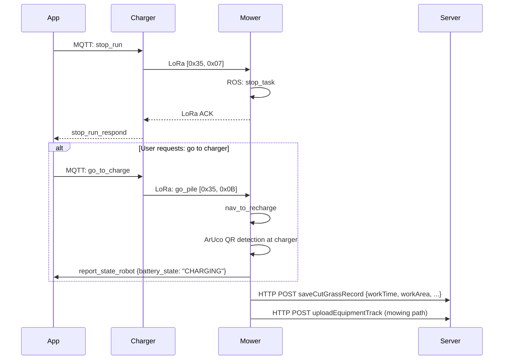
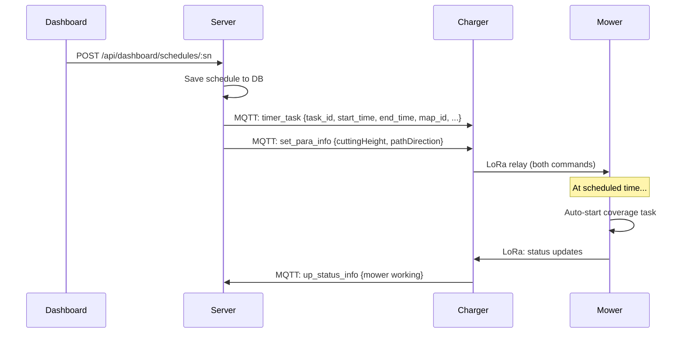
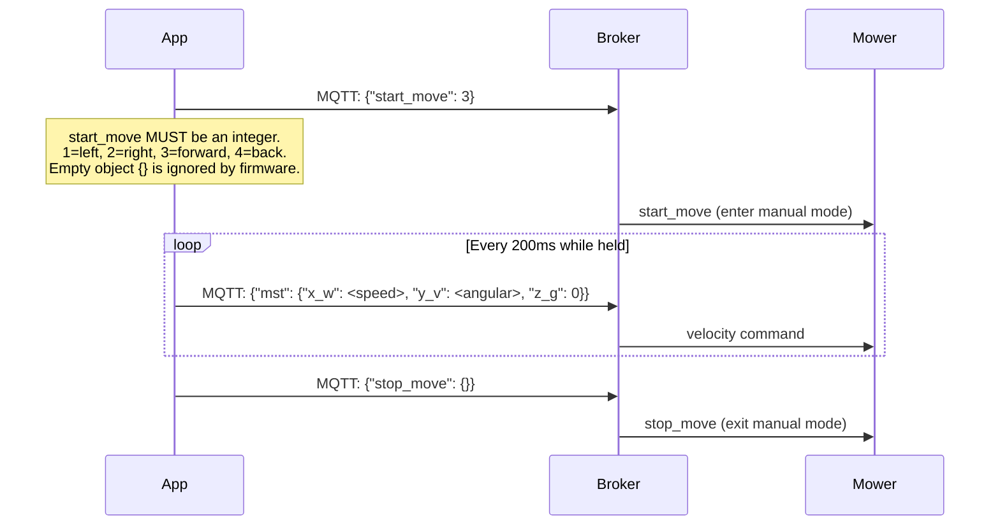
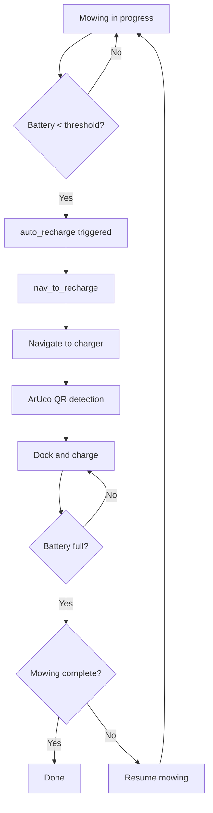

# Flow: Mowing Session

Complete flow from starting a mow to completion.

## Start Mowing (App-Initiated)

## Stop Mowing

## Scheduled Mowing

## Manual Control (Joystick)

Manual joystick control bypasses path planning and drives the wheels directly via MQTT.

## Low Battery Return

