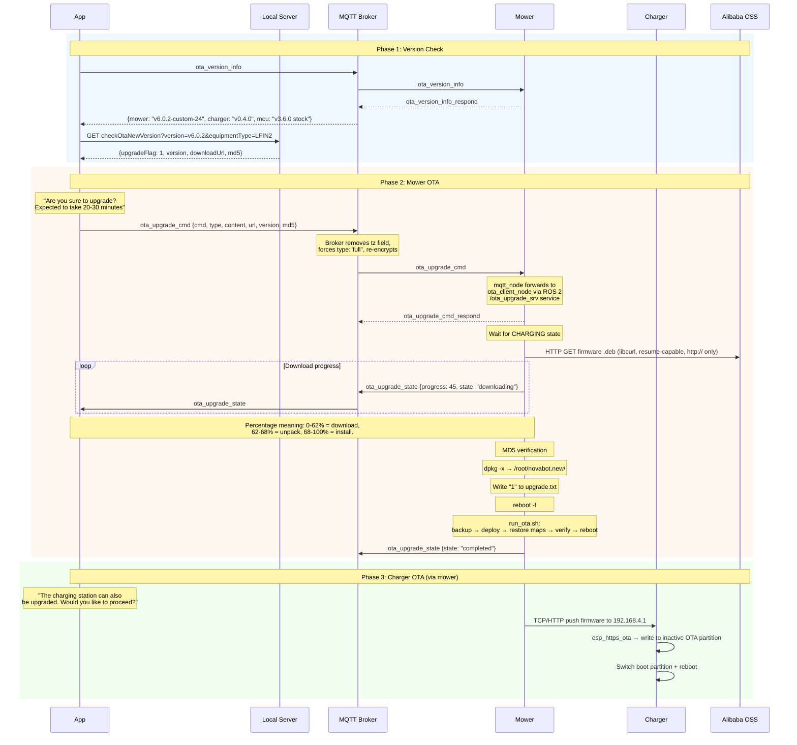
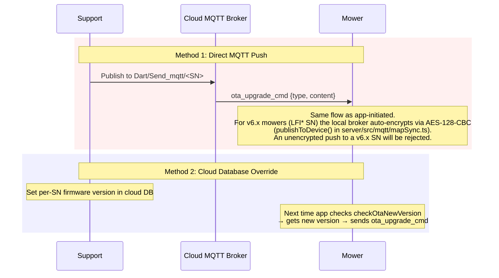
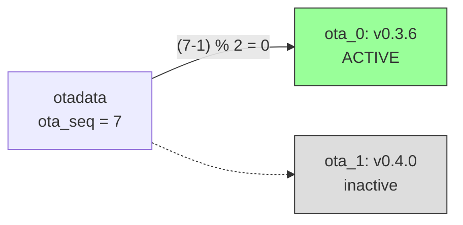

# Flow: OTA Firmware Update

## Overview

The OTA update system supports both **app-initiated** updates (user checks for updates) and **remote push** updates (support sends firmware directly via MQTT). The mower has a production-grade OTA pipeline with resume-capable downloads, MD5 verification, atomic replacement, and automatic rollback.

## App-Initiated Update Flow



## Remote Push (Support-Initiated)

Support can push firmware to a specific device **without user interaction** via two mechanisms:



!!! warning "No authentication on OTA commands"
    Any MQTT message on `Dart/Send_mqtt/<SN>` with `ota_upgrade_cmd` triggers a firmware download. There is no verification of the sender's identity.

---

## `ota_upgrade_cmd` JSON Format

!!! danger "CRITICAL — Exact payload format (proven working March 2026)"
    The payload below is the **only format** that works. Any deviation (wrong field names, missing fields, extra fields like `tz`) will cause the update to fail silently.

```json title="Full firmware upgrade (CORRECT format)"
{
  "ota_upgrade_cmd": {
    "cmd": "upgrade",
    "type": "full",
    "content": "app",
    "url": "http://<server>:<port>/api/dashboard/firmware/<filename>.deb",
    "version": "v6.0.2-custom-24",
    "md5": "<md5-checksum>"
  }
}
```

### Required Fields

| Field | Value | Required | Notes |
|-------|-------|----------|-------|
| `cmd` | `"upgrade"` | **Yes** | Without this, `mqtt_node` ignores the command entirely |
| `type` | `"full"` | **Yes** | `"increment"` does NOT trigger download |
| `content` | `"app"` | **Yes** | Must be the **string** `"app"`, NOT an object. Without this, `mqtt_node` ignores the command |
| `url` | `"http://..."` | **Yes** | Must be `http://` — mower does NOT support HTTPS for OTA downloads |
| `version` | version string | **Yes** | Version of the firmware being installed |
| `md5` | MD5 hash | **Yes** | Mower verifies checksum before installing |

!!! warning "NO `tz` field — Broker-level fix required"
    The Novabot app always includes `tz:"Europe/Amsterdam"` in `ota_upgrade_cmd`. When `mqtt_node` sees a `tz` field, it:

    1. Writes the timezone to `/userdata/ota/novabot_timezone.txt`
    2. **Overwrites `type` with `"increment"`** — breaking the full update!

    The local server's MQTT broker (`authorizePublish` in `broker.ts`) intercepts app→mower messages, removes the `tz` field, forces `type:"full"`, and re-encrypts. **This broker fix must NEVER be removed.**

### Upgrade Types

| Type | Description | Notes |
|------|-------------|-------|
| `full` | Full firmware replacement (.deb package) | **Only type that works for custom firmware** |
| `increment` | Incremental app update | mqtt_node sets this when `tz` field present — causes silent failure |
| `file_update` | Individual file updates (.zip with manifest) | Requires `check.json` manifest inside ZIP |
<!-- PRIVATE -->
| `system` | Full system upgrade via apt | Runs `sudo apt full-upgrade && reboot -f` |

!!! danger "`system` upgrade type"
    The `system` type runs `sudo apt-get update && sudo apt full-upgrade && sleep 2 && reboot -f`. If the mower's apt sources were pointed to a malicious repository, this would allow arbitrary code execution.
<!-- /PRIVATE -->

---

!!! danger "Firmware HTTP server must support Range / 206"
    The mower OTA client downloads firmware with resume-capable libcurl and depends on HTTP Range / 206 Partial Content responses from the server. Do NOT modify the Range handling in the firmware download route - it is the only working method. See `firmware-http-range` in MEMORY.md.

## Mower OTA Architecture

The mower has **two ROS 2 nodes** that handle OTA:

```mermaid
graph LR
    MQTT[MQTT Broker] -->|ota_upgrade_cmd| MN[mqtt_node<br/>6.3MB]
    MN -->|/ota_upgrade_srv<br/>ROS 2 service| OC[ota_client_node<br/>5.8MB]
    OC -->|libcurl HTTPS| OSS[Alibaba OSS]
    OC -->|/ota/upgrade_status<br/>ROS 2 topic| MN
    MN -->|ota_upgrade_state| MQTT
    OC -->|Check| CS[/pipe_charge_status<br/>Charging required]

    style MN fill:#f9f,stroke:#333
    style OC fill:#9ff,stroke:#333
```

### ROS 2 Service: OtaUpgradeSys

```
# Request (mqtt_node → ota_client)
string ota_cmd          # Full JSON string from MQTT command

---

# Response (ota_client → mqtt_node)
bool state              # true = accepted, false = error
string state_out        # Status message
```

### OTA Client Launch Parameters

```yaml
upgrade_srv_name: /ota_upgrade_srv
ota_state_pub: /ota/upgrade_status
charging_state_sub: /pipe_charge_status
ota_data_dir_root: /userdata/ota
download_max_time: 86400          # 24 hours max download time
upgrade_app_subs_maxt: 600        # 10 minutes max per submodule
upgrade_file_enable: True
```

---

## Full Firmware Installation Flow

### Phase 1: Download (ota_client_node)

```
1. Receive ota_upgrade_cmd via /ota_upgrade_srv ROS 2 service
2. Parse JSON: extract type, content.upgradeApp.{version, downloadUrl, md5}
3. Wait for mower to be in CHARGING state
   └─ If not charging: pause download, wait, retry every 60s
4. Download .deb to /userdata/ota/upgrade_pkg/
   └─ libcurl with HTTP (NOT https), resume-capable, max 24h timeout
5. Verify MD5 checksum
   └─ If mismatch: delete package, retry download
6. Extract: dpkg -x <package.deb> /root/novabot.new/
7. Verify extracted files via /root/novabot.new/package_verify.json
8. Copy charger firmware to /userdata/ota/charging_station_pkg/
9. Start submodule upgrades (charger OTA, max 10 min)
10. Copy run_ota.sh to /userdata/ota/run_ota.sh
11. Write "1" to /userdata/ota/upgrade.txt
12. reboot -f
```

### Phase 2: Install (run_ota.sh at boot)

```
1. Check /root/novabot.new exists AND /userdata/ota/upgrade.txt == "1"
2. Backup: mv /root/novabot → /root/novabot.bak
3. Deploy: cp -rfp /root/novabot.new → /root/novabot
4. Restore user data:
   └─ Maps, charging_station config, CSV files from backup
5. Run start_service.sh (install system libraries, services)
6. Optionally replace WiFi driver (bcm/)
7. Verify: /root/novabot/scripts/run_novabot.sh exists and non-empty
   └─ If missing: ROLLBACK (cp /root/novabot.bak → /root/novabot)
8. Write "0" to /userdata/ota/upgrade.txt
9. Clean up: rm -rf /root/novabot.new
10. Final reboot
```

---

## File Update Flow (`type: "file_update"`)

For updating individual files without full firmware replacement:

```
1. Download .zip package to /userdata/ota/download/
2. Verify MD5
3. Extract to /userdata/ota/download/unzip/
4. Parse check.json manifest:
   {
     "upgradeFiles": [
       {"filePath": "source/in/zip", "destPath": "/target/path", "checkWay": "md5"}
     ]
   }
5. For each file: verify, then replace at destPath
6. Report status to cloud
```

---

## Charger OTA

### Via Mower (Relay)

The mower pushes charger firmware to the charger via two methods:

| Method | Target | Protocol |
|--------|--------|----------|
| TCP socket | `192.168.4.1` | Raw TCP, firmware in chunks |
| HTTP POST | `http://192.168.4.1/setotadata` | HTTP multipart |

Firmware source: `/userdata/ota/charging_station_pkg/lfi-charging-station_lora.bin`

### Direct (Charger Own OTA)

The charger can also handle `ota_upgrade_cmd` directly:

1. Receives command via MQTT (handled locally, no LoRa relay)
2. Downloads firmware via `esp_https_ota()` (ESP-IDF library)
3. Writes to **inactive** OTA partition
4. Updates `otadata` to switch boot partition
5. Reboots



---

<!-- PRIVATE -->
## OTA Download URLs

| Device | URL Pattern | Example |
|--------|------------|---------|
| Charger | `https://novabot-oss.oss-accelerate.aliyuncs.com/novabot-file/lfi-charging-station_lora-{timestamp}.bin` | `...-1709264279437.bin` |
| Mower | `https://novabot-oss.oss-us-east-1.aliyuncs.com/novabot-file/lfimvp-{YYYYMMDD}{ver}-{timestamp}.deb` | `...-20240915571-1726376551929.deb` |

!!! note "URL contains unpredictable timestamp"
    The download URL includes a millisecond timestamp, making it impossible to guess. The URL must be obtained from the cloud OTA API or the `ota_upgrade_cmd` message.
<!-- /PRIVATE -->

## Known Firmware Versions

| Device | Version | Size | Notes |
|--------|---------|------|-------|
| Charger | v0.3.6 | 1.4 MB | ESP32-S3, ESP-IDF v4.4.2, plain JSON MQTT |
| Charger | v0.4.0 | 1.4 MB | Adds AES-128-CBC MQTT encryption + `cJSON_IsNull` command validation |
| Mower | v5.7.1 | 35 MB | Debian/ROS 2, Horizon X3 |
| Mower | v6.0.2 | ~35 MB | Stock firmware (baseline for current customs) |
| Mower | v6.0.2-custom-24 | ~35 MB | Current custom build: SSH, mDNS, camera stream, extended commands |
| MCU | v3.6.0 stock | 444 KB | STM32F407 motor controller, currently deployed on production mowers |
| MCU | v3.6.6 (historical) | 444 KB | STM32F407 custom PIN-lock patch, NOT deployed (broke blade calibration) |

## File System Paths

| Path | Description |
|------|-------------|
| `/userdata/ota/upgrade.txt` | Flag: "0"=no update, "1"=pending |
| `/userdata/ota/upgrade_pkg/` | Downloaded .deb packages |
| `/userdata/ota/download/` | Downloaded .zip packages (file_update) |
| `/userdata/ota/run_ota.sh` | OTA startup script (updated during OTA) |
| `/userdata/ota/novabot_timezone.txt` | Timezone from OTA command |
| `/userdata/ota/charging_station_pkg/` | Charger firmware for relay |
| `/userdata/ota/ota_client.log` | OTA operation log |
| `/userdata/lfi/system_version.txt` | Current system version |
| `/root/novabot/` | Active firmware installation |
| `/root/novabot.new/` | Extracted new firmware (pre-reboot) |
| `/root/novabot.bak/` | Backup of previous firmware (rollback) |

## OTA Client Version History

| Version | Date | Developer | Changes |
|---------|------|-----------|---------|
| Pre-V0.0.1 | 2022 | Li Qiang | Initial: download, extract, replace |
| V0.0.1 | 2023/04 | Cai Tao | Weak network download, ROS service API, breakpoint resume |
| V0.0.2 | 2023/05 | Cai Tao | Charge-state pause/resume, progress reporting |
| V0.0.3 | 2023/10 | Cai Tao | MD5 verification, file size verification |
| V0.0.4 | 2024/02 | Cai Tao | File update feature (`file_update` type) |

<!-- PRIVATE -->
## Firmware Patching (Local Server)

A patch tool (`research/patch_firmware.js`) allows modifying hardcoded MQTT hostnames/IPs
in the charger firmware binary so the charger connects to the local server without DNS rewrites.

### Patched Firmware Available

| Version | File | MD5 | Changes |
|---------|------|-----|---------|
| v0.3.6 | `research/firmware/charger_v0.3.6_patched.bin` | `fb7427789bf0e164ed00ef9ea8f9dbf0` | MQTT → `novabot.example.com` |
| v0.4.0 | `research/firmware/charger_v0.4.0_patched.bin` | `538f01c8412a7d9936d1de9c298f8918` | MQTT → `novabot.example.com` |

### Patch Tool Usage

```bash
node research/patch_firmware.js                          # Patch with defaults
node research/patch_firmware.js --analyze                # Analyze only
node research/patch_firmware.js --mqtt-host 192.168.1.50 # Short IP (in-place)
node research/patch_firmware.js --mqtt-host my.server.nl # Long hostname (relocation)
```

The tool handles:

- ESP32-S3 image header parsing
- String relocation to unused DROM space when replacement is longer
- Code reference updates (literal pool pointers)
- SHA256 hash recalculation

### OTA Flash via MQTT

To flash a patched firmware to a charger:

```json title="ota_upgrade_cmd"
{
  "ota_upgrade_cmd": {
    "type": "full",
    "content": {
      "upgradeApp": {
        "version": "v0.3.6-local",
        "downloadUrl": "http://<server>:8080/charger_v0.3.6_patched.bin",
        "md5": "fb7427789bf0e164ed00ef9ea8f9dbf0"
      }
    }
  }
}
```

!!! tip "v0.4.0 encrypted charger"
    For a charger running v0.4.0, commands must be AES-128-CBC encrypted
    and use `null` values: `{"ota_version_info": null}`.
    Use the raw-tcp endpoint: `POST /api/dashboard/raw-tcp/:sn`

!!! warning "Important notes"
    - `esp_https_ota()` may require HTTPS — set up an HTTPS server if HTTP fails
    - NVS config (set via BLE) is NOT affected by OTA — production MQTT host also needs BLE re-provisioning
    - On OTA failure: charger automatically boots from the other OTA partition
    - Recovery via UART: press `b` to manually switch OTA partition
    - **Always test on a spare board first!**
<!-- /PRIVATE -->

---

<!-- PRIVATE -->
## Security Considerations

| Issue | Risk | Details |
|-------|------|---------|
| No authentication on MQTT OTA | **Critical** | Any message on `Dart/Send_mqtt/<SN>` triggers update |
| No code signing | **High** | Only MD5 integrity check, no digital signatures |
| Download URL not validated | **High** | Can point to any server |
| `system` upgrade type | **Critical** | Runs `apt full-upgrade` — malicious apt repo = RCE |
| Charger OTA via HTTP | **Medium** | HTTP POST to `192.168.4.1`, no TLS |
| No rollback verification | **Low** | Rollback only checks if run_novabot.sh exists |
<!-- /PRIVATE -->
