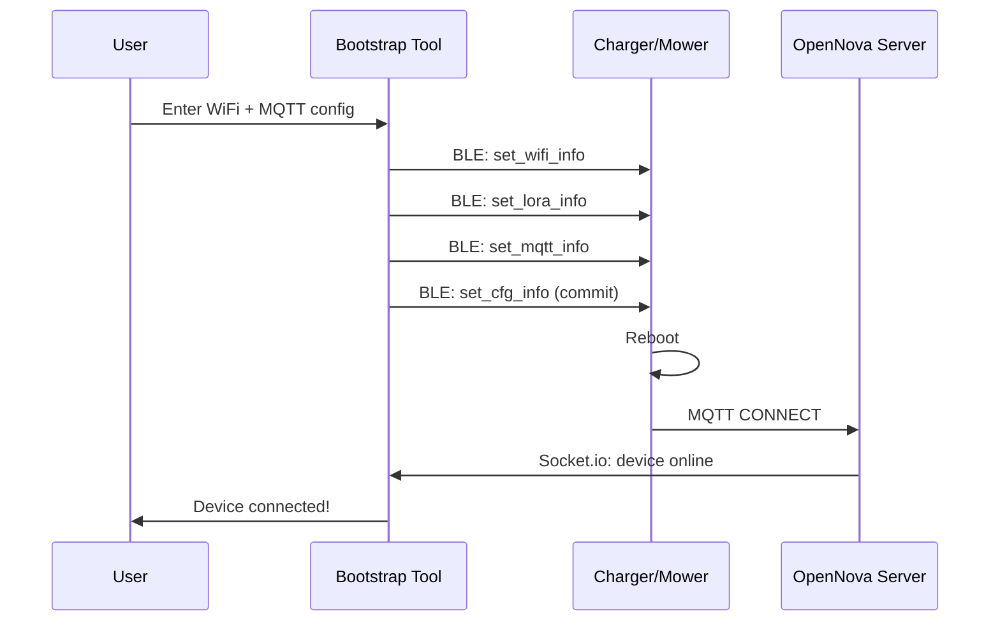

# Bootstrap Tool Guide

The Bootstrap Tool is a standalone desktop application that provisions Novabot chargers and mowers via Bluetooth Low Energy (BLE). It configures WiFi, MQTT, and LoRa settings so devices connect to your local OpenNova server.

## When to Use

| Scenario | Use Bootstrap Tool | Use OpenNova App |
|----------|-------------------|-----------------|
| First-time device setup | Yes | Yes |
| No mobile device available | **Yes** | No |
| Re-provision after WiFi change | Yes | Yes |
| Flash custom firmware (OTA) | Yes | Use ESP32 Tool |
| Multiple devices at once | **Yes** (parallel) | One at a time |

## Download

Pre-built binaries are available in `bootstrap/dist/`:

| Platform | File |
|----------|------|
| macOS (Apple Silicon) | `novabot-bootstrap-macos-arm64` |
| macOS (Intel) | `novabot-bootstrap-macos-x64` |
| Windows | `novabot-bootstrap-win-x64.exe` |

!!! important "Native BLE prebuilds"
    The `prebuilds/` folder must be in the **same directory** as the executable. Without it, BLE scanning won't work.

### Build from Source

```bash
cd bootstrap
bash build.sh
```

Output in `dist/binaries/`.

## First Launch

### 1. Start the Bootstrap Tool

```bash
# macOS
./novabot-bootstrap-macos-arm64

# Windows
novabot-bootstrap-win-x64.exe
```

The tool starts a local web server and opens a wizard in your browser at **http://localhost:7789**.

It also starts its own MQTT broker on port 1883 (for initial device communication) and advertises `opennovabot.local` via mDNS.

!!! warning "Port 1883 conflict"
    The bootstrap tool and the OpenNova server both bind port 1883. They cannot run on the same host at the same time. Stop the OpenNova container (or run the bootstrap tool from a different machine) before provisioning.

### 2. Network Configuration

On the first screen, enter:

- **Home WiFi SSID** — your 2.4 GHz network name
- **Home WiFi Password**
- **MQTT Server Address** — your OpenNova server IP (e.g., `192.168.0.100`)
- **MQTT Port** — usually `1883`

!!! warning "2.4 GHz only"
    Both the charger (ESP32) and mower (Horizon X3) only support **2.4 GHz WiFi**. 5 GHz networks are not visible to the devices.

### 3. Firmware Detection

The tool automatically detects whether the mower runs **stock** or **custom** firmware:

- **Stock firmware**: MQTT address is forced to `mqtt.lfibot.com` (firmware whitelist)
- **Custom firmware**: Any MQTT address is accepted

This is detected by querying the mower's firmware version via MQTT after it connects.

## Provisioning Flow

### Step 1: Provision Charger

1. Power on the charger
2. The tool scans for BLE devices named `CHARGER_PILE`
3. Select your charger from the list
4. The tool sends via BLE:
   - `set_wifi_info` — WiFi credentials
   - `set_rtk_info` — RTK GPS config
   - `set_lora_info` — LoRa address + channel
   - `set_mqtt_info` — MQTT broker address
   - `set_cfg_info` — Commit configuration

The charger reboots and connects to your WiFi + MQTT broker.

### Step 2: Provision Mower

1. Power on the mower (hold power button 3 seconds)
2. The tool scans for BLE devices named `Novabot` or `novabot`
3. Select your mower
4. The tool sends the same BLE command sequence

!!! note "Stock firmware limitation"
    Stock firmware only accepts `mqtt.lfibot.com` as MQTT address. The tool handles this automatically — it provisions with `mqtt.lfibot.com` and your DNS redirect resolves it to your server.

### Step 3: Verify Connection

After provisioning, both devices should appear in the dashboard:

- **Charger**: orange lightning icon, shows GPS satellites + LoRa status
- **Mower**: green construct icon, shows battery + localization quality

## LoRa Pairing

The charger and mower communicate via LoRa radio for GPS/RTK data. They must share **identical address AND identical channel**:

| Device | Address | Channel |
|--------|---------|---------|
| Charger | 718 | 16 |
| Mower | 718 | 16 |

For multiple mower+charger sets, each set gets a unique address (channel stays the same within the set):

| Set | Address | Channel |
|-----|---------|---------|
| Set 1 | 718 | 16 |
| Set 2 | 719 | 16 |
| Set 3 | 720 | 16 |

The Bootstrap Tool assigns addresses automatically.

!!! warning "Mismatched pair symptoms"
    If charger and mower end up on different addresses or different channels, the mower reports **Error 8** (LoRa comm fail) and **Error 132** (data transmission loss). Re-run provisioning so both sides share the same pair.

## OTA Firmware Update

The Bootstrap Tool can trigger OTA firmware updates:

1. Upload a `.deb` firmware file via the web UI
2. Select the mower to update
3. The tool serves the firmware over HTTP
4. The mower downloads and installs it

!!! info "Custom firmware"
    Custom firmware removes the `mqtt.lfibot.com` whitelist, adds SSH access, and includes `extended_commands.py` for advanced MQTT control. See [Custom Firmware](../firmware/custom-firmware.md).

## Troubleshooting

### BLE scan finds no devices

- Ensure the device is powered on and in pairing mode
- Charger: should show `CHARGER_PILE` in BLE advertisements
- Mower: hold power button until it beeps
- Check that your computer has Bluetooth enabled
- macOS: grant Bluetooth permission to Terminal/the app
- **Restart Bluetooth** on your computer if scan hangs

### "Noble not found" error

The `prebuilds/` folder must be next to the executable:

```
bootstrap/dist/binaries/
  novabot-bootstrap-macos-arm64
  prebuilds/
    darwin-x64+arm64/
      @stoprocent+noble.node
```

### Provisioning fails at set_mqtt_info

- Stock firmware rejects non-`*.lfibot.com` addresses — this is normal
- The tool falls back to `mqtt.lfibot.com` and uses DNS redirect
- Ensure your DNS redirect is configured (Pi-hole, AdGuard, or Docker DNS)

### Device connects to WiFi but not MQTT

1. Check that `mqtt.lfibot.com` resolves to your server: `nslookup mqtt.lfibot.com`
2. Verify MQTT port 1883 is reachable: `nc -zv your-server-ip 1883`
3. Check server logs: `docker compose logs opennova | grep CONNECT`

### Charger shows no GPS

- The charger needs a **clear sky view** for GPS fix
- First fix can take 1-5 minutes (cold start)
- Check `gps_satellites` in the dashboard — needs 8+ for good RTK

## Architecture



## Command Reference

The Bootstrap Tool accepts command-line arguments:

```bash
# Start with custom port
./novabot-bootstrap-macos-arm64 --port 8080

# Specify MQTT address
./novabot-bootstrap-macos-arm64 --mqtt-addr 192.168.0.100
```

## File Locations

| File | Purpose |
|------|---------|
| `bootstrap/src/server.ts` | HTTP server + Socket.io |
| `bootstrap/src/ble.ts` | BLE scanning + provisioning |
| `bootstrap/src/broker.ts` | Embedded MQTT broker |
| `bootstrap/wizard/src/` | React wizard UI |
| `bootstrap/build.sh` | Build script for standalone binaries |
