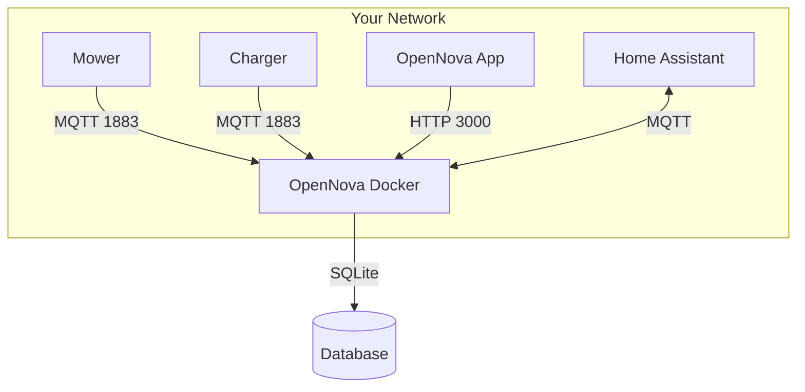

# Docker Container Guide

The OpenNova server runs as a single Docker container that replaces the Novabot cloud. It includes an MQTT broker, REST API, real-time dashboard, and optional DNS/TLS services.

## What's Inside

| Component | Port | Purpose |
|-----------|------|---------|
| **Express Server** | 80/3000 | REST API + WebSocket (Socket.io) |
| **MQTT Broker** | 1883 | Device communication (Aedes) |
| **dnsmasq** | 53 | DNS redirect for Novabot app (optional) |
| **nginx** | 443 | TLS termination for iOS app (optional) |
| **SQLite** | — | Persistent database |

## Prerequisites

- **Docker** 20.10+ and Docker Compose v2
- A device on the same **local network** as your mower and charger
- Supported platforms: macOS, Linux, Windows (WSL2), NAS (Synology, QNAP)

!!! note "No cloud dependency"
    OpenNova runs entirely on your local network. No internet connection required after initial setup.

## Quick Start

### 1. Pull the Docker image

```bash
docker pull rvbcrs/opennova:latest
```

### 2. Create docker-compose.yml

Create a new directory and a `docker-compose.yml` file:

```bash
mkdir opennova && cd opennova
```

```yaml
services:
  opennova:
    image: rvbcrs/opennova:latest
    container_name: opennova
    restart: unless-stopped
    ports:
      - "80:80"       # HTTP (API + admin panel + mower connectivity check)
      - "443:443"     # HTTPS (required for Novabot app)
      - "1883:1883"   # MQTT broker
    environment:
      PORT: 80
      ENABLE_TLS: "true"  # Required for the official Novabot app (HTTPS)
    volumes:
      - novabot-data:/data

volumes:
  novabot-data:
```

### 3. Start the container

```bash
docker compose up -d
```

!!! note "No git clone needed"
    You do NOT need to clone the repository. The Docker image from Docker Hub contains everything. The `docker-compose.yml` above is all you need.

### 4. Verify it's running

```bash
# Check container status
docker compose ps

# Check health endpoint
curl http://localhost/api/setup/health
```

You should see:
```json
{"server":"ok","mqtt":"ok","version":"..."}
```

### 5. Set up DNS redirect

Your mower and charger need to find your server when they look up `mqtt.lfibot.com`. See the [DNS Setup Guide](dns-setup.md) for detailed instructions.

### 6. Log in with the Novabot app

Open the official Novabot app and log in with your normal account. The server automatically:

1. **Detects you're a new user** (not in the local database)
2. **Verifies your credentials** with the Novabot cloud
3. **Creates your local account** (first user becomes admin)
4. **Imports your devices** from the cloud

From this point on, the app talks to your local server — no cloud needed.

!!! tip "Restart your mower"
    After setting up DNS, restart the mower (power off, wait 10s, power on) so it picks up the new DNS settings and connects to your server.

### Fallback: Admin Panel

If the Novabot cloud is down or automatic login doesn't work:

1. Open **http://your-server-ip/admin**
2. With an empty database, you'll see a **"Welcome to OpenNova"** setup page
3. Enter your Novabot cloud credentials to import your account + devices
4. Or click **"Skip — Create Local Account"** (creates admin@local with password admin)

## Configuration Reference

### Required Variables

| Variable | Default | Description |
|----------|---------|-------------|
| `PORT` | `80` | Internal HTTP port (mapped to 3000 externally) |
| `DB_PATH` | `/data/novabot.db` | SQLite database location |
| `STORAGE_PATH` | `/data/storage` | Upload storage (maps, firmware) |
| `FIRMWARE_PATH` | `/data/firmware` | OTA firmware directory |

### Optional: DNS Redirect

Only needed if you use the **original Novabot app** (not the OpenNova app).

| Variable | Default | Description |
|----------|---------|-------------|
| `ENABLE_DNS` | `false` | Enable integrated dnsmasq |
| `TARGET_IP` | — | Your server's LAN IP address |
| `UPSTREAM_DNS` | `8.8.8.8` | Fallback DNS server |

```yaml
# docker-compose.yml — uncomment DNS port + env vars:
ports:
  - "53:53/udp"
environment:
  ENABLE_DNS: "true"
  TARGET_IP: "192.168.0.100"
```

### Optional: TLS/HTTPS

Only needed for the **Novabot iOS app** which requires HTTPS.

| Variable | Default | Description |
|----------|---------|-------------|
| `ENABLE_TLS` | `false` | Enable nginx with self-signed certificate |
| `TARGET_IP` | — | Your server's LAN IP (included in cert SAN) |

```yaml
ports:
  - "443:443"
environment:
  ENABLE_TLS: "true"
  TARGET_IP: "192.168.0.100"
```

A self-signed certificate is auto-generated on first start. For iOS, install the CA profile — see [iOS TLS Setup](#ios-tls-setup).

### Optional: Home Assistant

Bridge mower sensor data to Home Assistant via MQTT auto-discovery.

| Variable | Default | Description |
|----------|---------|-------------|
| `HA_MQTT_HOST` | — | Home Assistant MQTT broker IP |
| `HA_MQTT_PORT` | `1883` | MQTT broker port |
| `HA_MQTT_USER` | — | MQTT username |
| `HA_MQTT_PASS` | — | MQTT password |
| `HA_DISCOVERY_PREFIX` | `homeassistant` | MQTT discovery prefix |
| `HA_THROTTLE_MS` | `1000` | Sensor update throttle (ms) |

```yaml
environment:
  HA_MQTT_HOST: "192.168.0.248"
  HA_MQTT_USER: "mqtt"
  HA_MQTT_PASS: "mqtt"
```

Entities will auto-appear in Home Assistant under the device name matching the mower/charger serial number.

### All Environment Variables

| Variable | Default | Description |
|----------|---------|-------------|
| `PORT` | `80` | Internal HTTP port |
| `DB_PATH` | `/data/novabot.db` | Database path |
| `STORAGE_PATH` | `/data/storage` | File storage path |
| `FIRMWARE_PATH` | `/data/firmware` | OTA firmware path |
| `TARGET_IP` | — | Server LAN IP (for TLS/DNS) |
| `ENABLE_TLS` | `false` | Enable HTTPS via nginx |
| `ENABLE_DNS` | `false` | Enable DNS redirect |
| `UPSTREAM_DNS` | `8.8.8.8` | Fallback DNS |
| `HA_MQTT_HOST` | — | Home Assistant MQTT host |
| `HA_MQTT_PORT` | `1883` | Home Assistant MQTT port |
| `HA_MQTT_USER` | — | MQTT username |
| `HA_MQTT_PASS` | — | MQTT password |
| `HA_DISCOVERY_PREFIX` | `homeassistant` | HA MQTT prefix |
| `HA_THROTTLE_MS` | `1000` | HA sensor throttle |
| `ADMIN_EMAIL` | — | Auto-promote user to admin |
| `LOG_LEVEL` | `verbose` | Logging verbosity |
| `ENABLE_DASHBOARD` | `false` | Enable web dashboard UI |
| `CORS_ORIGIN` | — | CORS allowed origin |
| `PROXY_MODE` | `local` | `local` or `cloud` (proxy to upstream) |
| `OTA_BASE_URL` | — | Firmware download base URL |

## Docker Compose Variants

### macOS / NAS (default)

```bash
docker compose up -d
```

Uses **bridge networking**. Ports are mapped via Docker. Suitable for macOS, Synology, QNAP.

### Linux (host networking)

```bash
docker compose -f docker-compose.linux.yml up -d
```

Uses **host networking** for direct LAN access. Required if you need:

- Real client IP detection (for SSH map uploads)
- mDNS discovery
- Direct port binding without NAT

## Ports & Firewall

Ensure these ports are accessible on your server:

| Port | Direction | Purpose |
|------|-----------|---------|
| **3000** | Inbound | API + App connection (or 80 on Linux) |
| **1883** | Inbound | MQTT — mower and charger connect here |
| **443** | Inbound | HTTPS — only if `ENABLE_TLS=true` |
| **53/udp** | Inbound | DNS — only if `ENABLE_DNS=true` |

## Data Persistence

All data is stored in the `novabot-data` Docker volume:

```
/data/
  novabot.db          # SQLite database (users, equipment, maps, schedules)
  storage/            # Uploaded files (map ZIPs, firmware)
  firmware/           # OTA firmware files
  certs/              # TLS certificates (auto-generated)
```

### Backup

```bash
# Backup database
docker compose exec opennova cp /data/novabot.db /data/novabot-backup.db
docker compose cp opennova:/data/novabot-backup.db ./novabot-backup.db

# Backup everything
docker compose cp opennova:/data ./opennova-backup
```

### Restore

```bash
docker compose cp ./novabot-backup.db opennova:/data/novabot.db
docker compose restart opennova
```

## Upgrading

```bash
# Pull latest image
docker compose pull

# Restart with new version
docker compose down && docker compose up -d

# Check logs
docker compose logs -f --tail 50
```

Database migrations run automatically on startup.

## Troubleshooting

### Container won't start

```bash
# Check logs
docker compose logs opennova

# Common issues:
# - Port 1883 already in use (another MQTT broker)
# - Port 53 in use (systemd-resolved on Linux)
```

### Port 53 conflict (Linux)

If `ENABLE_DNS=true` and port 53 is taken by systemd-resolved:

```bash
sudo systemctl stop systemd-resolved
sudo systemctl disable systemd-resolved
```

Or use a different DNS approach (Pi-hole, AdGuard).

### Mower not connecting

1. Check that DNS `mqtt.lfibot.com` resolves to your server IP
2. Verify port 1883 is reachable: `nc -zv your-server-ip 1883`
3. Check MQTT logs: `docker compose logs opennova | grep MQTT`
4. Mower WiFi must be on **2.4 GHz** (5 GHz not supported)

### Database reset

```bash
docker compose down
docker volume rm novabot_novabot-data
docker compose up -d
```

!!! warning
    This deletes ALL data (users, devices, maps, schedules).

## iOS TLS Setup

If using the original Novabot iOS app with `ENABLE_TLS=true`:

1. Open **http://your-server-ip/api/setup/ios-profile** on your iPhone
2. Install the configuration profile (Settings → General → VPN & Device Management)
3. Trust the certificate (Settings → General → About → Certificate Trust Settings)
4. The app will now accept the self-signed certificate

## Network Diagram


