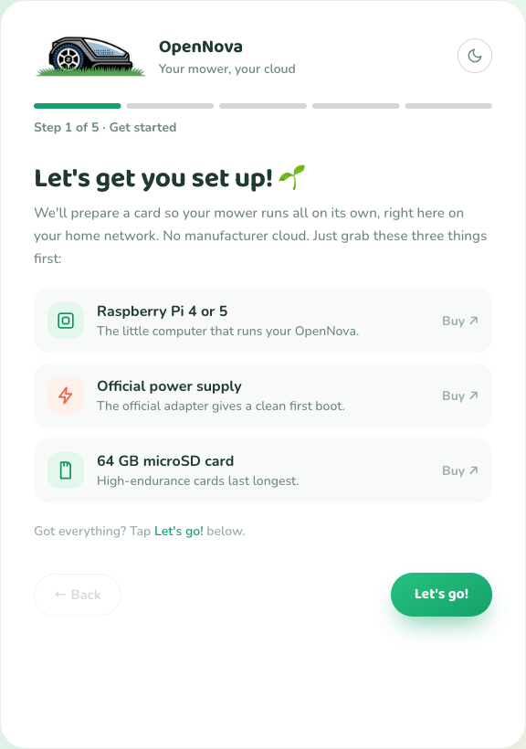
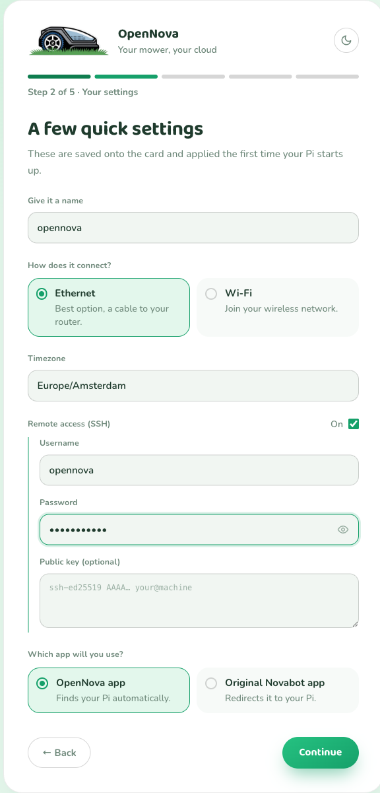
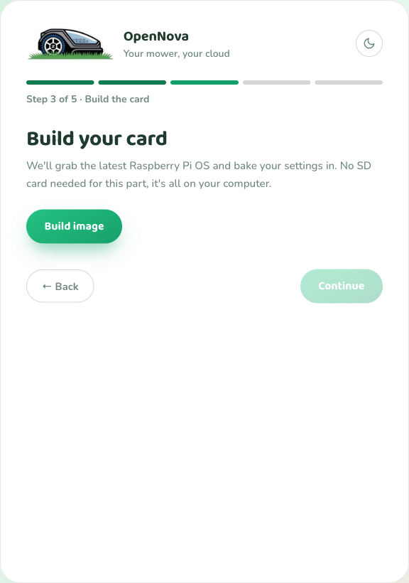
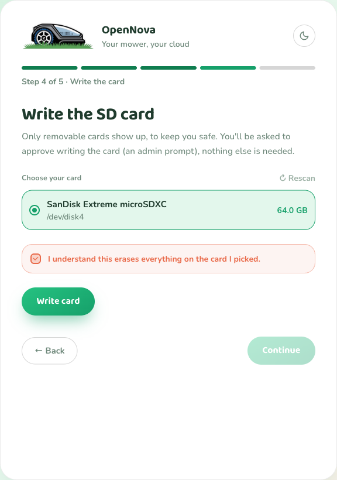
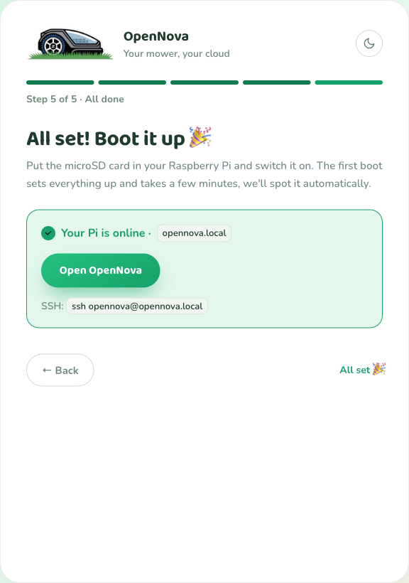

# Raspberry Pi Installer (Easy Setup)

The **OpenNova Installer** is a small desktop app that prepares a Raspberry Pi
SD card for you. It downloads the official Raspberry Pi operating system, bakes
your settings into it, and writes the card. The first time the Pi powers on it
installs everything and starts OpenNova on its own.

This is the easiest way to get OpenNova running. You point, click, and a few
minutes later your Pi is online.

!!! tip "Prefer to do it by hand?"
    If you would rather install Raspberry Pi OS and Docker manually, follow the
    [Beginner Installation Guide](beginner-installation.md) instead. The end
    result is the same; this page is just the shortcut.

## What you need

| Item | Recommendation |
|------|----------------|
| Raspberry Pi | Raspberry Pi **4** or **5** |
| Power supply | The **official** Raspberry Pi adapter (prevents crashes and card corruption) |
| microSD card | **64 GB** or larger, high-endurance |
| A computer | Windows, macOS, or Linux, with an SD-card reader. Used once to prepare the card. |

You also need your home network details (Wi-Fi name and password, unless you use
a network cable) and, if you want them, your OpenNova/Novabot account login for
importing devices later.

## Step 1: Download and open the installer

Open [downloads.ramonvanbruggen.nl](https://downloads.ramonvanbruggen.nl) and
download the OpenNova Installer for your computer.

=== "macOS"

    Download the `.dmg`, open it, and drag **OpenNova Installer** to your
    Applications folder.

    Because the app is self-distributed (not from the App Store), macOS may say
    it cannot verify the developer the first time. Right-click the app and choose
    **Open**, then confirm. You only have to do this once.

=== "Windows"

    Download the `.exe` and run it. If Windows SmartScreen shows a blue warning,
    click **More info → Run anyway**. You only have to do this once.

=== "Linux"

    Download the `.AppImage`, make it executable
    (`chmod +x OpenNova-Installer-*.AppImage`), and run it.

When the app opens you will see a short welcome screen listing the three things
you need. When you have them, click **Let's go!**

## Step 2: Your settings

The installer asks a few quick questions. These are saved onto the card and
applied the first time your Pi starts.

- **Give it a name** — the Pi's name on your network. The default `opennova`
  works fine. The installer warns you if that name is already used by another
  device, so pick a different one if it does.
- **How does it connect?**
    - **Ethernet** — the best option. Plug a network cable into your router.
    - **Wi-Fi** — enter your network name, password, and country.
- **Timezone** — defaults to `Europe/Amsterdam`; change it to your own.
- **SSH access** — on by default, so you can log into the Pi remotely if you
  ever need to. Set a username (default `opennova`) and a password of at least
  8 characters, or paste a public key. You can leave this on and forget about
  it.
- **How will you control the mower?**
    - **OpenNova app** (recommended) — the OpenNova phone app finds your Pi
      automatically over the network. No DNS changes needed.
    - **Original Novabot app** — keep using the manufacturer's app. The image
      switches on a built-in DNS service so the app talks to your Pi instead of
      the cloud. See [DNS Setup](dns-setup.md) for the details.

Click **Continue**.

## Step 3: Build the card

Click **Build image**. The installer now, in order:

1. **Downloads** the latest Raspberry Pi OS Lite (64-bit) straight from
   Raspberry Pi.
2. **Verifies** the download against its official checksum, so a corrupted
   download can never reach your card.
3. **Unpacks** it (about 3 GB, this takes a minute).
4. **Adds your settings** to the image.

When it finishes you will see **Your card image is ready!** Click **Continue**.

!!! note "It is safe to leave running"
    The download is resumable and cached. If your network hiccups, the installer
    retries automatically, and a second run reuses what it already downloaded.

## Step 4: Write the SD card

Put your microSD card in the reader. The installer lists **removable cards
only**, so you can never overwrite your own hard drive by accident.

1. Pick your card from the list (it shows the name and size).
2. Tick **I understand this erases everything on the card I picked**.
3. Click **Write card**.

!!! warning "This erases the card"
    Everything already on the card is wiped. Make sure you picked the right one
    and that it holds nothing you want to keep.

You will be asked for your computer's password (an admin prompt) so the app can
write the card, then a progress bar shows the write. **Leave the card in until
it says it is done.** When you see **Card written!**, click **Continue**.

## Step 5: Boot your Pi

1. Take the card out of your computer and put it into the **powered-off** Pi.
2. Connect the network cable (if you chose Ethernet).
3. Plug in the power.

The very first boot takes a few minutes longer than usual: the Pi installs
Docker and downloads the OpenNova server in the background. This is a one-time
step. Leave it powered on and connected to the internet while it works.

## Step 6: Open OpenNova

Back in the installer, the last screen looks for your Pi on the network. When it
appears, you will see **Your Pi is online** with an **Open OpenNova** button
that takes you straight to the admin page.

If it does not appear after a few minutes, open a browser and go to
`http://opennova.local/admin` (or use the name you gave it, e.g.
`http://yourname.local/admin`). If your network does not support `.local`
names, enter the Pi's IP address in the installer's manual box and open that
instead.

The first time you open the admin page you create your local OpenNova account
and can import your mower, charger, and existing maps.

## Next steps

- **Pair your mower and charger.** Open the OpenNova phone app (or the
  [Bootstrap Tool](bootstrap.md)) and follow the pairing flow. It sends your
  Wi-Fi and server details to the devices over Bluetooth.
- **Original Novabot app users:** finish the [DNS Setup](dns-setup.md) so the
  app reaches your Pi.
- **Learn the admin page:** see the [Admin Panel guide](../user-guide/admin-panel.md).

## Troubleshooting

| Problem | What to do |
|---------|------------|
| The app says the developer can't be verified (macOS) or shows a SmartScreen warning (Windows) | Expected for a self-distributed app. macOS: right-click → **Open**. Windows: **More info → Run anyway**. One time only. |
| "`name`.local is already taken" in the settings step | Another device already uses that name. Pick a different name and continue. |
| No SD card shows up in the Write step | Reseat the card and click **↻ Rescan**. Only removable cards are listed, by design. |
| The Pi never appears on the last screen | Give the first boot a few minutes (it installs Docker). Then try `http://opennova.local/admin`, or enter the Pi's IP in the manual box. Make sure the Pi has internet during first boot. |
| `opennova.local` does not resolve | Some networks block `.local` (mDNS) names. Find the Pi's IP in your router and use `http://<that-ip>/admin`. |

!!! info "What gets installed on the Pi"
    The card runs stock Raspberry Pi OS Lite plus a one-time first-boot script
    that installs Docker and starts the official OpenNova container
    (`rvbcrs/opennova:latest`). Nothing else is changed, and your maps and data
    live in a Docker volume on the card.
