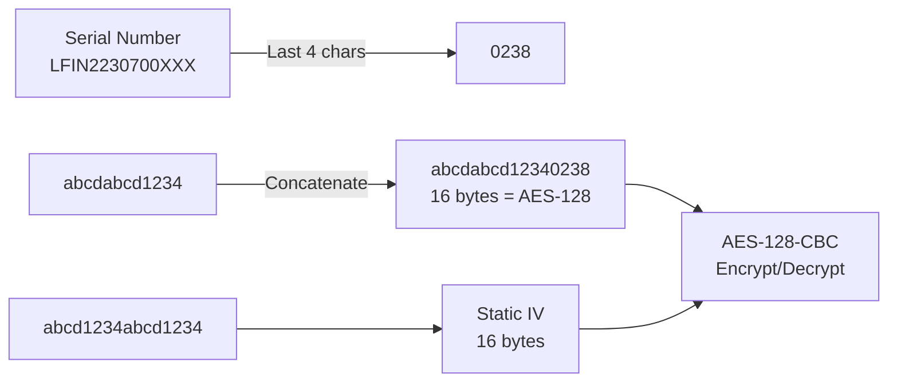
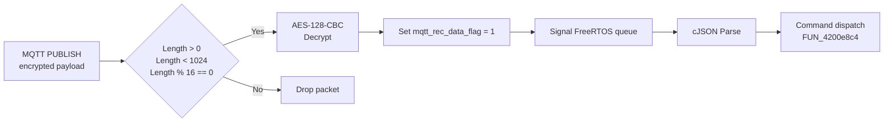

# MQTT Encryption

## Overview

| Device | Firmware | Encryption | Direction |
|--------|----------|-----------|-----------|
| Charger | v0.3.6 | **None** (plain JSON) | Both directions |
| Charger | **v0.4.0+** | **AES-128-CBC** | Both directions |
| Mower | v5.x | **None** (plain JSON) | Both directions |
| Mower | **v6.x+** | **AES-128-CBC** | Both directions |

The charger firmware v0.3.6 sends and receives plain JSON.
Charger firmware **v0.4.0 adds AES-128-CBC encryption**, identical key scheme as the mower v6.x+.
Mower firmware v5.x sends and receives plain JSON; v6.x+ encrypts all MQTT messages with AES-128-CBC.

---

## Mower AES-128-CBC Encryption

Discovered via Blutter decompilation of APK v2.4.0 (`encrypt_utils.dart`).

<!-- PRIVATE -->
### Key Derivation

| Property | Value |
|----------|-------|
| **Algorithm** | AES-128-CBC |
| **Key formula** | `"abcdabcd1234" + SN.substring(SN.length - 4)` |
| **Key example** | `abcdabcd12340238` (for mower `LFIN2230700238`) |
| **IV** | `abcd1234abcd1234` (static, hardcoded) |
| **Padding** | Null-byte padding to 16-byte boundary (AES block size, NOT PKCS7) |
| **Encoding** | UTF-8 for key and IV |

### Step-by-Step Key Construction



1. Take device serial number (e.g., `LFIN2230700XXX`)
2. Extract last 4 characters: `0238`
3. Concatenate: `"abcdabcd1234"` + `"0238"` = `"abcdabcd12340238"` (16 bytes)
4. Convert to bytes via UTF-8 → AES-128 key
5. IV = `"abcd1234abcd1234"` (always fixed)

### Source Code (from Blutter decompilation)

```
// encode():
0x76cc9c: r16 = "abcdabcd1234"           // Key prefix (12 chars)
0x76ccb4: r0 = _interpolate()             // "abcdabcd1234${snSuffix}" → 16 chars
0x76ccd8: r0 = Uint8List.fromList()       // Key as bytes
0x76cd84: r0 = Key()                      // encrypt package Key object
0x76cdac: r0 = AES()                      // AES cipher setup
0x76cdb0: r0 = Encrypter()                // Encrypter wrapper
0x76cdcc: r2 = "abcd1234abcd1234"         // IV string (16 chars)
0x76cdd8: r0 = Encrypted.fromUtf8()       // IV object
0x76cde8: r0 = encryptBytes()             // Encrypt!

// In mqtt.dart, decode() call:
0x765bf8: sub x1, x4, #4                  // length - 4
0x765c0c: r0 = substring()                // SN.substring(len-4) = last 4 chars
0x765c18: r0 = decode()                   // EncryptUtils.decode(data, snSuffix)
```
<!-- /PRIVATE -->

### Encrypted Message Sizes

| Report Type | Encrypted | Blocks | Plaintext | Content |
|-------------|-----------|--------|-----------|---------|
| `report_state_robot` | 800B | 50 | ~750B | Status, battery, GPS, errors |
| `report_exception_state` | 144B | 9 | ~100B | Sensors, emergency stop, WiFi |
| `report_state_timer_data` | 480-496B | 30-31 | ~440B | GPS, timer tasks |

MQTT overhead per message: 37 bytes.

### Proof of AES-CBC Mode

1. All payloads are **exactly divisible by 16** (AES block size)
2. Shannon entropy **7.5-7.8 bits/byte** — uniform byte distribution
3. **Block boundary divergence**: two type-2 payloads (480B vs 496B) identical until byte 208, then 100% divergent — this is the CBC cascade effect
4. Confirmed by successful decryption

---

## Password Encryption (Separate System)

The app uses a **different** AES setup for encrypting login passwords.

<!-- PRIVATE -->
| Property | Value |
|----------|-------|
| Class | `AesEncryption` in `flutter_novabot/common/aes.dart` |
| Key | `1234123412ABCDEF` (UTF-8, 16 bytes) |
| IV | `1234123412ABCDEF` (same as key) |
| Mode | AES-CBC with PKCS7 padding |
| Output | Base64 encoded |
| Usage | Login, registration, password reset — **NOT for MQTT** |

!!! warning "Two different AES systems"
    - **Password AES**: key/IV = `1234123412ABCDEF`, PKCS7 padding, Base64 output
    - **MQTT AES**: key = `abcdabcd1234` + SN suffix, IV = `abcd1234abcd1234`, null-byte padding
<!-- /PRIVATE -->

---

## App Version Differences

| Feature | v2.3.8 | v2.4.0 |
|---------|--------|--------|
| `encrypt_utils.dart` | **Missing** | Present |
| Mower MQTT decryption | None → `jsonDecode()` fails | `EncryptUtils.decode()` → success |
| Mower status visible | **No** (FormatException, silently dropped) | **Yes** |
| Password AES | Present | Present |

The `encrypt_utils.dart` module is **new in v2.4.0**. In v2.3.8, mower messages are passed directly to `jsonDecode()` which throws a `FormatException` on the ciphertext, and the exception is silently caught and dropped.

---

## Charger Firmware v0.4.0 — AES Confirmed

!!! success "Fully reverse-engineered via Ghidra decompilation"
    Charger firmware v0.4.0 has been decompiled and analysed. It uses the **exact same AES-128-CBC scheme** as the mower.

<!-- PRIVATE -->
### Key Details

| Property | Value |
|----------|-------|
| Algorithm | AES-128-CBC |
| Key formula | `"abcdabcd1234" + SN[-4:]` (same as mower) |
| IV | `"abcd1234abcd1234"` (static) |
| Padding | Null-byte padding to 16-byte boundary |
| Direction | Both: publish (encrypt) AND subscribe (decrypt) |

The firmware string `abcdabcd12341234abcdabcd12341234` at offset 0x23b600 is likely a test/default key variant. The actual key is device-specific: `"abcdabcd1234" + SN[-4:]`.

### MQTT Receive Path (v0.4.0)



### cJSON_IsNull Validation

!!! warning "v0.4.0 command values must be JSON `null`"
    Unlike v0.3.6 which accepts `0` or `{}`, v0.4.0 uses `cJSON_IsNull()` to validate
    certain command values. Sending `{"get_lora_info": 0}` will be **silently ignored**.

| Command | Expected value | cJSON check |
|---------|---------------|-------------|
| `get_lora_info` | `null` | `cJSON_IsNull()` |
| `ota_version_info` | `null` | `cJSON_IsNull()` |
| `ota_upgrade_cmd` | `{...}` object | `cJSON_IsString()` on nested fields |

### Server Implementation

The local server handles v0.4.0 encrypted charger messages via the raw-TCP endpoint:

```
POST /api/dashboard/raw-tcp/:sn
Body: {"command": {"get_lora_info": null}, "qos": 1}
```

This endpoint:

1. Takes the JSON command
2. Encrypts with AES-128-CBC using `"abcdabcd1234" + SN[-4:]`
3. Writes the MQTT PUBLISH packet directly to the device's TCP socket (bypassing aedes)
4. Returns success/failure with packet size
<!-- /PRIVATE -->
