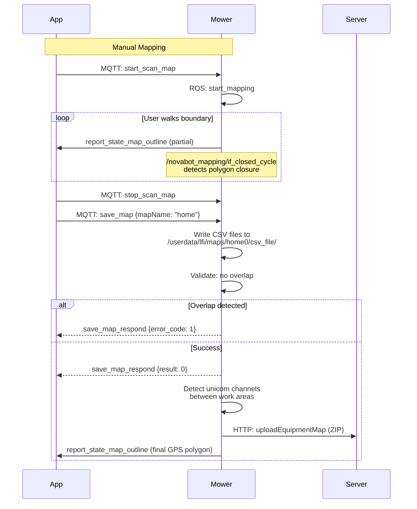

# Mapping Commands

Commands for building, editing, and managing mower maps.

!!! important "Mapping commands are sent over BLE, not MQTT"
    All mapping commands (`start_scan_map`, `add_scan_map`, `stop_scan_map`, `save_map`, etc.) are transmitted via BLE (`BleTools.writeData` with `ble_start` / 20-byte chunks / `ble_end` framing). The mower must be actively advertising over BLE during mapping. The JSON shapes below are the BLE payloads. Only the field structure (not the MQTT transport) applies here.

## Map Building

### start_scan_map

Start manual boundary scanning for the first work area (map0). All subsequent regions use `add_scan_map`.

**ROS service**: `/robot_decision/start_mapping`

```json title="Command"
{
  "start_scan_map": {
    "model": "manual",
    "mapName": "map0",
    "type": 0,
    "cmd_num": 1
  }
}
```

| Field | Type | Description |
|-------|------|-------------|
| `model` | string | Always `"manual"` |
| `mapName` | string | `"map0"` for the first work area |
| `type` | int | Integer `0` (NOT JSON `null`). Dart serialises an unset Smi as `0` |
| `cmd_num` | number | Auto-incrementing counter |

```json title="Response"
{
  "type": "start_scan_map_respond",
  "message": { "result": 0, "value": null }
}
```

---

### stop_scan_map

Finish boundary scanning for the current region.

**ROS service**: `/robot_decision/map_stop_record`

```json title="Command"
{
  "stop_scan_map": {
    "value": false,
    "cmd_num": 3
  }
}
```

| Field | Type | Description |
|-------|------|-------------|
| `value` | boolean | `false` for work / obstacle / charge-channel. `true` ONLY for unicom-channel finishes |
| `cmd_num` | number | Auto-incrementing counter |

Timeout: 20 seconds on `stop_scan_map_respond`.

---

### add_scan_map

Add a subsequent region (map1, map2, obstacle, unicom channel, etc.) to the current mapping session.

```json title="Command"
{
  "add_scan_map": {
    "model": "manual",
    "mapName": "map1",
    "type": 0,
    "cmd_num": 2
  }
}
```

| `type` | Meaning |
|--------|---------|
| `0` | Additional work area (map1, map2, ...) |
| `1` | Obstacle polygon (see obstacle note below) |
| `4` | Map-to-map unicom channel |
| `8` | Map-to-charger unicom channel |

!!! warning "Obstacle uses `type:1` and literal `mapName:"map"`"
    Live BLE capture 2026-04-19 shows the obstacle flow uses `type:1` (NOT `type:2`) and the literal string `mapName:"map"` (NOT the active map name) in both `add_scan_map` AND the `save_map` calls. The mower firmware derives the parent work-map from context and auto-indexes the obstacle files (`map0_0_obstacle.csv`, `map0_1_obstacle.csv`, ...). Stopping the obstacle scan uses `stop_scan_map {"value": false, ...}`.

---

### start_assistant_build_map

Start automatic map building. The mower autonomously maps the area.

**ROS service**: `/robot_decision/start_assistant_mapping`

```json title="Command"
{
  "start_assistant_build_map": {}
}
```

---

### quit_mapping_mode

Exit mapping mode entirely.

**ROS service**: `/robot_decision/quit_mapping_mode`

```json title="Command"
{
  "quit_mapping_mode": {}
}
```

```json title="Response"
{
  "type": "quit_mapping_mode_respond",
  "message": { "result": 0, "value": null }
}
```

!!! note "Response confirmed"
    Firmware analysis confirms `quit_mapping_mode_respond` exists in the mower's `mqtt_node`.

---

### get_mapping_path2d

Get the 2D mapping path during an active mapping session.

!!! info "New — discovered in mower firmware"
    Useful for visualizing the boundary being recorded in real-time.

```json title="Command"
{
  "get_mapping_path2d": {}
}
```

```json title="Response"
{
  "type": "get_mapping_path2d_respond",
  "message": { "result": 0, "value": null }
}
```

---

## Map Erasure

### start_erase_map

Start erasing part of a map area.

**ROS service**: `/robot_decision/start_erase`

```json title="Command"
{
  "start_erase_map": {}
}
```

---

### stop_erase_map

Stop map erasing.

```json title="Command"
{
  "stop_erase_map": {}
}
```

---

## Map Storage

### save_map

Finalize the mapping session. `save_map` does NOT accept external coordinate data - the mower generates CSV files from its own recorded path.

!!! danger "save_map fires TWICE per session"
    `save_map` is sent twice per mapping session, with different `type` values that cause different firmware behaviour. Sending only the first call results in **Error 107 "Load map failed"** when `start_navigation` runs later.

    | Call | `type` | When | Firmware label | Files produced |
    |------|--------|------|----------------|----------------|
    | 1st (sub map) | `0` | Auto, right after `stop_scan_map_respond` | "Saving sub map!!!" | `csv_file/` + `x3_csv_file/` only |
    | 2nd (total map) | `1` | 500 ms after `save_recharge_pos_respond` | "Saving total map!!!" | `map.pgm` + `map.png` + `map.yaml` (Nav2) |

    The 2nd call (type:1) is the ONLY call that generates `home0/map.yaml`. Without it, `/map_server/load_map` fails at `start_navigation` time and the mower reports Error 107.

    The 500 ms delay is set in Flutter: `Future.delayed(Duration(microseconds:500000))` (logic.dart addr 0x906744) before `_writeSaveMap()` at 0x9075a8.

**ROS service**: `/robot_decision/save_map` → `SaveMap.srv`

```json title="Command (1st call, sub map)"
{ "save_map": { "mapName": "map0", "type": 0, "cmd_num": 4 } }
```

```json title="Command (2nd call, total map)"
{ "save_map": { "mapName": "map0", "type": 1, "cmd_num": 6 } }
```

```json title="Response"
{
  "type": "save_map_respond",
  "message": { "result": 0, "value": null }
}
```

Timeout per call: 12 seconds on `save_map_respond`.

**SaveMap.srv definition:**

```
string mapname       # Map name (e.g. "map0", "map1")
float32 resolution   # Grid resolution (meters, typically 0.02-0.05)
int64 type           # 0=sub map, 1=total map
---
string data
uint8 result
uint8 error_code     # 1=OVERLAPING_OTHER_MAP
                     # 2=OVERLAPING_OTHER_UNICOM
                     # 3=CROSS_MULTI_MAPS
```

**On-disk output:** the firmware writes CSV files to BOTH `csv_file/` AND `x3_csv_file/` in parallel under `/userdata/lfi/maps/home0/`. The firmware ALWAYS uses the `home0/` directory regardless of `mapName`.

---

### delete_map

Delete a map.

**ROS service**: `/robot_decision/delete_map` → `DeleteMap.srv`

```json title="Command"
{
  "delete_map": {
    "map_name": "map0",
    "map_type": 0
  }
}
```

| map_type | Description |
|----------|-------------|
| 0 | Work area |
| 1 | Obstacle area |
| 2 | Unicom (channel) |

---

### reset_map

Reset the current mapping session.

**ROS service**: `/robot_decision/reset_mapping`

```json title="Command"
{
  "reset_map": {}
}
```

---

### rename_map

Rename an existing map.

!!! info "New — discovered in mower firmware"

```json title="Command"
{
  "rename_map": {
    "map_name": "map0",
    "new_name": "front_lawn"
  }
}
```

```json title="Response"
{
  "type": "rename_map_respond",
  "message": { "result": 0, "value": null }
}
```

---

## Map Queries

### get_map_info

Get detailed information about a specific map.

```json title="Command"
{
  "get_map_info": {
    "map_id": 0
  }
}
```

```json title="Response"
{
  "type": "get_map_info_respond",
  "message": { "result": 0, "value": null }
}
```

---

### get_map_list

Get a list of all maps on the mower.

```json title="Command"
{
  "get_map_list": {}
}
```

```json title="Response"
{
  "type": "get_map_list_respond",
  "message": {
    "result": 0,
    "value": {
      "map_ids": [0, 1],
      "map_names": ["map0_work", "map1_work"]
    }
  }
}
```

---

### get_map_outline

Request map boundary coordinates. Response comes as a status report.

```json title="Command"
{
  "get_map_outline": {
    "map_id": 0
  }
}
```

The mower responds with `report_state_map_outline` containing GPS polygon coordinates.

---

### get_map_plan_path

Get the planned mowing path for a map.

```json title="Command"
{
  "get_map_plan_path": {
    "map_id": 0
  }
}
```

---

### get_preview_cover_path / generate_preview_cover_path

Get or generate a coverage path preview.

**ROS service**: `/robot_decision/generate_preview_cover_path` → `GenerateCoveragePath.srv`

```json title="Command"
{
  "generate_preview_cover_path": {
    "map_ids": 0,
    "cov_direction": 90
  }
}
```

```
# GenerateCoveragePath.srv
uint32 map_ids
bool specify_direction
uint8 cov_direction     # 0-180°
---
bool result
```

---

### request_map_ids

Request available map IDs from the mower.

```json title="Command"
{
  "request_map_ids": {}
}
```

---

## Area Definition

### area_set

Define a working area via GPS bounding box. This sends GPS coordinates to the mower.

```json title="Command"
{
  "area_set": {
    "latitude1": 52.1409,
    "longitude1": 6.2310,
    "latitude2": 52.1412,
    "longitude2": 6.2315,
    "map_name": "map0"
  }
}
```

**ROS service**: `/robot_decision/add_area`

---

### update_virtual_wall

Update obstacle barriers for a map.

```json title="Command"
{
  "update_virtual_wall": {
    "virtual_wall": [],
    "map_name": "map0"
  }
}
```

---

## Map Building Flow



---

## Map File Format

Maps are stored on the mower at `/userdata/lfi/maps/home0/csv_file/`:

```
csv_file/
├── map_info.json              # Charging pose + area sizes
├── map0_work.csv              # Work area 0 (x,y meters)
├── map0_0_obstacle.csv        # Obstacle 0 in work area 0
├── map0tocharge_unicom.csv    # Channel from area 0 to charger
├── map1_work.csv              # Work area 1
└── map_0_unicom.csv           # Channel type 2
```

CSV format: comma-separated local x,y coordinates (meters, relative to charger):

```csv
-0.0306977,-0.918932
-0.0388416,-0.868202
-9.62,-8.29
```

See [Architecture → Overview](../architecture/overview.md) for coordinate system details.
