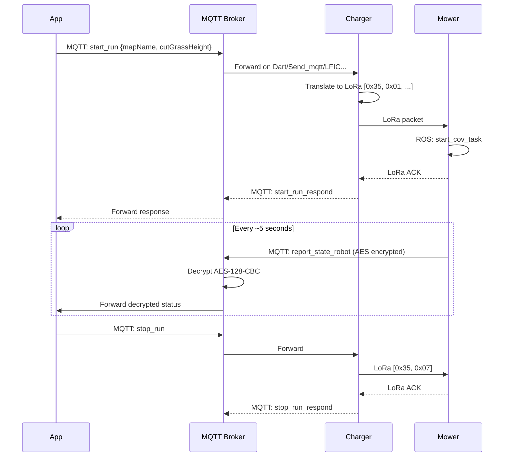

# Mowing Commands

All mowing commands are sent to `Dart/Send_mqtt/<SN>`.

!!! important "v6.x firmware uses `*_navigation` commands"
    v6.x firmware uses the new protocol: `start_navigation`, `pause_navigation`, `resume_navigation`, `stop_navigation` (see below). The `*_run` commands further down are the legacy charger-relay protocol still used by older firmware.

## start_navigation

Start a mowing session on v6.x firmware. Sent directly to the mower via WiFi MQTT (no charger LoRa relay).

```json title="Command"
{
  "start_navigation": {
    "mapName": "test",
    "area": 1,
    "cutterhigh": 2,
    "cmd_num": 12345
  }
}
```

| Field | Type | Description |
|-------|------|-------------|
| `mapName` | string | Hardcoded literal `"test"`, NOT the real map name |
| `area` | number | Map-selection bitfield: `1`=map0, `10`=map1, `200`=map2 |
| `cutterhigh` | number | Blade height enum 0..7 (see [cutterhigh](#cutterhigh-cutting-height)) |
| `cmd_num` | number | Auto-incrementing command counter |

```json title="Response"
{
  "type": "start_navigation_respond",
  "message": { "result": 0, "value": null }
}
```

!!! tip "Set cutting height first"
    The app sends `{"set_para_info": {"cutGrassHeight": <mm>, ...}}` ~500 ms before `start_navigation`. See [Device Management - set_para_info](device-management.md#set_para_info).

---

## pause_navigation / resume_navigation / stop_navigation

Pause, resume, or stop an active v6.x mowing session. All three require `cmd_num`.

```json title="Pause"
{ "pause_navigation": { "cmd_num": 12346 } }
```
```json title="Resume"
{ "resume_navigation": { "cmd_num": 12347 } }
```
```json title="Stop"
{ "stop_navigation": { "cmd_num": 12348 } }
```

!!! note "Stop does not auto-dock"
    `stop_navigation` does NOT trigger return-to-charger. Send `go_pile` followed by `go_to_charge` separately. See [Navigation - go_to_charge](navigation-commands.md#go_to_charge).

---

## start_edge_cut (custom firmware only)

Custom-firmware-only command that drives the saved boundary as a coverage edge pass. Implemented in `research/extended_commands.py` (`handle_start_edge_cut`) and dispatches the `coverage_planner/NavigateThroughCoveragePaths` action with `only_edge_mode:true`.

```json title="Command"
{
  "start_edge_cut": {
    "mapName": "map0",
    "bladeHeight": 40
  }
}
```

| Field | Type | Description |
|-------|------|-------------|
| `mapName` | string | Map base name (no extension). Default `"map0"`. Whitelisted to `[A-Za-z0-9_-]+` |
| `bladeHeight` | number | Blade height in mm (20..90). Default 40 |

```json title="Response"
{
  "type": "start_edge_cut_respond",
  "message": { "result": 0, "map": "map0", "blade_mm": 40 }
}
```

!!! danger "Do NOT use these instead"
    - Stock MQTT `start_patrol` is a JSON-echo stub in `mqtt_node` (no ROS call).
    - `/robot_decision/start_cov_task cov_mode:2` silently falls through to normal COVERING.
    - Direct `/boundary_follow` action uses the local costmap, not the saved polygon.

    Only `start_edge_cut` (custom firmware) actually drives the saved boundary.

Stop via existing `stop_boundary_follow` (cancels NTCP the same way).

---

## start_run

Start a mowing session (legacy protocol, used by older firmware).

**Direction**: App → Charger (via MQTT) → Mower (via LoRa)
**LoRa mapping**: Queue `0x20`, payload `[0x35, 0x01, mapName, area, cutterHeight]`
**ROS service**: `/robot_decision/start_cov_task` → `StartCoverageTask.srv`

```json title="Command"
{
  "start_run": {
    "mapName": null,
    "area": 1,
    "cutterhigh": 2,
    "targetIsMower": false
  }
}
```

| Field | Type | Description |
|-------|------|-------------|
| `mapName` | string \| null | Always `null` in the legacy flow (NOT `"map0"`) |
| `area` | number | Map-selection bitfield: `1`=map0, `10`=map1, `200`=map2 |
| `cutterhigh` | number | Blade height enum 0..7 (see [cutterhigh](#cutterhigh-cutting-height)) |
| `targetIsMower` | boolean | Always `false` |

```json title="Response"
{
  "type": "start_run_respond",
  "message": {
    "result": 0,
    "value": null
  }
}
```

### ROS Service: StartCoverageTask.srv

The mower's `mqtt_node` translates this to a ROS 2 service call:

```
uint8 NORMAL=0              # Mow saved map
uint8 SPECIFIED_AREA=1      # Mow within provided polygon (GPS points)
uint8 BOUNDARY_COV=2        # Boundary-only mowing

uint8 cov_mode              # Mowing mode (0/1/2)
uint8 request_type          # Source: 11=app, 12=schedule, 21=MCU, 22=MCU schedule
uint32 map_ids              # Map ID (priority over map_names if > 0)
string[] map_names          # Map names to mow
geometry_msgs/Point[] polygon_area  # GPS polygon (for SPECIFIED_AREA)
uint8[] blade_heights       # Blade heights (0-7)
bool specify_direction
uint8 cov_direction         # Mowing direction 0-180°
uint8 light                 # LED brightness
bool specify_perception_level
uint8 perception_level      # 0=off, 1=detection, 2=segmentation, 3=sensitive
uint8 blade_info_level      # 0=default, 1=all off, 2=buzzer, 3=LED, 4=all on
bool night_light            # Allow night LED
bool enable_loc_weak_mapping
bool enable_loc_weak_working
---
bool result
```

!!! tip "SPECIFIED_AREA mode"
    With `cov_mode=1`, the mower can mow within GPS polygon coordinates passed via `polygon_area`, without needing a saved map on the device.

---

## stop_run

Stop the current mowing session.

**LoRa mapping**: Queue `0x23`, payload `[0x35, 0x07]`
**ROS service**: `/robot_decision/stop_task`

```json title="Command"
{
  "stop_run": {}
}
```

```json title="Response"
{
  "type": "stop_run_respond",
  "message": { "result": 0, "value": null }
}
```

---

## pause_run

Pause the current mowing session.

**LoRa mapping**: Queue `0x21`, payload `[0x35, 0x03]`

```json title="Command"
{
  "pause_run": {}
}
```

```json title="Response"
{
  "type": "pause_run_respond",
  "message": { "result": 0, "value": null }
}
```

---

## resume_run

Resume a paused mowing session.

**LoRa mapping**: Queue `0x22`, payload `[0x35, 0x05]`

```json title="Command"
{
  "resume_run": {}
}
```

```json title="Response"
{
  "type": "resume_run_respond",
  "message": { "result": 0, "value": null }
}
```

---

## stop_time_run

Stop a timer/scheduled mowing task.

**LoRa mapping**: Queue `0x24`, payload `[0x35, 0x09]`

```json title="Command"
{
  "stop_time_run": {}
}
```

---

## Timer-Related Mowing Commands

See also [Device Management → Timer/Scheduling](device-management.md#timer_task) for `timer_task`, `timer_task_active`, and `timer_task_stop`.

---

## cutterhigh (cutting height)

The MQTT wire field is `cutterhigh` and its value is the **0..7 enum**, NOT millimeters.

| Formula | Meaning |
|---------|---------|
| `cutterhigh = user_cm - 2` | Encode user's desired cm into the wire value |
| `display_cm = cutterhigh + 2` | Decode `cutterhigh` (or `target_height`) back to cm |
| `mm = (cutterhigh + 2) * 10` | Physical blade height in mm |

**Example**: user picks 4 cm → send `cutterhigh: 2` → firmware sets blades to 40 mm.

The `target_height` field in `report_state_robot` echoes the accepted `cutterhigh` value (same 0..7 enum). Display as `target_height + 2` cm.

!!! danger "Never send mm values on the wire"
    Sending `cutterhigh: 40` (mm) or `cutterhigh: 6` (cm+2) results in the firmware silently rejecting the value or setting the blades to the wrong height. The accepted range is `0..7`.

---

## Mowing Command Flow



## Complete Command Summary

| Command | Response | LoRa Queue | LoRa Payload | ROS Service |
|---------|----------|-----------|-------------|-------------|
| `start_run` | `start_run_respond` | `0x20` | `[0x35, 0x01, mapName, area(2B), cutterHeight]` | `/robot_decision/start_cov_task` |
| `stop_run` | `stop_run_respond` | `0x23` | `[0x35, 0x07]` | `/robot_decision/stop_task` |
| `pause_run` | `pause_run_respond` | `0x21` | `[0x35, 0x03]` | — |
| `resume_run` | `resume_run_respond` | `0x22` | `[0x35, 0x05]` | — |
| `stop_time_run` | `stop_time_run_respond` | `0x24` | `[0x35, 0x09]` | — |

!!! info "LoRa ACK mechanism"
    For all LoRa-relayed commands, the charger:

    1. Resets ACK flag (`DAT_42000c88 = 0`)
    2. Sends LoRa queue byte with 1000ms timeout
    3. Polls up to 3 times (1000ms each) for ACK:
        - `0x01` = success → `result: 0`
        - `0x101` = failure → `result: 1`
    4. After 3 failures → timeout → `result: 1`
