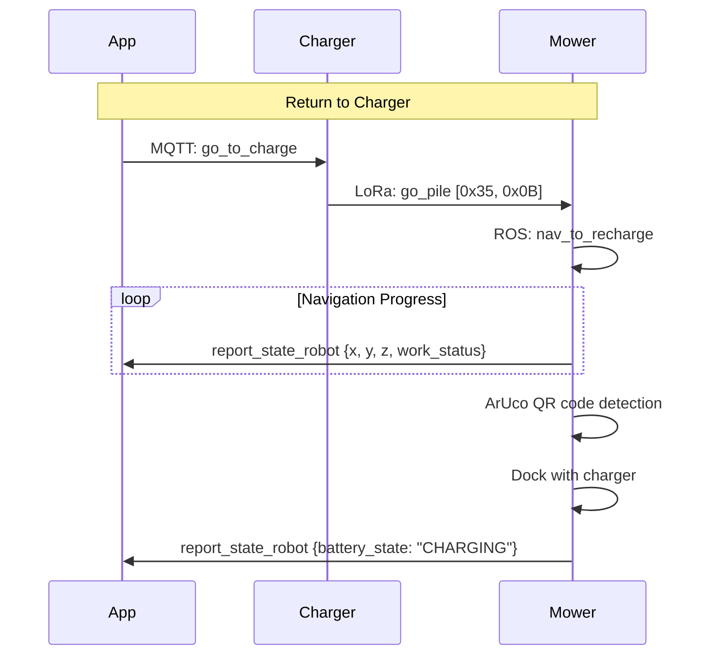

# Navigation Commands

!!! info "Mowing-session control lives elsewhere"
    `start_navigation`, `pause_navigation`, `resume_navigation`, and `stop_navigation` are the v6.x firmware mowing-session commands. See [Mowing Commands - start_navigation](mowing-commands.md#start_navigation) for the real payloads and `cmd_num` requirements. They are NOT point-to-point goto commands.

## Point-to-Point Navigation

### navigate_to_position

Navigate to a specific GPS position with optional arrival angle. More explicit than `start_navigation`.

!!! note "Discovered in mower firmware"
    This command was found in the `mqtt_node` binary and is separate from `start_navigation`. It supports an `angle` parameter for the desired heading at arrival.

```json title="Command"
{
  "navigate_to_position": {
    "latitude": 52.1409,
    "longitude": 6.2310,
    "angle": 0.0
  }
}
```

| Parameter | Type | Required | Description |
|-----------|------|----------|-------------|
| `latitude` | float | Yes | Target GPS latitude (WGS84) |
| `longitude` | float | Yes | Target GPS longitude (WGS84) |
| `angle` | float | No | Desired heading at arrival (degrees, default 0.0) |

```json title="Response"
{
  "type": "navigate_to_position_respond",
  "message": { "result": 0, "value": null }
}
```

---

## Timed Navigation

### start_time_navigation

Start a timed/scheduled navigation task.

```json title="Command"
{
  "start_time_navigation": {}
}
```

```json title="Response"
{
  "type": "start_time_navigation_respond",
  "message": { "result": 0, "value": null }
}
```

---

### stop_time_navigation

Stop a timed/scheduled navigation task.

```json title="Command"
{
  "stop_time_navigation": {}
}
```

```json title="Response"
{
  "type": "stop_time_navigation_respond",
  "message": { "result": 0, "value": null }
}
```

---

## Navigation Speed

### set_navigation_max_speed

Set the maximum speed during navigation.

```json title="Command"
{
  "set_navigation_max_speed": {
    "max_speed": 0.5
  }
}
```

```json title="Response"
{
  "type": "set_navigation_max_speed_respond",
  "message": { "result": 0, "value": null }
}
```

---

## Patrol Mode (deprecated / no-op stubs)

!!! danger "`start_patrol` and `stop_patrol` are no-op stubs"
    Stock `mqtt_node` JSON-echoes `start_patrol` and `stop_patrol` without making any ROS call (verified, see `research/extended_commands.py:1101`). They will NOT drive the mower along the boundary.

    For boundary/edge cutting use [start_edge_cut](mowing-commands.md#start_edge_cut-custom-firmware-only) on custom firmware. `cov_mode:2` and direct `/boundary_follow` action calls also do NOT work for saved-polygon edge cutting.

### start_patrol

```json title="Command (no-op)"
{ "start_patrol": {} }
```

```json title="Response (echo only)"
{
  "type": "start_patrol_respond",
  "message": { "result": 0, "value": null }
}
```

---

### stop_patrol

```json title="Command (no-op)"
{ "stop_patrol": {} }
```

```json title="Response (echo only)"
{
  "type": "stop_patrol_respond",
  "message": { "result": 0, "value": null }
}
```

---

## Charging / Docking

### go_to_charge

Navigate back to the charging station. Sent as the second step of a two-command sequence: app first sends `go_pile` and waits for `go_pile_respond`, then sends `go_to_charge`.

**ROS service**: `/robot_decision/nav_to_recharge`

```json title="Command"
{
  "go_to_charge": {
    "cmd_num": 12349,
    "chargerpile": {
      "latitude": 200,
      "longitude": 200
    }
  }
}
```

| Field | Type | Description |
|-------|------|-------------|
| `cmd_num` | number | Required, auto-incrementing |
| `chargerpile.latitude` | number | **Sentinel value `200`** (NOT real GPS) |
| `chargerpile.longitude` | number | **Sentinel value `200`** (NOT real GPS) |

```json title="Response"
{
  "type": "go_to_charge_respond",
  "message": { "result": 0, "value": null }
}
```

!!! warning "Both `cmd_num` and the 200/200 sentinel are mandatory"
    Omitting either field causes the mower to ignore the command. Always send `go_pile {}` first and wait for `go_pile_respond` before sending `go_to_charge`.

---

### go_pile

Navigate to the charging pile.

**LoRa mapping**: Queue `0x25`, payload `[0x35, 0x0B]`

```json title="Command"
{
  "go_pile": {}
}
```

```json title="Response"
{
  "type": "go_pile_respond",
  "message": { "result": 0, "value": null }
}
```

---

### stop_to_charge

Cancel return-to-charger navigation.

**ROS service**: `/robot_decision/cancel_recharge`

```json title="Command"
{
  "stop_to_charge": {}
}
```

---

### auto_recharge

Enable automatic recharge when battery is low.

**ROS service**: `/robot_decision/auto_recharge`

```json title="Command"
{
  "auto_recharge": {}
}
```

---

### auto_charge_threshold

Set the battery threshold for automatic recharging.

```json title="Command"
{
  "auto_charge_threshold": {
    "threshold": 20
  }
}
```

```json title="Response"
{
  "type": "auto_charge_threshold_respond",
  "message": { "result": 0, "value": null }
}
```

---

### get_recharge_pos

Get the saved charging station position.

```json title="Command"
{
  "get_recharge_pos": {}
}
```

```json title="Response"
{
  "type": "get_recharge_pos_respond",
  "message": {
    "result": 0,
    "value": {
      "latitude": 52.1409,
      "longitude": 6.2310,
      "orient_flag": 0
    }
  }
}
```

---

### save_recharge_pos

Save the current position as the charging station location.

**ROS service**: `/robot_decision/save_charging_pose`

```json title="Command"
{
  "save_recharge_pos": {}
}
```

---

## Manual Control (Joystick)

App route: `/manulController` (note: typo in app).

The joystick protocol is a 3-message sequence: `start_move` to enter manual mode, repeated `mst` velocity updates at 200 ms cadence, and `stop_move` to exit.

### start_move

Enter manual mode and set the initial direction. The value MUST be an **integer**, NOT an object.

```json title="Command"
{ "start_move": 3 }
```

| Value | Direction |
|-------|-----------|
| `1` | Left |
| `2` | Right |
| `3` | Forward |
| `4` | Backward |

```json title="Response"
{
  "type": "start_move_respond",
  "message": { "result": 0, "value": null }
}
```

!!! danger "Empty object and object forms do NOT work"
    Sending `{"start_move": {}}` or `{"start_move": {"direction": 3, "speed": 0.5}}` is silently ignored by the firmware. Only the integer form (`{"start_move": 3}`) enters manual mode.

---

### mst (joystick velocity)

Sent repeatedly at 200 ms cadence after `start_move` to drive the wheels. Combined with `start_move`'s direction, `mst` provides the speed magnitude.

```json title="Command"
{
  "mst": {
    "x_w": 0.3,
    "y_v": 0.0,
    "z_g": 0
  }
}
```

| Field | Type | Description |
|-------|------|-------------|
| `x_w` | number | Linear speed magnitude (m/s) |
| `y_v` | number | Angular velocity (rad/s) |
| `z_g` | number | Always `0` |

---

### stop_move

Exit manual mode.

```json title="Command"
{ "stop_move": {} }
```

```json title="Response"
{
  "type": "stop_move_respond",
  "message": { "result": 0, "value": null }
}
```

---

## Navigation Flow



## Complete Command Summary

| Command | Response | Via Charger LoRa? | ROS Service |
|---------|----------|-------------------|-------------|
| `navigate_to_position` | `navigate_to_position_respond` | No | — |
| `start_time_navigation` | `start_time_navigation_respond` | No | — |
| `stop_time_navigation` | `stop_time_navigation_respond` | No | — |
| `set_navigation_max_speed` | `set_navigation_max_speed_respond` | No | — |
| `start_patrol` | `start_patrol_respond` (no-op) | No | none (stub) |
| `stop_patrol` | `stop_patrol_respond` (no-op) | No | none (stub) |
| `go_to_charge` | `go_to_charge_respond` | No | `/robot_decision/nav_to_recharge` |
| `go_pile` | `go_pile_respond` | **Yes** (LoRa `0x25`) | — |
| `stop_to_charge` | `stop_to_charge_respond` | No | `/robot_decision/cancel_recharge` |
| `auto_recharge` | `auto_recharge_respond` | No | `/robot_decision/auto_recharge` |
| `auto_charge_threshold` | `auto_charge_threshold_respond` | No | — |
| `get_recharge_pos` | `get_recharge_pos_respond` | No | — |
| `save_recharge_pos` | `save_recharge_pos_respond` | No | `/robot_decision/save_charging_pose` |
| `start_move` | `start_move_respond` | No | — |
| `mst` | (no response) | No | publishes `cmd_vel` |
| `stop_move` | `stop_move_respond` | No | — |

Mowing-session commands (`start_navigation`, `pause_navigation`, `resume_navigation`, `stop_navigation`) are documented under [Mowing Commands](mowing-commands.md).
