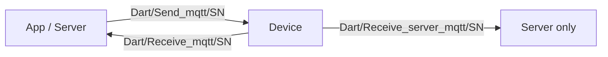

# MQTT Protocol Overview

## Broker

| Property | Value |
|----------|-------|
| Cloud broker | `mqtt.lfibot.com:1883` |
| Local broker | Aedes on `0.0.0.0:1883` |
| Protocol | MQTT 3.1.1 (plain TCP, no TLS) |
<!-- PRIVATE -->
| Fallback IP | `47.253.57.111` (hardcoded in charger firmware) |
<!-- /PRIVATE -->

## Topic Structure



| Direction | Topic Pattern | Example | Description |
|-----------|--------------|---------|-------------|
| App → Device | `Dart/Send_mqtt/<SN>` | `Dart/Send_mqtt/LFIC1230700XXX` | Commands |
| Device → App | `Dart/Receive_mqtt/<SN>` | `Dart/Receive_mqtt/LFIN2230700XXX` | Status reports + responses |
| Device → Server | `Dart/Receive_server_mqtt/<SN>` | `Dart/Receive_server_mqtt/LFIN2230700XXX` | Server-specific reports |

Devices use their serial number (SN) as topic suffix.

!!! info "Third topic pattern discovered in mower firmware"
    The mower publishes to `Dart/Receive_server_mqtt/<SN>` for server-specific reports such as `report_state_to_server_exception` and `report_state_to_server_work`. These reports include acknowledge responses from the server, unlike the standard app-facing reports.

## Message Format

All MQTT messages are JSON objects. The **command name is the root key**:

```json title="Command (app → device)"
{
  "start_navigation": {
    "mapName": "test",
    "area": 1,
    "cutterhigh": 2,
    "cmd_num": 12345
  }
}
```

!!! note "About `mapName` and `area`"
    `mapName` is a hardcoded literal string `"test"` in the app, NOT the real map name. The active map is selected by the `area` bitfield: `1` = map0, `10` = map1, `200` = map2. The `cutterhigh` value is the 0..7 enum (see [Mowing Commands](mowing-commands.md#cutterhigh-cutting-height)).

```json title="Response (device → app)"
{
  "type": "start_run_respond",
  "message": {
    "result": 0,
    "value": null
  }
}
```

```json title="Status report (device → app, unsolicited)"
{
  "type": "report_state_robot",
  "message": {
    "battery_power": 100,
    "work_status": 0,
    "x": 0, "y": 0, "z": 0
  }
}
```

## Encryption

| Device | Firmware | Encryption | Details |
|--------|----------|-----------|---------|
| Charger | v0.3.6 | **None** (plain JSON) | Published to `Dart/Receive_mqtt/LFIC...` |
| Charger | v0.4.0+ | **AES-128-CBC** | Same scheme as mower v6+ |
| Mower | v5.x | **None** (plain JSON) | Pre-AES firmware |
<!-- PRIVATE -->
| Mower | v6.x+ | **AES-128-CBC** | Key = `"abcdabcd1234" + SN[-4:]`, IV = `"abcd1234abcd1234"` |
<!-- /PRIVATE -->

See [Encryption](encryption.md) for full details.

## Complete Command Reference (61+ commands)

| Category | Commands | Page |
|----------|----------|------|
| Mowing | `start_navigation`, `pause_navigation`, `resume_navigation`, `stop_navigation` (v6.x active path); `start_run`, `stop_run`, `pause_run`, `resume_run`, `stop_time_run` (legacy charger-relay path); `timer_task`, `timer_task_active`, `timer_task_stop` | [Mowing](mowing-commands.md) |
| Navigation | `start_navigation`, `stop_navigation`, `navigate_to_position`, `go_to_charge`, `go_pile`, `start_patrol`, `stop_patrol`, `set_navigation_max_speed` | [Navigation](navigation-commands.md) |
| Mapping | `start_scan_map`, `save_map`, `area_set`, `delete_map`, `rename_map`, `get_mapping_path2d` | [Mapping](mapping-commands.md) |
| Device Management | `get_para_info`, `set_para_info`, `ota_upgrade_cmd`, `get_current_pose`, `get_vel_odom`, `set_control_mode`, `get_control_mode` | [Device Management](device-management.md) |
| Status Reports | `report_state_robot`, `report_exception_state`, `up_status_info`, `report_state_to_server_work`, `report_state_unbind` | [Status Reports](status-reports.md) |

## Message Flow Architecture

```mermaid
graph TB
    subgraph "App → Charger → Mower (via LoRa)"
        A1[App sends MQTT command] --> A2[Charger receives on<br/>Dart/Send_mqtt/LFIC...]
        A2 --> A3[Charger translates to<br/>LoRa binary packet]
        A3 --> A4[Mower receives<br/>LoRa packet]
        A4 --> A5[Mower executes command]
    end

    subgraph "Mower → App (direct MQTT)"
        B1[Mower publishes AES-encrypted<br/>on Dart/Receive_mqtt/LFIN...]
        B1 --> B2[Server decrypts AES-128-CBC]
        B2 --> B3[Server forwards to dashboard<br/>via Socket.io]
        B2 --> B4[Server forwards to Home Assistant<br/>via MQTT auto-discovery]
    end

    subgraph "Charger → App (direct MQTT)"
        C1[Charger publishes plain JSON<br/>on Dart/Receive_mqtt/LFIC...]
        C1 --> C2[Server processes sensor data]
        C2 --> C3[Server forwards to dashboard]
    end

    subgraph "Mower → Server only (direct MQTT)"
        D1[Mower publishes AES-encrypted<br/>on Dart/Receive_server_mqtt/LFIN...]
        D1 --> D2[Server decrypts + processes]
        D2 --> D3[Server sends acknowledge response]
    end
```



## Command Routing

!!! important "Not all commands go through the charger"
    Only the **6 legacy mowing commands** are relayed via the charger's LoRa bridge (`start_run`, `pause_run`, `resume_run`, `stop_run`, `stop_time_run`, `go_pile`). This applies to the legacy `*_run` flow only. The new `*_navigation` protocol used by v6.x firmware goes **directly to the mower via WiFi MQTT**, bypassing the charger entirely. All other commands (mapping, navigation, patrol, diagnostics, etc.) also go direct to the mower.
