# Status Reports

Status reports are **unsolicited messages** sent periodically by devices. They are NOT responses to commands.

## Charger Reports

### up_status_info

Main status update from the charger. Published every ~2 seconds.

**Topic**: `Dart/Receive_mqtt/LFIC1230700XXX`
**Encryption**: None (plain JSON)

```json title="Payload"
{
  "type": "up_status_info",
  "message": {
    "charger_status": 285212929,
    "mower_status": 0,
    "mower_x": 0,
    "mower_y": 0,
    "mower_z": 0,
    "mower_info": 0,
    "mower_info1": 0,
    "mower_error": 0,
    "battery_capacity": 100
  }
}
```

#### charger_status Bitfield

| Bit(s) | Mask | Source | Meaning |
|--------|------|--------|---------|
| Bit 0 | `0x00000001` | GPS NMEA parser | GPS valid (< 5 consecutive GNGGA parse failures) |
| Bit 8 | `0x00000100` | RTK quality check | RTK quality OK (< 5 consecutive altitude deviations) |
| Middle bits | `DAT_420013b8` | LoRa RSSI | OR'd when LoRa RSSI in valid range (1-145) |
| **Bits 24-31** | `0xFF000000` | GNGGA field 8 | **GPS satellite count** (shifted << 24) |

**Example values:**

| Value (hex) | Byte 3 (sats) | Bits | Meaning |
|-------------|--------------|------|---------|
| `0x00000000` | 0 sats | none | No GPS, no RTK, no LoRa |
| `0x0E000101` | **14 sats** | GPS + RTK | 14 satellites, GPS and RTK OK |
| `0x10000101` | **16 sats** | GPS + RTK | 16 satellites, GPS and RTK OK |
| `0x11000101` | **17 sats** | GPS + RTK | 17 satellites, GPS and RTK OK |

#### mower_error Field

!!! warning "Not an error counter from the mower"
    `mower_error` is a **LoRa heartbeat failure counter** on the charger:

    1. Charger polls mower with LoRa `[0x34, 0x01]` every ~1.5 seconds
    2. Mower responds → counter resets to **0**
    3. No response → counter **increments by 1**
    4. Only reported when counter **>= 2** (filters brief interruptions)

#### Mower Position Fields

Mower position is received via LoRa from the mower's status report (19 bytes):

| Field | LoRa Bytes | Encoding | Description |
|-------|-----------|----------|-------------|
| `mower_status` | [7-10] | uint32 LE | Operational status |
| `mower_info` | [11-14] | uint32 LE | Info field 1 |
| `mower_x` | [15-17] | uint24 LE | X position (local meters) |
| `mower_y` | [18-20] | uint24 LE | Y position (local meters) |
| `mower_z` | [21-23] | uint24 LE | Z / heading |
| `mower_info1` | [24-25] | uint16 LE | Info field 2 |

---

## Mower Reports

The mower sends **3 JSON messages per cycle** (~5 second interval), all AES-128-CBC encrypted.

### report_state_robot

Main status report (~750B JSON, 800B encrypted).

**Topic**: `Dart/Receive_mqtt/LFIN2230700XXX`
**Encryption**: AES-128-CBC

```json title="Decrypted payload"
{
  "type": "report_state_robot",
  "message": {
    "battery_power": 100,
    "battery_state": "CHARGING",
    "work_status": 0,
    "error_status": 132,
    "error_msg": "",
    "cpu_temperature": 35,
    "x": 0,
    "y": 0,
    "z": 0,
    "loc_quality": 100,
    "current_map_id": "",
    "prev_state": 0,
    "work_mode": 0,
    "task_mode": 0,
    "recharge_status": 0,
    "charger_status": 0,
    "mow_blade_work_time": 72720,
    "working_hours": 0,
    "ota_state": 0,
    "mowing_progress": 0,
    "covering_area": 0,
    "finished_area": 0,
    "sw_version": "v0.3.25",
    "mow_speed": 0.0,
    "cpu_usage": 45,
    "memory_remaining": 512,
    "disk_remaining": 2048,
    "theta": 1.57,
    "perception_level": 1,
    "pipe_charge_status": 0,
    "cov_area": 75.5,
    "cov_ratio": 0.45,
    "cov_estimate_time": 30.0,
    "cov_remaining_area": 50.2,
    "cov_work_time": 25.0,
    "cov_direction": 90,
    "cov_map_path": "map0",
    "current_map_ids": 0,
    "target_height": 5,
    "map_num": 2,
    "finished_num": 1,
    "working_time": 120,
    "gps_status": 1,
    "light": 3,
    "cmd_num": 42
  }
}
```

| Field | Type | Description |
|-------|------|-------------|
| `battery_power` | number | Battery percentage (0-100) |
| `battery_state` | string | `"CHARGING"`, `"DISCHARGING"`, `"NOT_INITIALIZED"` |
| `work_status` | number | Work status (0=idle, see [ROS Status Enums](#ros-status-enums)) |
| `error_status` | number | Error code (see [Error Codes](#error-codes)) |
| `error_msg` | string | Error message text |
| `cpu_temperature` | number | CPU temperature (°C) |
| `cpu_usage` | number | CPU usage percentage |
| `memory_remaining` | number | Remaining memory (MB) |
| `disk_remaining` | number | Remaining disk space (MB) |
| `x`, `y` | number | Local position coordinates (meters) |
| `z` | number | Heading / orientation |
| `theta` | number | Robot heading angle (radians) |
| `loc_quality` | number | Localization quality (0-100%) |
| `current_map_id` | string | Active map ID |
| `current_map_ids` | number | Current mowing map ID (numeric) |
| `prev_state` | number | Previous state |
| `work_mode` | number | Work mode |
| `task_mode` | number | Task mode (cover/mapping/patrol/control) |
| `recharge_status` | number | Recharge status |
| `charger_status` | number | Charger connection status |
| `pipe_charge_status` | number | Charging pipe/station status |
| `gps_status` | number | GPS status |
| `mow_blade_work_time` | number | Total blade work time (seconds) |
| `working_hours` | number | Current session work hours |
| `working_time` | number | Software runtime (minutes) |
| `ota_state` | number | OTA update state |
| `mowing_progress` | number | Mowing progress (0-100%) |
| `covering_area` | number | Current coverage area |
| `finished_area` | number | Completed area |
| `sw_version` | string | Firmware version |
| `mow_speed` | number | Current mowing speed |
| `perception_level` | number | AI perception: 0=off, 1=detection, 2=segmentation, 3=sensitive |
| `light` | number | LED brightness level |
| `cmd_num` | number | Command sequence number |

### Coverage Fields (during mowing)

| Field | Type | Description |
|-------|------|-------------|
| `cov_area` | number | Total covered area (m²) |
| `cov_ratio` | number | Coverage ratio (0.0-1.0) |
| `cov_estimate_time` | number | Estimated remaining time (minutes) |
| `cov_remaining_area` | number | Remaining area to mow (m²) |
| `cov_work_time` | number | Coverage work time elapsed (minutes) |
| `cov_direction` | number | Coverage mowing direction (0-180°) |
| `cov_map_path` | string | Map path being covered |
| `target_height` | number | Target cutting height (0..7 enum). Physical cm = `target_height + 2`, mm = `(target_height + 2) * 10` |
| `map_num` | number | Total map count in current task |
| `finished_num` | number | Finished map count |

---

### report_exception_state

Exception/sensor status (~100B JSON, 144B encrypted).

```json title="Decrypted payload"
{
  "type": "report_exception_state",
  "message": {
    "button_stop": false,
    "chassis_err": 0,
    "pin_code": "",
    "rtk_sat": 29,
    "wifi_rssi": 55
  }
}
```

| Field | Type | Description |
|-------|------|-------------|
| `button_stop` | boolean | Emergency stop pressed |
| `chassis_err` | number | Chassis error code |
| `pin_code` | string | PIN code status |
| `rtk_sat` | number | RTK GPS satellite count |
| `wifi_rssi` | number | WiFi signal strength |

---

### report_state_timer_data

Battery, GPS position, localization, and timer tasks (~440B JSON, 480-496B encrypted).

```json title="Decrypted payload"
{
  "type": "report_state_timer_data",
  "message": {
    "battery_capacity": 100,
    "battery_state": "CHARGING",
    "latitude": 52.1409,
    "longitude": 6.2310,
    "orient_flag": 0,
    "localization_state": "NOT_INITIALIZED",
    "timer_task": [
      {
        "task_id": "uuid",
        "start_time": "08:00",
        "end_time": "12:00",
        "map_id": 0,
        "map_name": "map0",
        "repeat_type": "weekly",
        "is_timer": true,
        "work_mode": 0,
        "task_mode": 0,
        "cov_direction": 90,
        "path_direction": 90
      }
    ]
  }
}
```

| Field | Type | Description |
|-------|------|-------------|
| `battery_capacity` | number | Battery percentage |
| `battery_state` | string | Charge state |
| `latitude` | number | GPS latitude |
| `longitude` | number | GPS longitude |
| `orient_flag` | number | Orientation flag |
| `localization_state` | string | `"NOT_INITIALIZED"`, `"INITIALIZED"`, etc. |
| `timer_task` | array | Scheduled task list |

---

### report_state_map_outline

Map boundary data (sent after `get_map_outline` request or after mapping).

```json title="Payload"
{
  "type": "report_state_map_outline",
  "message": {
    "map_id": 0,
    "map_name": "map0_work",
    "map_type": 0,
    "map_position": [
      {"latitude": 52.1409, "longitude": 6.2310},
      {"latitude": 52.1412, "longitude": 6.2310},
      {"latitude": 52.1412, "longitude": 6.2315}
    ]
  }
}
```

---

### report_state_map_path_list

Map path list data (sent by mower).

```json title="Payload"
{
  "type": "report_state_map_path_list",
  "message": {
    "map_paths": []
  }
}
```

---

### report_state_unbind

Device unbind notification (sent by mower when factory reset or unbind occurs).

```json title="Payload"
{
  "type": "report_state_unbind",
  "message": {}
}
```

---

### report_state_all_by_ble / report2_state_all_by_ble

Full state dump sent via BLE. These are comprehensive status messages used during BLE provisioning or diagnostics.

```json title="Payload"
{
  "type": "report_state_all_by_ble",
  "message": { ... }
}
```

!!! note "BLE-specific"
    These reports contain the same fields as `report_state_robot` + `report_exception_state` combined, used when the mower communicates via BLE instead of MQTT.

---

## Server-Specific Reports

!!! important "Published on `Dart/Receive_server_mqtt/<SN>`"
    These reports use a **separate MQTT topic** from the standard app-facing reports. They are intended for the server and include acknowledge responses.

### report_state_to_server_exception

Exception report sent to the server (with server-side acknowledge).

**Topic**: `Dart/Receive_server_mqtt/LFIN2230700XXX`

```json title="Payload"
{
  "type": "report_state_to_server_exception",
  "message": {
    "error_status": 132,
    "error_msg": "Data transmission loss"
  }
}
```

```json title="Server acknowledge"
{
  "type": "report_state_to_server_exception_respond",
  "message": { "result": 0 }
}
```

---

### report_state_to_server_work

Work result report sent to the server (with server-side acknowledge).

**Topic**: `Dart/Receive_server_mqtt/LFIN2230700XXX`

```json title="Payload"
{
  "type": "report_state_to_server_work",
  "message": {
    "work_status": 9,
    "cov_area": 150.0,
    "cov_work_time": 45.0,
    "map_ids": 0,
    "target_height": 5
  }
}
```

```json title="Server acknowledge"
{
  "type": "report_state_to_server_work_respond",
  "message": { "result": 0 }
}
```

---

### report_state_battery

Battery status report.

```json title="Payload"
{
  "type": "report_state_battery",
  "message": {
    "battery_capacity": 85,
    "battery_state": "DISCHARGING"
  }
}
```

---

### report_state_work

Work/mowing status report.

```json title="Payload"
{
  "type": "report_state_work",
  "message": {
    "work_status": 1,
    "work_mode": 0,
    "mowing_progress": 45,
    "covering_area": 75.5,
    "finished_area": 34.0
  }
}
```

---

### report_exception_state

See above (sent by mower).

---

## Error Codes

Selected error codes from `mower_error_text.dart`:

| Category | Examples |
|----------|---------|
| **Motor/Hardware** | Blade motor stalled, wheel motor overcurrent, emergency stop, lifted, tilted, turned over |
| **Physical** | Collided, wheels slipping, outside map |
| **Battery** | Out of power, low battery |
| **Sensors** | TOF hardware malfunction, front camera malfunction, chassis error |
| **Mapping** | Mapping module error, mapping failed, map upload failed |
| **Charging** | Failed to obtain charging location, QR code not found, unable to leave station |
| **GPS** | GPS signal weak, poor location quality |
| **Network** | Network configuration error, WiFi connection failed, Bluetooth disconnected |

!!! note "Error code 132"
    Error status `132` = "Data transmission loss" — commonly seen when LoRa connection between charger and mower is interrupted.

---

## ROS Status Enums

From `RobotStatus.msg`:

### merged_work_status

| Value | Constant | Description |
|-------|----------|-------------|
| 0 | `FREE` | Idle/standby |
| 1 | `COVER` | Coverage mowing |
| 2 | `RECHARING` | Returning to charger |
| 3 | `MAPPING` | Building a map |
| 4 | `CHARGING` | Charging |
| 5 | `STOP` | Stopped |

### task_mode Values

| Mode | Description |
|------|-------------|
| cover | Coverage mowing task |
| mapping | Map building task |
| patrol | Patrol task |
| control | Manual control |
| other | Other tasks |

### CovTaskResult work_status

| Value | Meaning |
|-------|---------|
| 1 | Failed |
| 2 | Cancelled |
| 9 | Complete |

---

## Report Timing

```mermaid
gantt
    title Mower Report Cycle (~5 seconds)
    dateFormat X
    axisFormat %L

    section Mower → MQTT
    report_state_robot (800B enc)     :0, 100
    report_exception_state (144B enc) :200, 50
    report_state_timer_data (480B enc):400, 100

    section Charger → MQTT
    up_status_info (plain JSON)       :0, 50
    up_status_info                    :2000, 50
    up_status_info                    :4000, 50
```


